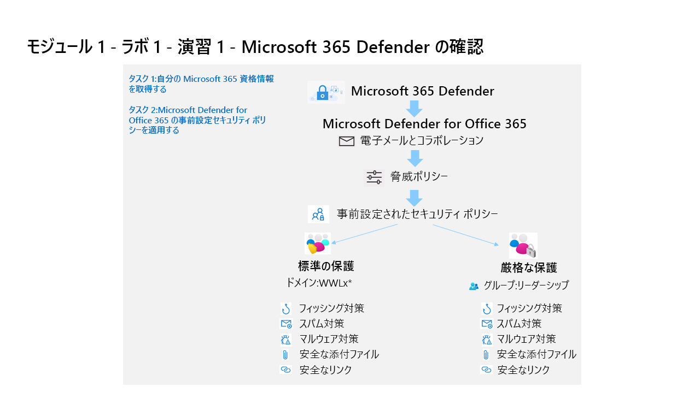

---
lab:
  title: 演習 1 - Microsoft 365 Defender の確認
  module: Module 1 - Mitigate threats using Microsoft 365 Defender
---

# モジュール 1 - ラボ 1 - 演習 1 - Microsoft 365 Defender の確認 

## ラボのシナリオ

あなたは Microsoft 365 Defender を実装している企業で働くセキュリティ オペレーションアナリストです。 まず、EOP と Microsoft Defender for Office 365 で事前設定されたセキュリティ ポリシーを割り当てます。

### タスク 1:Microsoft 365 資格情報の取得

ラボを起動すると、無料のトライアル テナントを利用して Microsoft Virtual Lab 環境にアクセスできるようになります。 このテナントには自動的に一意のユーザー名とパスワードが割り当てられます。 Microsoft Virtual Lab 環境で Azure と Microsoft 365 にサインインするには、このユーザー名とパスワードを取得する必要があります。 

このコースは、学習パートナーが複数の認証済みラボ ホスティング プロバイダーのいずれかを使用して実施することもあり、お使いになっているテナントに関連のあるテナント ID を取得する実際の手順はラボ ホスティング プロバイダーに応じて異なります。 このため、コース内での当該情報の取得方法については、講師が必要な指示を行います。 後ほど使用できるよう以下の情報に留意してください。

- **テナント サフィックス ID。** この ID は、ラボ全体で Microsoft 365 にサインインする際に使用する onmicrosoft.com アカウント用です。 形式は **{username}@ZZZZZZ.onmicrosoft.com** です。ZZZZZZ はラボ ホスティング プロバイダーの提供した一意のテナント サフィックス ID です。 後で使用できるよう、この ZZZZZZ を記録しておきます。 ラボの手順で Microsoft 365 ポータルにサインインするよう指示されたら、ここで取得した ZZZZZZ の値を入力してください。
- **テナント パスワード:** これは、ラボ ホスティング プロバイダーの提供する管理者アカウント向けのパスワードです。

### タスク 2:Microsoft Defender for Office 365 の事前設定セキュリティ ポリシーを適用する

このタスクでは、Microsoft 365 セキュリティ ポータルで Exchange Online Protection (EOP) と Microsoft Defender for Office 365 の事前設定セキュリティ ポリシーを割り当てます。

1. 管理者として WIN1 仮想マシンにログインします。パスワードは**Pa55w.rd**。  

1. 新しい Microsoft Edge ブラウザーを起動します。

1. Edge ブラウザーで、 https://security.microsoft.com) の Microsoft 365 Defender ポータルに移動します。

1. **[サインイン]** ダイアログ ボックスで、ラボ ホスティング プロバイダーから提供された管理者ユーザー名のテナント電子メール アカウントをコピーして貼り付け、**[次へ]** を選択します。

1. **パスワードの入力**ダイアログ ボックスで、ラボ ホスティング プロバイダーの提供した管理者のテナント パスワードをコピーして貼り付け、**サインイン**します。

    >**注:**  "操作を完了できませんでした。 後で再度お試しください。 問題が解決しない場合は、Microsoft サポートにお問い合わせください" というメッセージが表示された場合は、単に **[OK]** をクリックして続行します。  

1. 表示されている場合は、Microsoft 365 Defender クイック ツアーを閉じます。

1. ナビゲーション メニューの *[電子メールとコラボレーション]* 領域で、**[Policies & rules]\(ポリシーとルール\)** を選択します。

1. *[Policies & rules]\(ポリシーとルール\) * ダッシュボードで、**[Threat policies]\(脅威ポリシー\)** を選択します。

1. *[Threat policies]\(脅威ポリシー\)]* ダッシュボードで、**[Preset Security Policies] (事前設定セキュリティ ポリシー)** を選択します。

    >**注:**  "*クライアント エラー - bip ルールの取得時にエラーが発生しました*" というメッセージが表示された場合は、 **[OK]** を選択して続行します。 このエラーは、既定では有効になっていない Office 365 のテナントのハイドレーション状態が原因です。

    >**注:**  "*クライアント エラー - 事前設定されたセキュリティ ポリシーを取得するときにエラーが発生しました。後でもう一度やり直してください。* " というエラーが表示されることがあります。 続行するには **[OK]** を選択します。 **Ctrl + F5** キーを使用して、ブラウザーを更新します。

1. *[標準的な保護]* の **[保護設定の管理]** を選択します。 **ヒント:** このオプションが淡色表示されている場合は、**Ctrl + F5** キーを押してブラウザーを更新します。

1. *[Exchange Online Protection の適用]* セクションで **[特定の受信者]** を選択し、 **[ドメイン]** でテナントのドメイン名の書き込みを開始し、それを選んで、 **[次へ]** を選択します。 **ヒント:** テナントのドメイン名は、管理者アカウントのドメイン名と同じです。例: *WWLx######.onmicrosoft.com*。 この構成では、スパム対策、送信スパム フィルター、マルウェア対策、フィッシング対策のポリシーが適用されます。 

1. *[Defender for Office 365 保護の適用]* セクションで、前の手順と同じ構成を適用し、 **[次へ]** を選択します。 この構成は、フィッシング対策、安全な添付ファイル、安全なリンクのポリシーに対して適用されることに注意してください。

1. *[偽装保護]* セクションで、 **[次へ]** を 4 回 (4x) 選択して続行します。

1. *[ポリシー モード]* セクションで、 **[Turn on the policy after I finish]\(完了したらポリシーを有効にする\)** ラジオ ボタンが選択されていることを確認し、 **[次へ]** を選択します。

1. *[変更のレビューと確認]* の内容を読み、 **[確認]** を選択して変更を適用してから、 **[完了]** を選択して完了します。

    >**注:**  "*URI 'https://outlook.office365.com/psws/service.svc/AntiPhishPolicy ' は PUT 操作に対して無効です。PUT 操作では、1 つのリソースを URI で参照する必要があります*" [ **OK] を** 選択し、[ **キャンセル** ] を選択してメイン ページに戻ります。 *"標準的な保護が有効になっている"* オプションが表示されます。

1. *[厳密な保護]* で **[保護設定の管理]** を選択します。 **ヒント:** *[厳密な保護]* は、"[電子メールとコラボレーション] - [Policies & rules]\(ポリシーとルール\) - [Threat policies]\(脅威ポリシー\) - [Preset Security Policies] (事前設定セキュリティ ポリシー)" の下に表示されます。

1. *[Exchange Online Protection の適用]* で **[特定の受信者]** を選択し、 **[グループ]** で **[リーダーシップ]** の書き込みを開始し、 **[次へ]** を選択します。 この構成では、スパム対策、送信スパム フィルター、マルウェア対策、フィッシング対策のポリシーが適用されます。

1. *[Defender for Office 365 保護の適用]* セクションで、前の手順と同じ構成を適用し、 **[次へ]** を選択します。 この構成は、フィッシング対策、安全な添付ファイル、安全なリンクのポリシーに対して適用されることに注意してください。

1. *[偽装保護]* セクションで、 **[次へ]** を 4 回 (4x) 選択して続行します。

1. *[ポリシー モード]* セクションで、 **[Turn on the policy after I finish]\(完了したらポリシーを有効にする\)** ラジオ ボタンが選択されていることを確認し、 **[次へ]** を選択します。

1. *[変更のレビューと確認]* の内容を読み、 **[確認]** を選択して変更を適用してから、 **[完了]** を選択して完了します。

    >**注:**  "*URI 'https://outlook.office365.com/psws/service.svc/AntiPhishPolicy ' は PUT 操作に対して無効です。PUT 操作では、1 つのリソースを URI で参照する必要があります*" [ **OK] を** 選択し、[ **キャンセル** ] を選択してメイン ページに戻ります。 *''[厳密な保護] が有効になっている''* オプションが表示されます。

### タスク 3: Microsoft 365 Defender ワークスペースの準備

1. **[Microsoft 365 Defender]** ポータルのナビゲーション メニューで、左側の **[設定]** を選択します。

1. **[設定]** ページで、 **[Microsoft 365 Defender]** を選択します。 コーヒー マグの画像と次のメッセージが表示 *されます。データ用に新しいスペースを準備し、接続しています*。. 完了するまで数分かかるので、ページを開いたままにしておきますが、次のラボに必要になるため、完了していることを確認してください。 

    >**注:**  "失敗するつもりはありませんでしたが、問題が発生しました" というエラー メッセージが表示された場合は、 後で手順を再試行するか、次のラボの前に実行します。

1. 新しいスペースが正常に完了すると、アカウント、電子メール通知、プレビュー機能、ストリーミング API の Microsoft 365 Defender 設定が表示されます。

## これでラボは完了です。
