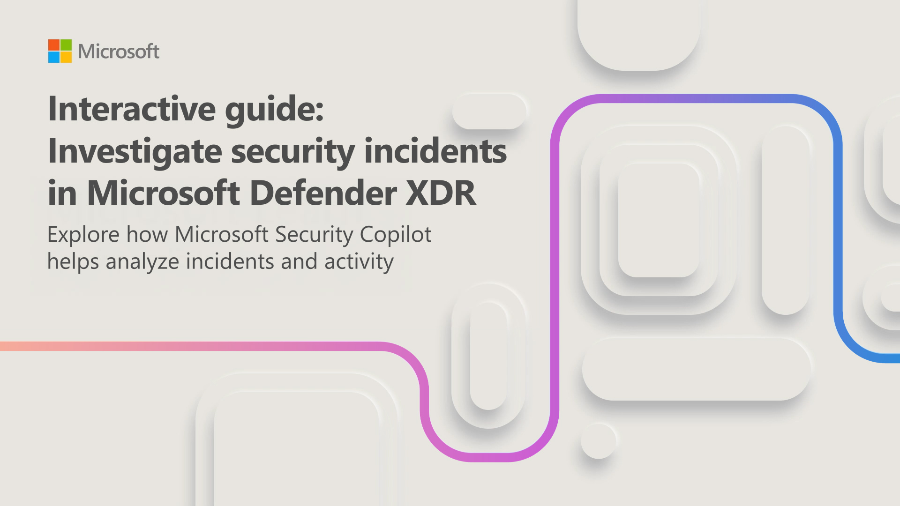
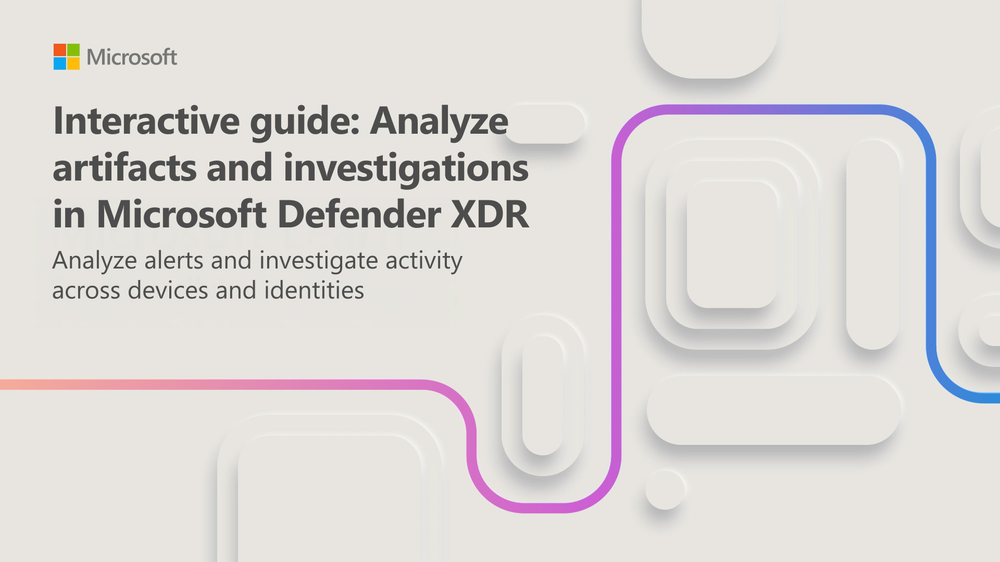

---
lab:
  title: 演習 1 - Microsoft Security Copilot のユース ケースを探索する
  module: Learning Path 2 - Mitigate threats using Microsoft Security Copilot
  description: この演習では、Microsoft Security Copilot のスタンドアロン エクスペリエンスのランディング ページにあるすべての主要なランドマークについて確認します。
  duration: 20 minutes
  level: 200
  islab: true
---

# ラーニング パス 2 - ラボ 1 - 演習 1 - Microsoft Security Copilot を探索する

## ラボのシナリオ

あなたが所属する組織が、セキュリティ運用アナリストの効率と能力を向上させて、セキュリティの成果を改善したいと考えています。 その目標をサポートするために、CISO のオフィスでは Microsoft Security Copilot の展開がその目標に向けた重要なステップであると判断しました。 組織のセキュリティ管理者として、あなたは、Copilot を設定する必要があります。

<!--- In this exercise, you go through the *first run experience* of Microsoft Security Copilot to provision Copilot with one security compute unit (SCU). --->

>**注:** この演習の環境は、製品から生成されたシミュレーションです。 シミュレーションには制限があるため、ページ上のリンクが有効にならない場合があり、指定されたスクリプトに該当しないテキストベースの入力はサポートされない場合があります。 "This feature is not available within the simulation" (この機能はシミュレーション内では使用できません) というポップアップ メッセージが表示されます。 これが発生したら、[OK] を選択し、演習の手順を続行してください。  

### このラボの推定所要時間: 20 分

Security Copilot は Microsoft Defender XDR と連携して、セキュリティ インシデントの調査と対応を支援します。 このユニットでは、インシデントのコンテキスト理解から特定の成果物の分析や詳細な調査の実行までのインシデント調査の完全なワークフローを、2 つの対話型ガイドで進めます。

## インシデントのコンテキストと活動を調査する

Microsoft Defender XDR で、資産のセキュリティ侵害や多数のアラートを伴う複雑なインシデントが特定されると、攻撃の発生場所や進行の経緯を特定するのが難しいことがあります。 Security Copilot はインシデント活動を要約し、関連するイベントを結びつけ、重要なことに集中できるようガイド付きの対応を提供します。

所要時間約 10 分のこのインタラクティブ ガイドでは、Microsoft Defender XDR でセキュリティ インシデントを調査します。 インシデントやアラートの要約をレビューし、関連するエンティティを分析し、Security Copilot のインサイトを使って調査を進めます。

開始するには、下の画像を選択してください。

## 成果物を分析し、詳細な調査に切り替える

インシデントのコンテキスト全体を理解したら、次のステップは個々のアラートを分析し、特定の成果物を調査することです。 Security Copilot はアラートの詳細の確認、デバイスやユーザーのコンテキストのレビュー、リスクの特定を、おすすめのアクションでサポートします。

所要時間約 10 分のこのインタラクティブ ガイドでは、Microsoft Defender XDR でアラートを分析して調査を続けます。 アラートの詳細をレビューし、デバイスやユーザーのコンテキストを確認し、詳細な調査の支援に Security Copilot を使用します。

開始するには、下の画像を選択してください。

## まとめと追加リソース

この演習では、Microsoft Security Copilot の最初の実行エクスペリエンス、プロビジョニングされた容量、および Copilot のスタンドアロンおよび埋め込みエクスペリエンスについて調べました。 Microsoft Defender XDR でインシデントを調査し、インシデントの概要、デバイスの概要、スクリプト分析などを調べました。 また、調査をスタンドアロン エクスペリエンスに切り替えて、調査の詳細を仕事仲間と共有する方法としてピン ボードを使用しました。

追加の Microsoft Security Copilot ユース ケース シミュレーションを実行するには、 [Explore Microsoft Security Copilot ユース ケース シミュレーション](/training/modules/security-copilot-exercises/)を参照してください。
