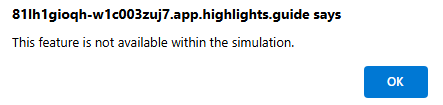

---
lab:
  title: 演習 1 - Microsoft Security Copilot のユース ケースを探索する
  module: Learning Path 2 - Mitigate threats using Microsoft Security Copilot
  description: この演習では、Microsoft Security Copilot のスタンドアロン エクスペリエンスのランディング ページにあるすべての主要なランドマークについて確認します。
  duration: 20 minutes
  level: 200
  islab: true
---

# ラーニング パス 2 - ラボ 1 - 演習 1 - Microsoft Security Copilot を探索する

## ラボのシナリオ

あなたが所属する組織が、セキュリティ運用アナリストの効率と能力を向上させて、セキュリティの成果を改善したいと考えています。 その目標をサポートするために、CISO のオフィスでは Microsoft Security Copilot の展開がその目標に向けた重要なステップであると判断しました。 組織のセキュリティ管理者として、あなたは、Copilot を設定する必要があります。

<!--- In this exercise, you go through the *first run experience* of Microsoft Security Copilot to provision Copilot with one security compute unit (SCU). --->

>**注:** この演習の環境は、製品から生成されたシミュレーションです。 シミュレーションには制限があるため、ページ上のリンクが有効にならない場合があり、指定されたスクリプトに該当しないテキストベースの入力はサポートされない場合があります。 "This feature is not available within the simulation" (この機能はシミュレーション内では使用できません) というポップアップ メッセージが表示されます。 これが発生したら、[OK] を選択し、演習の手順を続行してください。  

### このラボの推定所要時間: 20 分

Security Copilot は Microsoft Defender XDR と連携して、セキュリティ インシデントの調査と対応を支援します。 このユニットでは、インシデントのコンテキスト理解から特定の成果物の分析や詳細な調査の実行までのインシデント調査の完全なワークフローを、2 つの対話型ガイドで進めます。

## インシデントのコンテキストと活動を調査する

Microsoft Defender XDR で、資産のセキュリティ侵害や多数のアラートを伴う複雑なインシデントが特定されると、攻撃の発生場所や進行の経緯を特定するのが難しいことがあります。 Security Copilot はインシデント活動を要約し、関連するイベントを結びつけ、重要なことに集中できるようガイド付きの対応を提供します。

所要時間約 10 分のこのインタラクティブ ガイドでは、Microsoft Defender XDR でセキュリティ インシデントを調査します。 インシデントやアラートの要約をレビューし、関連するエンティティを分析し、Security Copilot のインサイトを使って調査を進めます。

開始するには、下の画像を選択してください。

## 成果物を分析し、詳細な調査に切り替える

インシデントのコンテキスト全体を理解したら、次のステップは個々のアラートを分析し、特定の成果物を調査することです。 Security Copilot はアラートの詳細の確認、デバイスやユーザーのコンテキストのレビュー、リスクの特定を、おすすめのアクションでサポートします。

所要時間約 10 分のこのインタラクティブ ガイドでは、Microsoft Defender XDR でアラートを分析して調査を続けます。 アラートの詳細をレビューし、デバイスやユーザーのコンテキストを確認し、詳細な調査の支援に Security Copilot を使用します。

開始するには、下の画像を選択してください。

<!--- 

### Estimated time to complete this lab: 45 minutes

### Task 1: Provision Microsoft Security Copilot

For this exercise, you're logged in as Avery Howard and you have the global administrator role in Microsoft Entra. You'll work in both the Azure portal and Microsoft Security Copilot.

This exercise should take approximately **15** minutes to complete.

>**Note:**
> When a lab instruction calls for opening a link to the simulated environment, it is generally recommended that you open the link in a new browser window so that you can simultaneously view the instructions and the exercise environment. To do so, select the right mouse key and select the option.

Before users can start using Copilot, admins need to provision and allocate capacity. To provision capacity:

- You must have an Azure subscription.
- You need to be an Azure owner or Azure contributor, at a resource group level, as a minimum.

In this task, you walk through the process of ensuring you have the appropriate role permissions. This starts by enabling access management for Azure resources.

Once you're assigned the User Access Administrator role in Azure, you can assign a user the necessary access to provision SCUs for Copilot.  For the purpose of this exercise only, which is to show you the steps involved,  you will be assigning yourself the necessary access.  The steps that follow will guide you through the process.

1. Ensure you have the User Access Administrator role assigned to your account.

1. Open the simulated environment by selecting this link: <https://app.highlights.guide/start/6d7270b9-7187-456a-ac16-97bc227d5c27?token=045faae1-1078-4eac-bf56-e12472eddaf9&link=1&azure-portal=true>.

    <!--- Open the simulated environment by selecting this link: **[Azure portal](https://app.highlights.guide/start/6d7270b9-7187-456a-ac16-97bc227d5c27?token=045faae1-1078-4eac-bf56-e12472eddaf9&link=1&azure-portal=true)**.--->

   <!--- 1. You'll start by enabling Access management for Azure resources. To access this setting:
       1. From the Azure portal, select **Microsoft Entra ID**.
       2. From the left navigation panel, expand **Manage**.
       3. From the left navigation panel, scroll down and select **Properties**.
       4. Enable the toggle switch for **Access management for Azure resources**, then select **Save**.

   2. Now that you can view all resources and assign access in any subscription or management group in the directory, assign yourself the Owner role for the Azure subscription.
       1. From the blue banner on the top of the page, select **Microsoft Azure** to return to the landing page of the Azure portal.
       2. Select **Subscriptions** then select the subscription listed **Woodgrove - GTP Demos (Exernal/Sponsored)**.
       3. Select **Access control (IAM)**.
       4. Select **Add**, then **Add role assignment**.
       5. From the Role tab, select **Privileged administrator roles**.
       6. Select **Owner**, then select **Next**.
       7. Select **+ Select members**.
       8. Avery Howard is the first name on this list, select the **+** to the right of the name.  Avery Howard is now listed under selected members. Select the **Select** button, then select **Next**.
       9. Select **Allow user to assign all roles except privileged administrator roles, Owner, UAA, RBAC (Recommended)**.
       10. Select **Review + assign**, then select **Review + assign** one last time.

   As an owner to the Azure subscription, you'll now be able to provision capacity within Copilot.

   #### Sub-task 1: Provision capacity

   In this task, you go through the steps of provisioning capacity for your organization. There are two options for provisioning capacity:

   - Provision capacity within Security Copilot (recommended)
   - Provision capacity through Azure

   For this exercise, you provision capacity through Security Copilot. When you first open Security Copilot, a wizard guides you through the steps in setting up capacity for your organization.

   1. Open the simulated environment by selecting this link: **[Microsoft Security Copilot](https://app.highlights.guide/start/6d7270b9-7187-456a-ac16-97bc227d5c27?token=045faae1-1078-4eac-bf56-e12472eddaf9&azure-portal=true)**.

   2. Follow the steps in the Wizard, select **Get started**.
   3. On this page, you set up your security capacity. For any of the fields listed below, you can select the information icon for more information.
       1. Azure subscription: From the drop-down, select **Woodgrove - GTP Demos (External/Sponsored)**.
       2. Resource group: From the drop-down, select **RG-1**.
       3. Capacity name: Enter a capacity name.
       4. Prompt evaluation location [Geo]: From the drop-down, select your region.
       5. You can choose whether you want to select the option, "If this location has too much traffic, allow Copilot to evaluate prompts anywhere in the world (recommended for optimal performance).
       6. Capacity region is set based on location selected.
       7. Security compute: This field is automatically populated with the minimum required SCU units, which is 1. Leave  field with the value of **1**.
       8. Select the box, **"I acknowledge that I have read, understood, and agree to the Terms and Conditions**.
       9. Select **Continue** on the bottom right corner of the page.

   4. The wizard displays information about where your customer data will be stored. The region displayed is based on the region you selected in the Prompt evaluation field. Select **Continue**.

   5. You can select options to help improve Copilot. You can select the toggle based on your preferences.  Select **Continue**.

   6. As part of the initial setup, Copilot provides contributor access to everyone by default and includes Global administrators and Security administrators as Copilot owners. In your production environment, you can change who has access to Copilot, once you've completed the initial setup. Select **Continue**.
   7. You're all set! Select **Finish**.
   8. Close the browser tab, as the next exercise will use a separate link to the lab-like environment.

   ### Task 2: Explore the Microsoft Security Copilot standalone experience

   The security administrator for your organization provisioned Copilot. Since you're the senior analyst on the team, the administrator added you as a Copilot owner and asked you to familiarize yourself with the solution.

   In this exercise, you explore all the key landmarks in the landing page of the standalone experience of Microsoft Security Copilot.

   You're logged in as Avery Howard and have the Copilot owner role. You'll work in the standalone experience of Microsoft Security Copilot.

   This exercise should take approximately **15** minutes to complete.

   #### Sub-task 1: Explore the menu options

   In this task, you start your exploration in the home menu.

   9. Open the simulated environment by selecting this link: **[Microsoft Security Copilot](https://app.highlights.guide/start/7608581a-ee3a-4fe0-be03-309a58b78c60?token=045faae1-1078-4eac-bf56-e12472eddaf9&azure-portal=true)**.

   10. Select the **Menu** icon , which is sometimes referred to as the hamburger icon.

   11. Select **My sessions** and note the available options.
       1. Select recent to view the most recent sessions
       2. Select filter and note the available options, then close the filer.
       3. Select the home menu icon to open the home menu.

   12. Select **Promptbook library**.
       1. Select My promptbooks. A subsequent task dives deeper into promptbooks.
       2. Select Woodgrove.
       3. Select Microsoft.
       4. Select filter to view the available options, then select the X to close.
       5. Select the home menu icon to open the home menu.

   13. From the *Home* menu, select **Owner settings**. These settings are available to you as a Copilot owner. A Copilot contributor does not have access to these menu options.
       1. Select the drop-down for who can upload files to view the available options.

   14. Return to the *Home* menu and explore the *Plugin* options:
       1. Select the *Plugin settings* for Who can add and manage their own custom plugins to view the available options.
       2. Select drop-down for Who can add and manage custom plugins for everyone in the organization to view the available options. Note, this option is greyed out if Who can add and manage their own custom plugins is set to owners only.
       3. Select the information icon next to "Allow Security Copilot to access data from your Microsoft 365 Services."  This setting must be enabled if you want to use the Microsoft Purview plugin. You'll work with this setting in a later exercise.

   15. Select **Role assignment**.
       1. Select Add members, then close.
       2. Expand owner.
       3. Expand contributor.
       4. Select the home menu icon to open the home menu.

   16. Select **Usage monitoring**.
       1. Select the date filter to view available options.
       2. Select the home menu icon to open the home menu.

   17. Select **Settings**.
       1. Select preferences. Scroll down to view available options.
       2. Select data and privacy.
       3. Select About.
       1. Select the X to close the preferences window.

   18. Select where it says **Woodgrove** at the bottom left of the home menu.
       1. When you select this option, you see your tenants. This is referred to as the tenant switcher. In this case, Woodgrove is the only available tenant.
       2. Select the **Home** to return to the landing page.

   #### Sub-task 2: Explore access to recent sessions

   In the center of the landing page, there are cards representing your most recent sessions.

   19. The largest card is your last session. Selecting the title of any session card takes you to that session.
   20. Select **View all sessions** to go to the My sessions page.
   21. Select **Microsoft Copilot for Security**, next to the home menu icon, to return to the landing page.

   #### Sub-task 3: Explore access to promptbooks

   The next section of the Copilot landing page revolves around promptbooks. The landing page shows tiles for some Microsoft security promptbooks. Here you explore access to promptbooks and the promptbook library. In a subsequent exercise, you explore creating and running a promptbook.

   1. Select the *Promptbooks* button.

   2. Each tile shows the title of the promptbook, a brief description, the number of prompts, and a run icon. Select the title of any of the promptbook tiles to open that promptbook. Select **Vulnerability impact assessment**, as an example.
       1. The window for the selected promptbook provides information, including who created the promptbook, tags, a brief description, inputs required to run the promptbook, and a listing of the prompts.
       2. Note the information about the promptbook and the available options. For this simulation you can't start a new session, you'll do that in a subsequent exercise. 
       1. Select **X** to close the window.

   3. Select **View the promptbook library**.
       1. To view promptbooks that you own, select My promptbooks.
       2. Select Woodgrove for a listing of promptbooks owned by Woodgrove, the name of a fictitious organization.
       1. To view built-in, Microsoft owned/developed promptbooks, select Microsoft.
       1. Select the filter icon. Here you can filter based on tags assigned to the workbook. Close the filter window by selecting the X in the New filter tab.
       2. Select **Microsoft Copilot for Security**, next to the home menu icon, to return to the landing page.

   #### Sub-task 4: Explore the prompts and sources icon in the prompt bar

   At the bottom center of the page is the prompt bar. The prompt bar includes the prompts and sources icon, which you explore in this task. In subsequent exercises you'll enter inputs directly in the prompt bar.

   4. From the prompt bar, you can select the prompts icon to select a built-in prompt or a promptbook. Select the **prompts icon** .
       1. Select **See all promptbooks**
           1. Scroll to view all the available promptbooks.
           2. Select the **back-arrow** next to the search bar to go back.
       2. Select **See all system  capabilities**. The list shows all available system capabilities (these capabilities are in effect prompts that you can run). Many system capabilities are associated with specific plugins and as such will only be listed if the corresponding plugin is enabled.
           1. Scroll to view all the available promptbooks.
           2. Select the **back-arrow** next to the search bar to go back.

   5. Select the **sources icon** .
       1. The sources icon opens the manage sources window. From here, you can access Plugins or Files. The **Plugins** tab is selected by default.
           1. Select whether you want to view all plugins, those that are enabled (on), or those that are disabled (off).
           2. Expand/collapse list of Microsoft, non-Microsoft, and custom plugins.
           3. Some plugins require configuring parameters. Select the **Set up** button for the Microsoft Sentinel plugin, to view the settings window. Select **cancel** to close the settings window. In a separate exercise, you configure the plugin.
       2. You should still be in the Manage sources window. Select **Files**.
           1. Review the description.
           2. Files can be uploaded and used as a knowledge base by Copilot. In a subsequent exercise, you'll work with file uploads.
           3. Select **X** to close the manage sources window.

   #### Sub-task 5:  Explore the help feature

   At the bottom right corner of the window is the help icon where you can easily access documentation and find solutions to common problems. From the help icon, you also submit a support case to the Microsoft support team if you have the appropriate role permissions.

   6. Select the **Help (?)** icon.
       1. Select **Documentation**. This selection opens a new browser tab to the Microsoft Security Copilot documentation. Return to the Microsoft Security Copilot browser tab.
       1. Select **Help**.
           1. Anyone with access to Security Copilot can access the self help widget by selecting the help icon then selecting the Help tab. Here you can find solutions to common problems by entering something about the problem.
           2. Users with a minimum role of Service Support Administrator or Helpdesk Administrator role can submit a support case to the Microsoft support team. If you have this role, a headset icon is displayed. Close the contact support page.

   ### Task 3: Explore the Microsoft Security Copilot embedded experience

   In this exercise, you investigate an incident in Microsoft Defender XDR. As part of the investigation, you explore the key features of Microsoft Copilot in Microsoft Defender XDR, including incident summary, device summary, script analysis, and more. You also pivot your investigation to the standalone experience and use the pin board as a way to share details of your investigation with your colleagues.

   You're logged in as Avery Howard and have the Copilot owner role. You'll work in Microsoft Defender, using the new unified security operations platform, to access the embedded Copilot capabilities in Microsoft Defender XDR. Towards the end of the exercise, you pivot to the standalone experience of Microsoft Security Copilot.

   This exercise should take approximately **30** minutes to complete.

   #### Sub-task 1: Explore Incident summary and guided responses

   7. Open the simulated environment by selecting this link: **[Microsoft Defender portal](https://app.highlights.guide/start/be8a91c3-3979-4048-ad38-fd38deaf7117?token=045faae1-1078-4eac-bf56-e12472eddaf9&azure-portal=true)**.

   8. From the Microsoft Defender portal:
       1. Expand **Investigation & response**.
       2. Expand  **Incidents & alerts**.
       3. Select **Incidents**.

   9. Select the first incident in the list, **Incident Id: 185856** named Human-operated ransomware attack was launched from a compromised asset (attack disruption).

   10. This is a complex incident. Defender XDR provides a great deal of information, but with 50 alerts it can be a challenge to know where to focus. On the right side of the incident page, Copilot automatically generates an **Incident summary** that helps guide your focus and response. Select **See more**.
       1. Copilot's summary describes how this incident has evolved, including initial access, lateral movement, collection, credential access and exfiltration. It identifies specific devices, indicates that the PsExec tool was used to launch executable files, and more.
       1. These are all items you can leverage for further investigation. You explore some of these in subsequent tasks.

   11. Scroll down on the Copilot panel and just beneath the summary are **Guided responses**. Guided responses recommend actions in support of triage, containment, investigation, and remediation.
       1. The first item in the triage category it to Classify this incident. Select **Classify** to view the options. Review the guided responses in the other categories.
       2. Select the **Status** button above the *Summary* and filter on **Completed**. Four completed activities show labeled as *Attack Disruption*. Automatic attack disruption is designed to contain attacks in progress, limit the impact on an organization's assets, and provide more time for security teams to remediate the attack fully.
   12. Keep the incident page open, you'll use it in the next task.

   #### Sub-task 2:  Explore device and identity summary

   1. From the incident page, on the *Attack story* tab, scroll down through the alerts and select the **Suspicious RDP session** alert.

   2. Copilot  automatically generates an **Alert summary**, which provides a wealth of information for further analysis. For example, the summary identifies suspicious activity, it identifies data collection activities, credential access, malware, discovery activities, and more.

   3. There's a lot of information on the page, so to get a better view of this alert, select **Open alert page**. It's on the third panel on the alert page, next to the incident graph and below the alert title.

   4. On the top of the page, is card for the device **parkcity-win10v**. Select the ellipses and note the options. Select **Summarize**. Copilot generates a **Device summary**. It's worth noting that there are many ways you can access device summary and this way is just one convenient method. The summary shows the device is a VM, identifies the owner of the device, it shows its compliance status against Intune policies, and more.

   5. Next to the device card is a card for the owner of the device. Select **PARKCITY\jonaw**. The third panel on the page updates from showing details of the alert to providing information about the user Jonathan Wolcott, an account executive, whose Microsoft Entra ID risk and Insider risk severity are classified as high. These aren't surprising given what you've learned from the Copilot incident and alert summaries. Select the ellipses then select  **Summarize** to obtain an identity summary generated by Copilot.

   6. Keep the alert page open, you'll use it in the next task.

   #### Sub-task 3:  Explore script analysis

   7. Let's Focus on the alert story. Select **Maximize **, located on the main panel of the alert, just beneath the card labeled 'partycity\jonaw' to get a better view of the process tree. From maximized view, you begin to get a clearer view of how this incident came to be. Many line items indicate that powershell.exe executed a script. Since the user Jonathan Wolcott is an account executive, it's reasonable to assume that executing PowerShell scripts isn't something this user is likely to be doing regularly.

   8. Expand the first instance of **powershell.exe execute a script**, it's the one showing the timestamp of 4:57:11 AM. Copilot has the capability to analyze scripts. Select **Analyze**.
       1. Copilot generates an analysis of the script and suggests it could be a phishing attempt or used to deliver a web-based exploit.
       2. Select **Show code**. The code shows a defanged URL.

   9. There are several other items that indicate powershell.exe executed a script. Expand the one labeled **powershell.exe -EncodedCommand...**. The original script was base 64 encoded, but Defender has decoded that for you. For the decoded version, select **Analyze**. The analysis highlights the sophistication of the script used in this attack.

   10. In the Copilot Script analysis, you have buttons for Show code and Show MITRE techniques

   11. Select the **Show MITRE Techniques** button and select the link labeled: T1105: Ingress Tool Transfer

   12. This opens the *MITRE | ATT&CK* site page describing the technique in detail.

   13. Close the alert story page by selecting the **X** (the X that is to the left of Copilot panel). Now use the breadcrumb to return to the incident. Select **Human-operated ransomware attack was launched from a compromised asset (attack disruption)**.

   #### Sub-task 4:  Explore file analysis

   14. You're back at the incident page. In the alert summary, Copilot identified the file mimikatz.exe, which is associated with the 'Mimikatz' malware. You can use the file analysis capability in Defender XDR to see what other insights you can get. There are several ways to access files. From the top of the page, select the **Evidence and Response** tab.

   15. From the left side of the screen select **Files**.
   16. Select the first item from the list with the entity named **mimikatz.exe**.
   17. From the window that opens, select **Open file page**.
   18. Select the Copilot icon (if File analysis doesn’t automatically open), and Copilot generates a File analysis.
   19. Review the detailed file analysis that Copilot generates.
   20. Close the File page and use the breadcrumb to return to the incident. Select **Human-operated ransomware attack was launched from a compromised asset (attack disruption)**.

   #### Sub-task 5: Pivot to the standalone experience

   This task is complex and requires the involvement of more senior analysts. In this task, you pivot your investigation and run the Defender incident promptbook so the other analysts have a running start on the investigation. You pin responses to the pin board and generate a link to this investigation that you can share with more advanced members of the team to help investigate.

   21. Return to the incident page by selecting the **Attack story** tab from the top of the page.

   22. Select the ellipses next to Copilot's Incident summary and select **Open in Security Copilot**.

   23. Copilot opens in the standalone experience and shows the incident summary. You can also run more prompts. In this case, you'll run the promptbook for an incident. Select the **prompt icon** . 
       1. Select **See all promptbooks**.
       2. Select **Microsoft 365 Defender incident investigation**.
       3. The promptbook page opens and asks for the Defender Incident ID. Enter **185856** then select **Submit**.
       4. Review the information provided. By pivoting to the standalone experience and running the promptbook, the investigation is able to invoke capabilities from a broader set security solution, beyond just Defender XDR, based on the plugins enabled.

   24. Select the **box icon ** next to the pin icon to select all the prompts and the corresponding responses, then select the **Pin icon ** to save those responses to the pin board.

   25. The pin board opens automatically. The pin board holds your saved prompts and responses, along with a summary of each one. You can open and close the pin board by selecting the **pin board icon **.

   26. From the top of the page, select **Share** to view your options. By sharing the incident via a link or email, people in your organization with Copilot access can view this session. Close the window by selecting the **X**.

   #### Sub-task 6: Create and run a KQL query

   Next, we'll use Copilot to help us create a KQL (Kusto Query Language) query to use with Advanced hunting in Defender XDR.

   27. While still in standalone Security Copilot, enter the following prompt in the prompt form:
   *Based on this incident, create a query to proactively hunt for this type of malware attack. Use the woodgrove-loganalyticsworkspace.*

   28. Press the Submit prompt icon to run your prompt.
   Copilot chooses Natural language to KQL for advanced hunting.

   29. Copilot generates a KQL query and a response:

       1. Read through the Explanation of the Kusto Query.

       2. Review the Breakdown of the Kusto Query. This is very helpful if you’re just getting started with KQL.

   30. Copy the KQL query Copilot generated and return to the Defender XDR portal.
   ***It's recommended that you copy the query into Notepad or another editor first to reduce formatting problems***.

   31. Defender XDR should still have the Investigations & response section open. Select **Hunting** and then **Advanced hunting** from the navigation menu.

   32. In Advanced hunting, select the **New query +** to open a new window and paste the KQL query generated by Copilot into the form.
   ***It's recommended that you copy the query into Notepad or another editor first to reduce formatting problems***.

   33. After running the KQL query, you can return to Copilot to refine the query or select the Copilot icon on the Advanced hunting query page to fine-tune hunting queries.

   34. You can now close the browser tab to exit the simulation.--->

## まとめと追加リソース

この演習では、Microsoft Security Copilot の最初の実行エクスペリエンス、プロビジョニングされた容量、および Copilot のスタンドアロンおよび埋め込みエクスペリエンスについて調べました。 Microsoft Defender XDR でインシデントを調査し、インシデントの概要、デバイスの概要、スクリプト分析などを調べました。 また、調査をスタンドアロン エクスペリエンスに切り替えて、調査の詳細を仕事仲間と共有する方法としてピン ボードを使用しました。

追加の Microsoft Security Copilot ユース ケース シミュレーションを実行するには、 [Explore Microsoft Security Copilot ユース ケース シミュレーション](/training/modules/security-copilot-exercises/)を参照してください。
