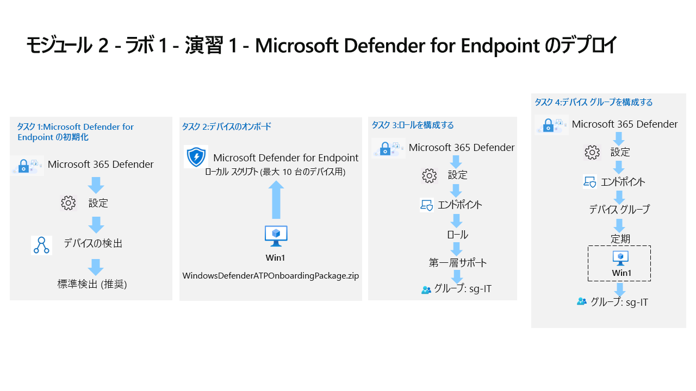

---
lab:
  title: 演習 1 - Microsoft Defender for Endpoint のデプロイ
  module: Learning Path 2 - Mitigate threats using Microsoft Defender for Endpoint
---

# ラーニング パス 2 - ラボ 1 - 演習 1 - Microsoft Defender for Endpoint のデプロイ

## ラボのシナリオ

あなたは Microsoft Defender for Endpoint を実装している企業で働いているセキュリティ運用アナリストです。 あなたの上司は、いくつかのデバイスをオンボードして、セキュリティ オペレーション (SecOps) チームの応答手順で必要な変更に関する情報を提供しようとしています。

最初に、Defender for Endpoint 環境を初期化します。 次に、デバイスでオンボード スクリプトを実行し、デプロイ対象の初期デバイスをオンボードします。 環境のセキュリティを構成します。 最後に、デバイス グループを作成し、適切なデバイスを割り当てます。

>**重要:** ラボの Virtual Machines は、さまざまなモジュールで使用されます。 仮想マシンを保存します。 保存せずにラボを終了する場合は、構成を再実行する必要があります。

>**注:**  前のモジュールのタスク 3 の手順が正常に完了していることを確認します。

### タスク 1:Microsoft Defender for Endpoint の初期化

このタスクでは、Microsoft Defender for Endpoint ポータルの初期化を行います。

1. 管理者として **WIN1** 仮想マシンにログインします。パスワードは **Pa55w.rd** です。  

1. Microsoft 365 Defender ポータルにまだ登録していない場合は、Microsoft Edge ブラウザーを起動します。

1. Edge ブラウザーで、 https://security.microsoft.com) の Microsoft 365 Defender ポータルに移動します。

1. **サインイン** ダイアログ ボックスで、ラボ ホスティング プロバイダーの提供した管理者ユーザー名のテナント電子メール アカウントをコピーして貼り付け、**[次へ]** を選択します。

1. **パスワードの入力**ダイアログ ボックスで、ラボ ホスティング プロバイダーの提供した管理者のテナント パスワードをコピーして貼り付け、**サインイン**します。

    >**ヒント:** 管理者のテナントのメール アカウントとパスワードは、[リソース] タブで確認できます。

1. **[Microsoft 365 Defender]** ポータルのナビゲーション メニューで、左側の **[設定]** を選択します。

1. **[設定]** ページで、 **[デバイス検出]** を選択します。 

    >**注:**  **[設定]** の下に **[デバイス検出]** オプションが表示されない場合は、ご自分のアカウントのイニシャルが表示された右上の円をクリックしてログアウトし、 **[サインアウト]** をクリックします。試すことのできるもう 1 つのオプションは、Ctrl + F5 キーを使用してページを更新するか、InPrivate ページを開くことです。 **テナントの電子メール**資格情報を使用して再度ログインします。

1. [検出] 設定で、 **[Standard discovery (recommended)](標準検出 (推奨))** が選択されていることを確認します。 
    >**ヒント:** オプションが表示されない場合は、ページを更新してください。

### タスク 2:デバイスのオンボード

このタスクでは、オンボード スクリプトを使用してデバイスを Microsoft Defender for Endpoint にオンボードします。

1. ブラウザーに Microsoft 365 Defender ポータルが表示されていない場合は、Microsoft Edge ブラウザーを起動し、(https://security.microsoft.com) にアクセスして、**テナントの電子メール**の資格情報でログインします。

1. 左側のメニュー バーから **[設定]** を選択し、設定 ページから **[エンドポイント]** を選択します。

1. デバイス管理セクションで **[オンボーディング]** を選択します。

    >**メモ:** 左側のメニュー バーの **[アセット]** セクションからデバイスのオンボードを実行することもできます。 [アセット] を展開し、[デバイス] を選択します。 [デバイス インベントリ] ページで、[コンピューター] と [モバイル] が選択された状態で、 **[デバイスのオンボード]** まで下にスクロールします。 そうすると、 **[設定] > [エンドポイント]** ページが表示されます。

1. [1. オンボード デバイス] 領域で、デプロイ方法ドロップダウンにローカル スクリプト (最大 10 デバイス) が表示されていることを確認し、**[オンボーディング パッケージのダウンロード]** ボタンを選択します。 

1. *[ダウンロード]* ポップアップで、マウスを使用して "WindowsDefenderATPOnboardingPackage.zip" ファイルを強調表示し、フォルダー アイコン **[フォルダーに表示]** を選択します。 **ヒント:** 表示されない場合は、ファイルを c:\users\admin\downloads ディレクトリに配置してください。

1. ダウンロードした zip ファイルを右クリックし、 **[すべて展開]** を選択し、 *[完了時に展開されたファイルを表示する]* チェックボックスがオンになっていることを確認し、 **[抽出]** を選択します。

1. 抽出されたファイル "WindowsDefenderATPLocalOnboardingScript.cmd" を右クリックし、**[プロパティ]** を選択します。 [プロパティ] ウィンドウの右下にある **[ブロック解除]** チェックボックスをオンにして、**[OK]** を選択します。

1. 抽出されたファイル "WindowsDefenderATPLocalOnboardingScript.cmd" を右クリックし、 **[管理者として実行]** を選択します。  **ヒント:** Windows SmartScreen ウィンドウが表示されたら、 **[詳細情報]** を選択し、 **[実行]** を選択します。 
    
1. [ユーザー アカウント制御] ウィンドウが表示されたら、 **[はい]** を選択してスクリプトの実行を許可し、スクリプトによって示される質問に **Y** と回答して、**Enter** キーを押します。 完了したら、コマンド画面に "マシンの Microsoft Defender for Endpoint へのオンボードに成功しました" という内容のメッセージが表示されます。**

1. 任意のキーを押して続行します。 コマンド プロンプト ウィンドウを閉じます。

1. 「2. 検出テストを実行する」セクションの下にある Microsoft 365 Defender ポータルからのオンボード ページに戻り、 **[コピー]** ボタンを選択して、検出テスト スクリプトをコピーします。  

1. WIN1 仮想マシンの Windows 検索バーで「**CMD**」と入力し、コマンド プロンプト アプリの右側のペインで **[管理者として実行]** を選択します。 

1. [ユーザー アカウント制御] ウィンドウが表示されたら **[はい]** を選択し、アプリの実行を許可します。 

1. **[管理者: コマンド プロンプト]** ウィンドウでスクリプトを右クリックして貼り付け、**Enter** キーを押して実行します。 **注:**  スクリプトの実行後、ウィンドウは自動的に閉じます。

1. Microsoft 365 Defender ポータルの左側のメニューの **[アセット]** 領域で **[デバイス]** を選択します。 デバイスが表示されていない場合は、次のタスクを完了し、後でもう一度確認してください。 最初のデバイスがポータルに表示されるまでに最大で 60 分かかることがあります。

    >**注:**  オンボード プロセスを完了してから 1 時間経ってもデバイス一覧にデバイスが表示されない場合は、オンボードまたは接続に問題があるおそれがあります。

### タスク 3:ロールの構成

このタスクでは、デバイス グループで使用するロールを設定します。

1. Microsoft 365 Defender ポータルで、左側のメニューバーから **[設定]** を選択し、 **[エンドポイント]** を選択します。 

1. [アクセス許可] 領域で、**[ロール]** を選択します。

1. **[ロールをオンにする]** ボタンを選択します。

1. **[+ 項目の追加]** を選択します。

1. ロールの追加 ダイアログで以下を入力します。

    |全般設定|値|
    |---|---|
    |ロール名|**第一層サポート**|
    |アクセス許可|ライブ応答機能 - 詳細設定|

1. 上部の **[割り当てられたユーザー グループ]** タブを選択します。 **[sg-IT]** を選択し、**[選択したグループを追加]** を選択します。 これが *[Azure AD user groups with this role](このロールを持つ Azure AD ユーザー グループ)* の下に表示されることを確認します。

1. **[保存]** を選択します。 ロールの保存中にエラーが発生した場合は、ページを更新してもう一度やり直してください。

### タスク 4:デバイス グループの構成

このタスクでは、アクセス コントロールと自動化の設定が可能なデバイス グループを構成します。

1. Microsoft 365 Defender ポータルで、左側のメニューバーから **[設定]** を選択し、 **[エンドポイント]** を選択します。 

1. アクセス許可領域で **[デバイス グループ]** を選択します。

1. **[デバイス グループの追加]** アイコンを選択します。

1. 全般 タブに次の情報を入力します。

    |全般設定|値|
    |---|---|
    |デバイス グループ名|**Regular**|
    |自動化レベル|Full - remediate threats automatically (完全 - 脅威を自動的に修復する)|

1. **[次へ]** を選択します。

1. [デバイス] タブの OS 条件で、**[Windows 10]** を選択し、**[次へ]** を選択します。

1. [デバイスのプレビュー] タブで、 **[プレビューを表示]** を選択して、WIN1 仮想マシンを表示します (多くの場合は、データがまだ入力されていません)。 そのままにして、 **[次へ]** を選択します。

1. ユーザー アクセス タブで **[sg-IT]** を選択し、**[選択したグループを追加]** ボタンを選択します。 これが *[Azure AD user groups with access to this device group](このデバイス グループへのアクセス権を持つ Azure AD ユーザー グループ)* の下に表示されることを確認します。

1. **[完了]** を選択します。

1. これでデバイス グループの構成が変わりました。 **[変更を適用]** を選択して、一致を確認し、グループ化を再計算します。

1. これで、先ほど作成した "Regular" と "グループに属していないデバイス (既定)" という 2 つのデバイス グループが同じ修復レベルで表示されます。

## 演習 2 に進みます。
