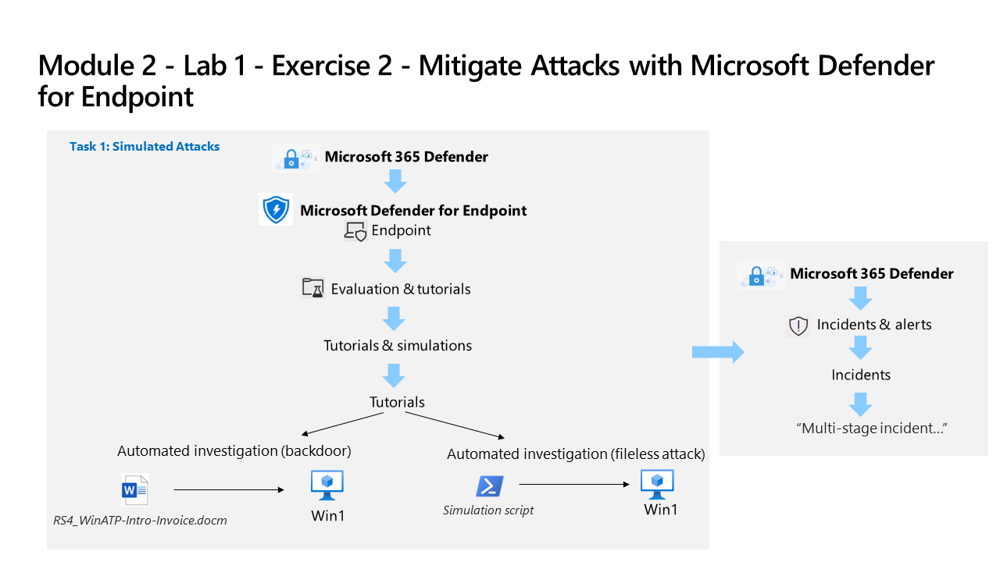

---
lab:
  title: 演習 2 - Microsoft Defender for Endpoint を使用した攻撃の軽減
  module: Learning Path 2 - Mitigate threats using Microsoft Defender for Endpoint
---

# ラーニング パス 2 - ラボ 1 - 演習 2 - Microsoft Defender for Endpoint を使用した攻撃の軽減

## ラボのシナリオ

あなたは Microsoft Defender for Endpoint を実装している企業で働いているセキュリティ運用アナリストです。 あなたの上司は、いくつかのデバイスをオンボードして、セキュリティ オペレーション (SecOps) チームの応答手順で必要な変更に関する情報を提供しようとしています。

Defender for Endpoint の攻撃緩和機能を確認するため、シミュレーション攻撃を 2 回行います。

>                **メモ:** このラボをご自分のペースでクリックして進めることができる、 **[ラボの対話型シミュレーション](https://mslabs.cloudguides.com/guides/SC-200%20Lab%20Simulation%20-%20Mitigate%20attacks%20with%20Microsoft%20Defender%20for%20Endpoint)** が用意されています。 対話型シミュレーションとホストされたラボの間に若干の違いがある場合がありますが、示されている主要な概念とアイデアは同じです。 

### タスク 1: デバイスのオンボードを確認する

このタスクでは、デバイスが正常にオンボードされていることを確認し、テスト アラートを作成します。

1. Microsoft Edge ブラウザーの Microsoft 365 Defender ポータルにまだアクセスしていない場合は、(https://security.microsoft.com) に移動し、テナントの Admin としてログインします。

1. 左側のメニューの **[アセット]** 領域の下で **[デバイス]** を選択します。 [デバイス] ページに WIN1 が表示されるまで待ち続けます。 そうしないと、後で生成されるアラートを表示するために、このタスクを繰り返さなければならなくなる可能性があります。

    >**注:**  オンボード プロセスを完了してから 1 時間経ってもデバイス一覧にデバイスが表示されない場合は、オンボードまたは接続に問題があるおそれがあります。

1. 左側のメニュー バーから **[設定]** を選択し、設定 ページから **[エンドポイント]** を選択します。

1. [デバイス管理] セクションで **[オンボード]** を選択し、 *[Windows 10 と 11]* がオペレーティング システムとして選択されていることを確認します。 *"最初のデバイスがオンボードされました"* というメッセージが *[完了]* と表示されるようになります。

1. 下にスクロールし、セクション *[2. 検出テストを実行します]* の下で **[コピー]** ボタンを選択して、検出テストのスクリプトをコピーします。  

1. WIN1 仮想マシンの Windows 検索バーで「**CMD**」と入力し、コマンド プロンプト アプリの右側のペインで **[管理者として実行]** を選択します。 

1. [ユーザー アカウント制御] ウィンドウが表示されたら **[はい]** を選択し、アプリの実行を許可します。 

1. **[管理者: コマンド プロンプト]** ウィンドウでスクリプトを右クリックして貼り付け、**Enter** キーを押して実行します。 **注:**  スクリプトの実行後、ウィンドウは自動的に閉じます。

### タスク 2: シミュレーション攻撃

このタスクでは、シミュレーション攻撃を 2 回行って、Microsoft Defender for Endpoint の機能を確認します。

1. 左側のメニューの **[エンドポイント]** の下で、 **[評価とチュートリアル]** を選択し、左側から **[チュートリアルとシミュレーション]** を選択します。

1. **[チュートリアル]** タブを選択します。

1. *[Automated investigation (backdoor)](自動調査 (バックドア))* に、シナリオを説明するメッセージが表示されます。 この段落の下にある **[Read the walkthrough](チュートリアルの読み取り)** をクリックします。 シミュレーションを実行する手順を含む新しいブラウザー タブが開きます。

1. 新しいブラウザー タブで、 **[シミュレーションの実行]** という名前のセクション (5 ページの手順 2 から) を見つけ、次の手順に従って攻撃を実行します。 **ヒント:** シミュレーション ファイル *RS4_WinATP-Intro-Invoice.docm* は、ポータルに戻り、 **[Get simulation file](シミュレーション ファイルの取得)** ボタンを選択して、前の手順で選択した **[Read the walkthrough](チュートリアルを読み取る)** の下に表示されます。 

1. 最後の 3 つの手順を繰り返して、"自動調査 (ファイルレス攻撃)" という別のチュートリアルを実行します。**

### タスク 3: 攻撃を調査する

1. Microsoft 365 Defender ポータルで、左側のメニュー バーから **[インシデントとアラート]** を選択し、 **[インシデント]** を選択します。

1. "マルチステージ インシデント..." という新しいインシデントが、右側のペインに表示されます。 インシデント名を選択して詳細を読み込みます。

    >**注:** "疑わしい.." というインシデントが最初に表示される場合があります。 Microsoft 365 Defender によって、タスク 1 で作成された元のテスト アラートを含め、1 つのセキュリティ問題を関連付けられると、これは後に前述のインシデントに置き換えられます。

1. **[インシデントの管理]** ボタンを選択すると、新しいウィンドウ ブレードが表示されます。 

1. **[Incident tags](インシデント タグ)** に「Tutorial」と入力し、**[Tutorial (Create new)](チュートリアル (新規作成))** を選択して新しいタグを作成します。 

1. **[割り当て先]** トグルを選択して、インシデントの所有者として自分のユーザー アカウント (Me) を追加します。 

1. **[分類]** で、ドロップダウン メニューを展開します。 

1. **[情報、予期されるアクティビティ]** で、 **[セキュリティ テスト]** を選択します。 

1. 必要に応じてコメントを追加し、 **[保存]** を選択してインシデントを更新し、完了します。

1. *[Attack story] (攻撃ストーリー)、[アラート]、[資産]、[調査]、[Evidence and Response] (証拠と応答)* 、および *[概要]* タブの内容を確認します。 デバイスとユーザーは *[資産]* タブにあります。 *[Attack story] (攻撃ストーリー)* タブには "インシデント グラフ" が表示されます。** **ヒント:** 一部のタブは、ディスプレイのサイズが原因で非表示になる場合があります。 省略記号タブ (...) を選択して表示します。

>**警告:** ここでのシミュレーションとチュートリアルは、実践を通して学ぶための優れた情報源です。  シミュレーションとチュートリアルは、ポータルで定期的に追加および編集されています。  ただし、これらのシミュレーションとチュートリアルの一部は、このトレーニングコース用に設計されたラボのパフォーマンスを妨げる可能性があります。  コースで提供される Azure テナントを使用する場合は、このラボで提供されている手順で推奨されているシミュレーションとチュートリアルのみを実行してください。  このテナントでこのトレーニング コースが完了した*後*、他のシミュレーションやチュートリアルを実行できます。

## これでラボは完了です。
