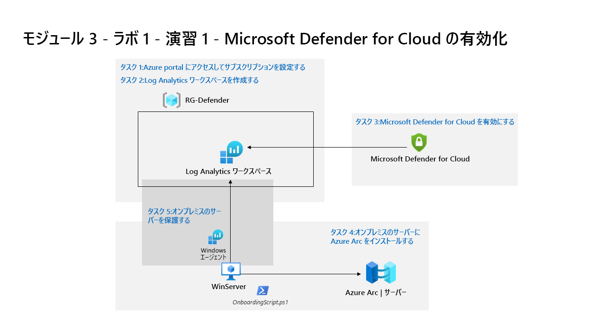

---
lab:
  title: 演習 1 - Microsoft Defender for Cloud の有効化
  module: Learning Path 3 - Mitigate threats using Microsoft Defender for Cloud
---

# ラーニング パス 3 - ラボ 1 - 演習 1 - Microsoft Defender for Cloud の有効化

## ラボのシナリオ

あなたは、Microsoft Defender for Cloud を使用してクラウド ワークロード保護を実装している企業に勤務するセキュリティ運用アナリストです。  このラボでは、Microsoft Defender for Cloud を有効にします。

>**メモ:** このラボをご自分のペースでクリックして進めることができる、 **[ラボの対話型シミュレーション](https://mslabs.cloudguides.com/guides/SC-200%20Lab%20Simulation%20-%20Enable%20Microsoft%20Defender%20for%20Cloud)** が用意されています。 対話型シミュレーションとホストされたラボの間に若干の違いがある場合がありますが、示されている主要な概念とアイデアは同じです。 

### タスク 1:Azure portal にアクセスしてサブスクリプションを設定する

このタスクでは、このラボと今後のラボを完了するために必要な Azure サブスクリプションを設定します。

1. 管理者として **WIN1** 仮想マシンにログインします。パスワードは **Pa55w.rd** です。  

1. Microsoft Edge ブラウザーを開くか、既に開いている場合は新しいタブを開きます。

1. Edge ブラウザーで、Azure portal (https://portal.azure.com) ) に移動します。

1. **サインイン** ダイアログ ボックスで、ラボ ホスティング プロバイダーの提供した管理者ユーザー名のテナント電子メール アカウントをコピーして貼り付け、**[次へ]** を選択します。

1. **パスワードの入力**ダイアログ ボックスで、ラボ ホスティング プロバイダーの提供した管理者のテナント パスワードをコピーして貼り付け、**サインイン**します。

1. Azureポータルの検索バーに「*サブスクリプション*」を入力し「**サブスクリプション**」を選択します。 

1. 表示された *[Azure Pass - スポンサー]* サブスクリプション (または、選択した言語で同等の名前) を選択します。

    >**注:** サブスクリプションが表示されない場合は、テナント管理者のユーザー資格情報を使用して Azure サブスクリプションを作成する方法について、インストラクターに確認してください。 **注:**  サブスクリプションの作成プロセスは最大 10 分かかることがあります。 

1. **[アクセス制御 (IAM)]** を選択し、 *[Grant access to this resource] (このリソースへのアクセス権の付与)* ボックスから **[ロールの割り当ての追加]** を選択します。

1. **[特権管理者ロール]** タブを選択し、 **[所有者]** を選びます。 **[次へ]** を選択して続行します。

1. *[メンバー]* タブの **[+ メンバーの選択]** を選択し、 **[MOD 管理者]** アカウントを選択し、 **[選択]** を選択して続行します。

    >**注:**  **[条件]** タブに赤い点が表示されている場合は **[次へ]** を選びます。そして [委任] の種類が表示されている場合は **[制約なし]** を選び、[ユーザーが実行できる内容] が表示されている場合は **[ユーザーにすべてのロールの割り当てを許可する (高い特権)]** を選びます。****

1. **[確認と割り当て]** を 2 回選択して、管理者アカウントに所有者ロールを割り当てます。

>**重要:** これらのラボは、クラス中に 10 米ドル未満の Azure サービスを使用するように設計されています。

### タスク 2:Log Analytics ワークスペースを作成する

このタスクでは、Microsoft Defender for Cloud で使用する Log Analytics ワークスペースを作成します。

1. Azure portal の検索バーに「*Log Analytics* ワークスペース」を入力し、同じサービス名を選択します。

1. コマンド バーから [**+ 作成**] を選択します。

1. リソース グループの **[新規作成]** を選択します。

1. 「*RG-Defender*」と入力し、**[OK]** を選択します。

1. 名前には、*uniquenameDefender* のように一意の名前を入力します。

1. **[確認および作成]** を選択します。

1. ワークスペースの検証に合格したら、**[作成]** を選択します。 新しいワークスペースがプロビジョニングされるのを待ちます。これには数分かかる場合があります。

### タスク 3:Microsoft Defender for Cloud を有効にする

このタスクでは、Microsoft Defender for Cloud を有効にして構成します。

1. Azure portal の検索バーに「*Defender*」と入力し、**[Microsoft Defender for Cloud]** を選択します。

1. **[作業の開始]** ページの **[アップグレード]** タブで、ご自分のサブスクリプションが選択されていることを確認し、ページの下部にある **[アップグレード]** ボタンを選択します。 "使用版の開始" 通知が表示されるまで、2 分ほど待ちます。** 

    >**ヒント:** 上部のバーにあるベルのボタンをクリックすると、Azure portal 通知を確認できます。

    >**注:** "*サブスクリプションで Azure Defender 試用版を開始できませんでした*" というエラーが表示された場合は、次の手順に進み、手順 5 ですべての Defender プランを有効にします。

1. Microsoft Defender for Cloud の左側のメニューの [管理] で、 **[環境設定]** を選択します。

1. **"Azure Pass - スポンサー"** サブスクリプション (または、お使いの言語の同等の名前) を選択します。 

1. 現在、Defender for Cloud プランで保護されている Azure リソースを確認します。

    >**重要:** すべての Defender プランが *[オフ]* の場合は、 **[すべてのプランを有効にする]** を選択し、 **[保存]** をクリックします。 "*サブスクリプション Azure Pass のリソース プランが正常に保存されました*" が表示されるまで待ちます 通知が表示されるまで待ちます。

1. [設定] 領域から **[Settings & monitoring] (設定と監視)** タブを選択します ([保存] の横)。

1. 監視拡張機能を確認します。 これには、Virtual Machines、コンテナー、ストレージ アカウントの構成が含まれます。 ページの右上にある [X] を選択して、[設定と監視] ページを閉じます。

1. ページの右上にある [X] を選択して設定ページを閉じ、 **[環境設定]** に戻って、サブスクリプションの左側にある [>] を選択します。

1. 前の手順で作成した Log Analytics ワークスペース *uniquenameDefender* を選択して、使用可能なオプションと価格を確認します。

1. **[すべてのプランを有効にする]** ([Defender プランを選択する] の右側にある) を選び、 **[保存]** を選択します。 "ワークスペース uniquenameDefender の Microsoft Defender プランが正常に保存されました" という** 通知が表示されるまで待ちます。

    >**注:**  そのページが表示されない場合は、Edge ブラウザーを最新の情報に更新して、もう一度やり直してください。

1. ページの右上にある [X] を選択して Defender プランのページを閉じ、 **[環境設定]** に戻ります

### タスク 4:オンプレミスのサーバーに Azure Arc をインストールする

このタスクでは、オンボードを簡単にするために、オンプレミスのサーバーに Azure Arc をインストールします。

>**重要:** 次の手順は、以前に作業していたものとは異なるマシンで行います。 仮想マシン名の参照を探します。

1. 管理者として **WINServer** 仮想マシンにログインします。パスワードは **Passw0rd!** です。 です (必要な場合)。  

1. Microsoft Edge ブラウザーを開き、Azure portal (https://portal.azure.com ) に移動します。

1. **サインイン** ダイアログ ボックスで、ラボ ホスティング プロバイダーから提供された**テナントの電子メール** アカウントをコピーして貼り付け、**[次へ]** を選択します。

1. **[パスワードの入力]** ダイアログ ボックスで、ラボ ホスティング プロバイダーから提供された**テナントのパスワード**をコピーして貼り付け、 **[サインイン]** を選択します。

1. Azure portal の検索バーに「*Arc*」と入力し、**[Azure Arc]** を選択します。

1. ナビゲーション ウィンドウの **[インフラストラクチャ]** の下にある **[マシン]** を選択します

1. **[+ Add/Create] (+ 追加/作成)** を選択し、 **[Add a machine] (マシンの追加)** を選択します。

1. [単一サーバーの追加] セクションから **[スクリプトの生成]** を選択します。

    <!--- 1. Read through the *Prerequisites* tab and then select **Next** to continue.--->

1. *[Azure Arc を使用してサーバーを追加する]* ページで、 *[プロジェクトの詳細]* で先ほど作成したリソース グループを選択します。 **ヒント:** *RG-Defender*

    >**注:**  リソース グループをまだ作成していない場合は、別のタブを開き、リソース グループを作成して最初からやり直します。

1. *[リージョン]* でドロップダウン リストから **[(米国) 米国東部]** を選びます。

1. *[サーバーの詳細]* と *[接続方法]* のオプションを確認します。 既定値のままにして **[次へ]** を選択し、[タグ] タブに移動します。

1. 使用可能な既定のタグを確認します。 **[次へ]** を選択して、[スクリプトのダウンロードと実行] タブに移動します。

1. 下にスクロールし、 **[ダウンロード]** ボタンを選択します。 **ヒント:** ブラウザーでダウンロードがブロックされた場合は、ブラウザーでダウンロードを許可するように対処してください。 Edge ブラウザーで、必要に応じて省略記号ボタン ([...]) を選択し、**[保存]** を選択します。

1. Windows の [スタート] ボタンを右クリックし、**[Windows PowerShell (管理者)]** を選択します。

1. UAC プロンプトが表示された場合は、「*Administrator*」を "ユーザー名" として、「*Passw0rd!*」を "パスワード" として入力します。

1. 「cd C:\Users\Administrator\Downloads」と入力します。

    >**重要:** このディレクトリがない場合は、ほとんどの場合、間違ったマシンを使用していることを意味します。 タスク 4 の先頭に戻り、WINServer に変更してやり直します。

1. *Set-ExecutionPolicy -ExecutionPolicy Unrestricted* を入力しEnterキーを押します。

1. [すべてにはい] の場合は「**A**」を入力し、Enter キーを押します。

1. 「*.\OnboardingScript.ps1*」と入力し、Enter キーを押します。  

    >**重要:** *用語 .\OnboardingScript.ps1 が認識されません...* というエラーが表示された場合は、タスク 4 を WINServer 仮想マシンで行っていることを確認してください。 他の問題として、複数回ダウンロードしたためにファイルの名前が変更された可能性があります。実行中のディレクトリで *".\OnboardingScript (1).ps1"* またはその他のファイル番号を検索してください。

1. **R** を入力して 1 回実行し、Enter キーを押します (これには数分かかる場合があります)。

1. セットアップ プロセスにより、Azure Arc エージェントを認証するための新しい Edge ブラウザー タブが開きます。 ご自分の管理者アカウントを選択し、"認証が完了しました" というメッセージが表示されるまで待ってから、Windows PowerShell ウィンドウに戻ります。

1. インストールが完了したら、スクリプトをダウンロードした Azure portal ページに戻り、 **[閉じる]** を選択します。 **[Azure Arc を使用してサーバーを追加]** を閉じて、Azure Arc の **[マシン]** ページに戻ります。

1. WINServer サーバー名が表示され、[状態] が *[接続済み]* になるまで **[更新]** を選択します。

    >**注:** これには数分かかることがあります。

### タスク 5:オンプレミスのサーバーを保護する

このタスクでは、**WINServer** 仮想マシンに "データ収集ルール (DCR)" を追加して、"Azure Monitor エージェント" を手動でインストールします。** **

1. **[Microsoft Defender for Cloud]** に移動し、左側のメニューから **[概要]** ページを選択します。

1. **[作業の開始]** タブを選択します。

1. *[非 Azure サーバーの追加]* セクションで **[構成]** を選択します。

1. 前に作成したワークスペースの横にある **[アップグレード]** を選択します。 これには数分かかることがあります。''*ワークスペース uniquenameDefender の Microsoft Defender プランが正常に保存されました*'' という通知が表示されるまで待ちます。

1. 前に作成したワークスペースの横にある **[+ サーバー追加]** を選択します。

1. **[データ収集ルール]** を選択します

1. **[+ 作成]** を選択します。

1. ルール名に「**WINServer**」と入力します。

1. *[Azure Pass - スポンサーシップ]* サブスクリプションを選択し、リソース グループを選択します。 **ヒント:** *RG-Defender*

1. 既定の *[米国東部]* リージョンをそのまま使うことも、別の優先する場所を選択することもできます。

1. *[プラットフォームの種類]* で **[Windows]** のオプション ボタンを選択し、 **[次へ: リソース]** を選択します。

1. **[リソース]** タブで **[+ リソースの追加]** を選択します。

1. **[スコープの選択]** ページで、**RG-Defender** の *[スコープ]* 列 (または作成したリソース グループ) を展開し、 **[WINServer]** を選択し、 **[適用]** を選択します。

    >**注:** **WINServer** が表示されない場合は、 *[リソースの種類]* の列フィルターを *Server-Azure Arc* に設定することが必要な場合があります。

1. **[次へ: 収集と配信]** を選択します

1. **[収集と配信]** タブで、 **[+ データ ソースの追加]** を選択します

1. **[データ ソースの追加]** ページで、 *[データ ソースの種類]* から **[パフォーマンス カウンター]** を選択します。

    >**注:** このラボの目的では、 *[Windows イベント ログ]* を選択できます。 これらの選択は後で変更できます。

1. **[データ ソースの追加]** を選択し、 **[確認と作成]** を選択します

1. *[検証に成功しました]* が表示されたら、 **[作成]** を選択します。

1. **データ収集ルール**の作成により、**WINServer** への *AzureMonitorWindowsAgent* 拡張機能のインストールが開始されます。

1. *データ収集ルール*の作成が完了したら、 *[リソース、サービス、ドキュメントの検索]* 検索バーに「**WINServer**」と入力し、 *[リソース]* から **[WINServer]** を選択します。

1. **WINServer** で、左側のメニューの *[設定]* と *[拡張機能]* まで下にスクロールします。

1. **AzureMonitorWindowsAgent** が **[成功]** の *[状態]* で表示されるはずです。

1. 次のラボに進み、後で戻って **Microsoft Defender for Cloud** の **[インベントリ]** セクションを確認し、**WINServer** が含まれていることを確認することができます。

## 演習 2 に進みます。
