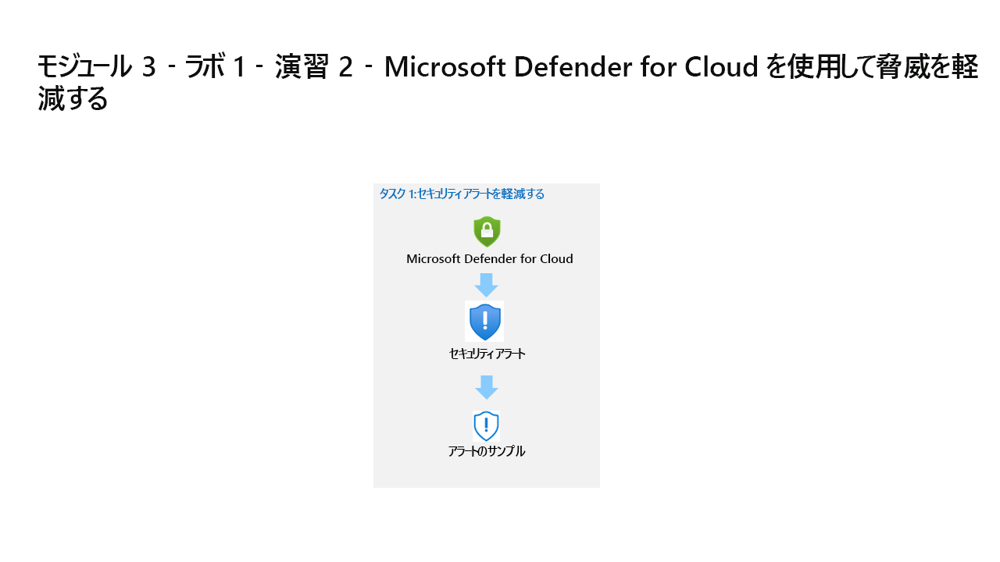

---
lab:
  title: 演習 2 ‐ Microsoft Defender for Cloud を使用して脅威を軽減する
  module: Module 3 - Mitigate threats using Microsoft Defender for Cloud
ms.openlocfilehash: 50d77067c70634a4f887a7c8669b38fa7977b860
ms.sourcegitcommit: a90325f86a3497319b3dc15ccf49e0396c4bf749
ms.translationtype: HT
ms.contentlocale: ja-JP
ms.lasthandoff: 04/07/2022
ms.locfileid: "141493959"
---
# モジュール 3 ‐ ラボ 1 ‐ 演習 2 ‐ Microsoft Defender for Cloud を使用して脅威を軽減する

## ラボのシナリオ

あなたは、Microsoft Defender for Cloud を実装した企業で働いているセキュリティ運用アナリストです。 Microsoft Defender for Cloud が生成するセキュリティ アラートに対応する必要があります。

### タスク 1:セキュリティ・アラートを軽減する

このタスクでは、サンプルのセキュリティアラートを読み込み、アラートの詳細を確認します。

>**重要:** 次の手順は、以前に作業していたものとは異なるマシンで行います。 仮想マシン名の参照を探します。

1. 管理者として WIN1 仮想マシンにログインします。パスワードは **Pa55w.rd**。  

1. Edge ブラウザーで Azure portal (https://portal.azure.com) を開きます。

1. **サインイン** ダイアログ ボックスで、ラボ ホスティング プロバイダーから提供された **テナントの電子メール** アカウントをコピーして貼り付け、「**次へ**」を選択します。

1. **パスワードの入力** ダイアログ ボックスで、ラボ ホスティング プロバイダーから提供された **テナントパスワード** をコピーして貼り付け、「**サインイン**」を選択します。

1. Azure portal の検索バーに「*Defender*」と入力し、 **[Microsoft Defender for Cloud]** を選択します。

1. ポータル メニューの *[全般]* で、 **[セキュリティ アラート]** を選択します。

1. コマンド バーから **[サンプル アラート]** を選択します。 **ヒント:** コマンド バーから省略記号 (...) ボタンを選択する必要がある場合があります。

1. サンプルアラートの作成（プレビュー）ペインで、サブスクリプションが選択されていることを確認します。 *[Defender for Cloud プラン]* 領域ですべてのサンプル アラートが選択されていることを確認し、 **[サンプル アラートの作成]** を選択します。  

    >**注:**  このサンプル アラートの作成プロセスの完了には、数分かかる場合があります。"サンプル アラートが正常に作成されました" 通知が表示されるのを待ちます。 完了すると、各アラートが *[セキュリティ アラート]* 領域に表示されます。

1. 注意が引かれたアラートには、次のアクションを実行します。

    - アラートを選択すると、アラートに関する情報が表示されます。 **[View full details]\(完全な詳細を表示\)** を選択します。

    - *[アラートの詳細]* タブを確認して読みます。

    - **[アクションの実行]** タブを選択するか、ページの終わりの **[次へ:アクションの実行]** ボタンを選択します。

    - *[アクションの実行]* の情報を確認します。 アクションの実行のセクションは、次のアラートの種類によることに注意してください。脅威の軽減、将来の攻撃の防止、自動応答のトリガー、類似のアラートの抑制。

## これでラボは完了です。
