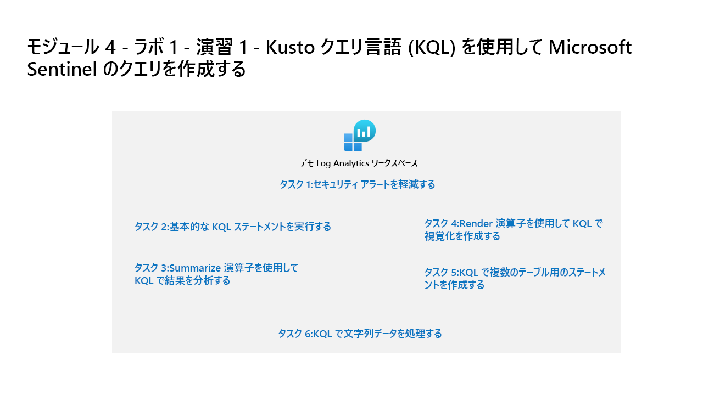

---
lab:
  title: '演習 1: Kusto クエリ言語 (KQL) を使用して Microsoft Sentinel のクエリを作成する'
  module: Module 4 - Create queries for Microsoft Sentinel using Kusto Query Language (KQL)
---

# <a name="module-4---lab-1---exercise-1---create-queries-for-microsoft-sentinel-using-kusto-query-language-kql"></a>モジュール 4 - ラボ 1 - 演習 1 - Kusto クエリ言語 (KQL) を使用して Microsoft Sentinel のクエリを作成する

## <a name="lab-scenario"></a>ラボのシナリオ



あなたは、Microsoft Sentinel を実装しようとしている会社で働いているセキュリティ運用アナリストです。 悪意のあるアクティビティを検索し、視覚化を表示し、脅威ハンティングを実行するためにログ データ分析を行う責任があります。 ログ データのクエリには、Kusto クエリ言語 (KQL) を使用します。

>**重要:** このラボでは、多くの KQL スクリプトを Microsoft Sentinel に入力する必要があります。 これらのスクリプトは、このラボの最初にファイルで提供されます。 また、 https://github.com/MicrosoftLearning/SC-200T00A-Microsoft-Security-Operations-Analyst/tree/master/Allfiles からダウンロードすることもできます。


### <a name="task-1-access-the-kql-testing-area"></a>タスク 1:KQL テスト領域にアクセスする

このタスクでは、KQLステートメントの記述を練習できるLog Analytics環境にアクセスします。

1. 管理者として **WIN1** 仮想マシンにログインします。パスワードは **Pa55w.rd** です。  

1. ブラウザーで https://aka.ms/lademo にアクセスします。 MOD管理者の資格情報を使用してログインします。 

1. 画面左側のタブのリストから使用可能なテーブルを調べます。

1. クエリ エディタで、次のクエリを入力し、**[実行]** ボタンを選択します。 下部のウィンドウにクエリ結果が表示されます。

    ```KQL
    SecurityEvent
    ```

1. 最初のレコードの横にある **[>]** を選択して、行の情報を展開します。


### <a name="task-2-run-basic-kql-statements"></a>タスク 2:基本的なKQL ステートメントを実行する

このタスクでは 基本的なKQL ステートメントを作成します。

>**重要:** 各クエリで、クエリ ウィンドウから前のステートメントをクリアするか、最後に開いたタブの後の **[+]** を選択して新しいクエリ ウィンドウを開きます (最大 25 個)。

1. 次のステートメントは、**let** ステートメントを使用して *変数* を宣言する方法を示しています。 クエリ ウィンドウで、次のステートメントを入力し、 **[実行]** を選択します。 

    ```KQL
    let timeOffset = 1h;
    let discardEventId = 4688;
    SecurityEvent
    | where TimeGenerated > ago(timeOffset*2) and TimeGenerated < ago(timeOffset)
    | where EventID != discardEventId
    ```

1. 次のステートメントは、**let** ステートメントを使用して *動的リスト* を宣言する方法を示しています。 クエリ ウィンドウで、次のステートメントを入力し、 **[実行]** を選択します。 

    ```KQL
    let suspiciousAccounts = datatable(account: string) [
      @"\administrator", 
      @"NT AUTHORITY\SYSTEM"
    ];
    SecurityEvent  
    | where TimeGenerated > ago(1h)
    | where Account in (suspiciousAccounts)
    ```

    >**ヒント:** クエリ ウィンドウで省略記号 (...) を選択し、 **[Format query](クエリの形式設定)** を選択すると、クエリの形式を簡単に再設定できます。
    
1. 次のステートメントは、**let** ステートメントを使用して *動的テーブル* を宣言する方法を示しています。 クエリ ウィンドウで、次のステートメントを入力し、 **[実行]** を選択します。 

    ```KQL
    let LowActivityAccounts =
        SecurityEvent 
        | summarize cnt = count() by Account 
        | where cnt < 1000;
    LowActivityAccounts | where Account contains "sql"
    ```

1. クエリ ウィンドウで、 **[時間の範囲]** を **[過去 1 時間]** に変更します。 これにより、次のステートメントの結果が制限されます。

1. 次のステートメントは、テーブル内のすべての列を検索して値を見つける **search** 演算子を示しています。 クエリ ウィンドウで、次のステートメントを入力し、 **[実行]** を選択します。 

    ```KQL
    search "err"
    ```

1. 次のステートメントは、**in** 句でリストされたテーブル全体を検索する **search** 演算子を示しています。 クエリ ウィンドウで、次のステートメントを入力し、**[実行]** を選択します。 

    ```KQL
    search in (SecurityEvent,SecurityAlert,A*) "err"
    ```

1. クエリ ウィンドウで、 **[時間の範囲]** を **[過去 24 時間]** に戻します。

1. 次のステートメントは、特定の述語でフィルター処理する **where** 演算子を示しています。 クエリ ウィンドウで、次のステートメントを入力し、 **[実行]** を選択します。 

    >**注:**  次のコード ブロックの各クエリを入力した後に **[実行]** を選択する必要があります。

    ```KQL
    SecurityEvent  
    | where TimeGenerated > ago(1h)
    ```

    ```KQL
    SecurityEvent  
    | where TimeGenerated > ago(1h) and EventID == "4624"
    ```

    ```KQL
    SecurityEvent  
    | where TimeGenerated > ago(1h)
    | where EventID == 4624
    | where AccountType =~ "user"
    ```

    ```KQL
    SecurityEvent  
    | where TimeGenerated > ago(1h) and EventID in (4624, 4625)
    ```

1. 次のステートメントは、計算列を作成し、それを結果セットに追加する **extend** 演算子を示しています。 クエリ ウィンドウで、次のステートメントを入力し、**[実行]** を選択します。 

    ```KQL
    SecurityEvent  
    | where TimeGenerated > ago(1h)
    | where ProcessName != "" and Process != ""
    | extend StartDir =  substring(ProcessName,0, string_size(ProcessName)-string_size(Process))
    ```

1. 次のステートメントは、入力テーブルの行を 1 つ以上の列で昇順または降順に並べ替える **order by** 演算子を示しています。 **order by** 演算子は、**sort by** 演算子のエイリアスです。 クエリ ウィンドウで、次のステートメントを入力し、**[実行]** を選択します。 

    ```KQL
    SecurityEvent  
    | where TimeGenerated > ago(1h)
    | where ProcessName != "" and Process != ""
    | extend StartDir =  substring(ProcessName,0, string_size(ProcessName)-string_size(Process))
    | order by StartDir desc, Process asc
    ```

1. 次のステートメントは、指定された順序で含める列を選択する **project** 演算子を示しています。 クエリ ウィンドウで、次のステートメントを入力し、**[実行]** を選択します。 

    ```KQL
    SecurityEvent  
    | where TimeGenerated > ago(1h)
    | where ProcessName != "" and Process != ""
    | extend StartDir =  substring(ProcessName,0, string_size(ProcessName)-string_size(Process))
    | order by StartDir desc, Process asc
    | project Process, StartDir
    ```

1. 次のステートメントは、出力から除外する列を選択する **project-away** 演算子を示しています。 クエリ ウィンドウで、次のステートメントを入力し、 **[実行]** を選択します。 

    ```KQL
    SecurityEvent  
    | where TimeGenerated > ago(1h)
    | where ProcessName != "" and Process != ""
    | extend StartDir =  substring(ProcessName,0, string_size(ProcessName)-string_size(Process))
    | order by StartDir desc, Process asc
    | project-away ProcessName
    ```


### <a name="task-3-analyze-results-in-kql-with-the-summarize-operator"></a>タスク 3:Summarize演算子を使用してKQLで結果を分析する

このタスクでは、データを集計するための KQL ステートメントを作成します。 **summarize** は、**by** グループ列別に行をグループ化し、各グループの集計を計算します。

1. 次のステートメントは、グループ数を返す **count()** 関数を示しています。 クエリ ウィンドウで、次のステートメントを入力し、**[実行]** を選択します。 

    ```KQL
    SecurityEvent  
    | where TimeGenerated > ago(1h) and EventID == '4688'  
    | summarize count() by Process, Computer
    ```

1. 次のステートメントも **count()** 関数を示していますが、今度の例では、列に *cnt* という名前が付けられています。 クエリ ウィンドウで、次のステートメントを入力し、**[実行]** を選択します。 

    ```KQL
    SecurityEvent  
    | where TimeGenerated > ago(1h) and EventID == '4624'  
    | summarize cnt=count() by AccountType, Computer
    ```

1. 次のステートメントは、グループ要素の個別カウントの概数を返す **dcount()** 関数を示しています。 クエリ ウィンドウで、次のステートメントを入力し、 **[実行]** を選択します。 

    ```KQL
    SecurityEvent  
    | where TimeGenerated > ago(1h)
    | summarize dcount(IpAddress)
    ```

1. 次のステートメントは、同じアカウントに対する複数のアプリケーション間で MFA エラーを検出するルールです。 クエリ ウィンドウで、次のステートメントを入力し、 **[実行]** を選択します。 

    ```KQL
    let timeframe = 30d;
    let threshold = 1;
    SigninLogs
    | where TimeGenerated >= ago(timeframe)
    | where ResultDescription has "MFA"
    | summarize applicationCount = dcount(AppDisplayName) by UserPrincipalName, IPAddress
    | where applicationCount >= threshold
    ```

1. 次のステートメントは、引数が最大化される場合に 1 つ以上の式を返す **arg_max()** 関数を示しています。 次のステートメントでは、SQL12.NA.contosohotels.com コンピューターの SecurityEvent テーブルから最新の行を返します。 arg_max 関数の * で、その行のすべての列を要求します。 クエリ ウィンドウで、次のステートメントを入力し、 **[実行]** を選択します。 

    ```KQL
    SecurityEvent  
    | where Computer == "SQL12.na.contosohotels.com"
    | summarize arg_max(TimeGenerated,*) by Computer
    ```

1. 次のステートメントは、引数が最小化される場合に 1 つ以上の式を返す **arg_min()** 関数を示しています。 このステートメントでは、SQL12.NA.contosohotels.com コンピューターの最も古い SecurityEvent を結果セットとして返します。 クエリ ウィンドウで、次のステートメントを入力し、**[実行]** を選択します。 

    ```KQL
    SecurityEvent  
    | where Computer == "SQL12.na.contosohotels.com"
    | summarize arg_min(TimeGenerated,*) by Computer
    ```

1. 次のステートメントは、*パイプ* の順序に基づいて結果を理解することの重要性を示しています。 クエリ ウィンドウで、次のクエリを入力し、各クエリを個別に実行します。 

    1. **Query 1** には、最後のアクティビティがログインだった Account が含まれます。 まず、SecurityEvent テーブルが集計され、各 Account の最新の行が返されます。 その後、EventID が 4624 (ログイン) に等しい行のみが返されます。

        ```KQL
        SecurityEvent  
        | summarize arg_max(TimeGenerated, *) by Account
        | where EventID == '4624'  
        ```

    1. **Query 2** には、ログインしている Account の最新のログインが含まれます。 SecurityEvent テーブルは、EventID = 4624 のみを含むようにフィルター処理されます。 これらの結果は、Account ごとに最新のログイン行に対して集計されます。

        ```KQL
        SecurityEvent  
        | where EventID == '4624'  
        | summarize arg_max(TimeGenerated, *) by Account
        ```

    >**注:**  右下の "クエリの詳細" リンクを選択して、"合計 CPU" と "処理されたクエリに使用するデータ" を確認し、両方のステートメント間のデータを比較することもできます。

1. 次のステートメントは、グループ内のすべての値の *リスト* を返す**make_list()** 関数を示しています。 この KQL クエリでは、まず where 演算子を使用して EventID をフィルター処理します。 次に、各コンピューターについて、結果がアカウントの JSON 配列になります。 結果として得られる JSON 配列には、重複するアカウントが含まれます。 クエリ ウィンドウで、次のステートメントを入力し、 **[実行]** を選択します。 

    ```KQL
    SecurityEvent  
    | where TimeGenerated > ago(1h)
    | where EventID == '4624'  
    | summarize make_list(Account) by Computer
    ```

1. 次のステートメントは、グループ内の *個別* の値のセットを返す **make_set()** 関数を示しています。 この KQL クエリでは、まず where 演算子を使用して EventID をフィルター処理します。 次に、各 Computer について、結果が一意の Account の JSON 配列になります。 クエリ ウィンドウで、次のステートメントを入力し、 **[実行]** を選択します。 

    ```KQL
    SecurityEvent  
    | where TimeGenerated > ago(1h)
    | where EventID == '4624'  
    | summarize make_set(Account) by Computer
    ```


### <a name="task-4-create-visualizations-in-kql-with-the-render-operator"></a>タスク 4:レンダー演算子を使用してKQLでビジュアライゼーションを作成します

このタスクでは,KQLステートメントを使用した視覚化の生成を使用します

1. 次のステートメントは、**barchart** 視覚化を使用する **render** 演算子を示しています (これは、結果をグラフィカル出力としてレンダリングします)。 クエリ ウィンドウで、次のステートメントを入力し、 **[実行]** を選択します。 

    ```KQL
    SecurityEvent  
    | where TimeGenerated > ago(1h)
    | summarize count() by Account
    | render barchart
    ```

1. 次のステートメントは、結果を時系列で視覚化する**render** 演算子を示しています。 **bin()** 関数は、多くの場合、**summarize**と組み合わせて使用され、期間内のすべての値を丸めてグループ化します。 値のセットが分散している場合、その値は特定の値の小さなセットにグループ化されます。 生成された結果を組み合わせて、**timechart** を指定した **render** 演算子にそれらをパイプすると、時系列の視覚化が提供されます。 クエリ ウィンドウで、次のステートメントを入力し、 **[実行]** を選択します。 

    ```KQL
    SecurityEvent  
    | where TimeGenerated > ago(1h)
    | summarize count() by bin(TimeGenerated, 1m)
    | render timechart
    ```


### <a name="task-5-build-multi-table-statements-in-kql"></a>タスク 5:KQLでマルチテーブルステートメントを作成する

このタスクでは、マルチテーブルKQLステートメントを作成します。

1. クエリ ウィンドウで、 **[時間の範囲]** を **[過去 1 時間]** に変更します。 これにより、次のステートメントの結果が制限されます。

1. 次のステートメントは、2 つ以上のテーブルを取得し、すべての行を返す **union** 演算子を示しています。 結果を渡す方法、およびパイプ文字によってどのような影響があるかを理解することは重要です。 クエリ ウィンドウで、次のステートメントを入力し、クエリごとに **[実行]** を個別に選択して、結果を確認します。 

    1. **Query 1** で SecurityEvent のすべての行と SigninLogs のすべての行が返されます。

        ```KQL
        SecurityEvent  
        | union SigninLogs  
        ```

    1. **Query 2** で SigninLogs のすべての行数と SecurityEvent のすべての行数である 1 つの行と列が返されます。

        ```KQL
        SecurityEvent  
        | union SigninLogs  
        | summarize count() 
        ```

    1. **Query 3** で SecurityEvent のすべての行と SigninLogs の 1 つの (最後の) 行が返されます。 SigninLogs の最後の行には、行の合計数を集計したカウントが含まれます。

        ```KQL
        SecurityEvent  
        | union (SigninLogs | summarize count() | project count_)
        ```

1. 次のステートメントは、ワイルドカードを使用して複数のテーブルの和集合を求める **union** 演算子を示しています。 クエリ ウィンドウで、次のステートメントを入力し、 **[実行]** を選択します。 

    ```KQL
    union Security*  
    | summarize count() by Type
    ```

1. 次のステートメントは、各テーブルから指定された列の値を照合することにより、2 つのテーブルの行をマージして新しいテーブルを形成する **join** 演算子を示しています。 クエリ ウィンドウで、次のステートメントを入力し、 **[実行]** を選択します。 

    ```KQL
    SecurityEvent  
    | where EventID == "4624" 
    | summarize LogOnCount=count() by EventID, Account
    | project LogOnCount, Account
    | join kind = inner( 
     SecurityEvent  
    | where EventID == "4634" 
    | summarize LogOffCount=count() by EventID, Account
    | project LogOffCount, Account
    ) on Account
    ```

    >**重要:** 結合で指定した最初のテーブルが、左テーブルと見なされます。 **join** 演算子の後のテーブルが右テーブルです。 テーブルの列を操作する場合、$ left.Columnnameと$ right.Column nameは、参照されるテーブルの列を区別するためのものです。 **join** 演算子では、すべての型 (flouter、inner、innerunique、leftanti、leftantisemi、leftouter、leftsemi、rightanti、rightantisemi、rightouter、rightsemi) がサポートされます。

1. クエリ ウィンドウで、 **[時間の範囲]** を **[過去 24 時間]** に戻します。


### <a name="task-6-work-with-string-data-in-kql"></a>タスク 6: KQLで文字列データを操作する

このタスクでは、KQLステートメントを使用して構造化および非構造化文字列フィールドを操作します。

1. 次のステートメントは、ソース文字列から正規表現の一致を取得する **extract** 関数を示しています。 抽出されたサブ文字列を指定された型に変換するオプションがあります。 クエリ ウィンドウで、次のステートメントを入力し、**[実行]** を選択します。 

    ```KQL
    print extract("x=([0-9.]+)", 1, "hello x=45.6|wo") == "45.6"
    ```

1. 次のステートメントでは、**extract** 関数を使用して、SecurityEvent テーブルの Account フィールドから Account Name を取得します。 クエリ ウィンドウで、次のステートメントを入力し、 **[実行]** を選択します。 

    ```KQL
    SecurityEvent  
    | where EventID == '4672' and AccountType == 'User' 
    | extend Account_Name = extract(@"^(.*\\)?([^@]*)(@.*)?$", 2, tolower(Account))
    | summarize LoginCount = count() by Account_Name
    | where Account_Name != ""
    | where LoginCount < 10
    ```

1. 次のステートメントは、文字列式を評価して、その値を 1 つ以上の計算列に解析する **parse** 演算子を示しています。 非構造化データを構造化するために使用されます。 クエリ ウィンドウで、次のステートメントを入力し、 **[実行]** を選択します。 

    ```KQL
    let Traces = datatable(EventText:string)
    [
    "Event: NotifySliceRelease (resourceName=PipelineScheduler, totalSlices=27, sliceNumber=23, lockTime=02/17/2016 08:40:01, releaseTime=02/17/2016 08:40:01, previousLockTime=02/17/2016 08:39:01)",
    "Event: NotifySliceRelease (resourceName=PipelineScheduler, totalSlices=27, sliceNumber=15, lockTime=02/17/2016 08:40:00, releaseTime=02/17/2016 08:40:00, previousLockTime=02/17/2016 08:39:00)",
    "Event: NotifySliceRelease (resourceName=PipelineScheduler, totalSlices=27, sliceNumber=20, lockTime=02/17/2016 08:40:01, releaseTime=02/17/2016 08:40:01, previousLockTime=02/17/2016 08:39:01)",
    "Event: NotifySliceRelease (resourceName=PipelineScheduler, totalSlices=27, sliceNumber=22, lockTime=02/17/2016 08:41:01, releaseTime=02/17/2016 08:41:00, previousLockTime=02/17/2016 08:40:01)",
    "Event: NotifySliceRelease (resourceName=PipelineScheduler, totalSlices=27, sliceNumber=16, lockTime=02/17/2016 08:41:00, releaseTime=02/17/2016 08:41:00, previousLockTime=02/17/2016 08:40:00)"
    ];
    Traces  
    | parse EventText with * "resourceName=" resourceName ", totalSlices=" totalSlices:long * "sliceNumber=" sliceNumber:long * "lockTime=" lockTime ", releaseTime=" releaseTime:date "," * "previousLockTime=" previousLockTime:date ")" *  
    | project resourceName, totalSlices, sliceNumber, lockTime, releaseTime, previousLockTime
    ```

1. 次のステートメントは、**dynamic** 型フィールドの操作を示しています。これらは、他のデータ型の任意の値を取ることができる特殊なフィールドです。 この例では、SigninLogs テーブルの DeviceDetail フィールドの型は**動的**です。 クエリ ウィンドウで、次のステートメントを入力し、 **[実行]** を選択します。 

    ```KQL
    SigninLogs | extend OS = DeviceDetail.operatingSystem
    ```

1. 次の例では、SigninLogs のパックされたフィールドを分割する方法を示します。 クエリ ウィンドウで、次のステートメントを入力し、 **[実行]** を選択します。 

    ```KQL
    SigninLogs | extend OS = DeviceDetail.operatingSystem, Browser = DeviceDetail.browser
    | extend CAPol0Name = tostring(ConditionalAccessPolicies[0].displayName), CAPol0Result = tostring(ConditionalAccessPolicies[0].result)
    | extend CAPol1Name = tostring(ConditionalAccessPolicies[1].displayName), CAPol1Result = tostring(ConditionalAccessPolicies[1].result)
    | extend CAPol2Name = tostring(ConditionalAccessPolicies[2].displayName), CAPol2Result = tostring(ConditionalAccessPolicies[2].result)
    | extend StatusCode = tostring(Status.errorCode), StatusDetails = tostring(Status.additionalDetails)
    | extend Date = startofday(TimeGenerated), City = tostring(LocationDetails.city)
    | summarize count() by Date, Identity, UserDisplayName, UserPrincipalName, IPAddress, City, ResultType, ResultDescription, StatusCode, StatusDetails, CAPol0Name, CAPol0Result, CAPol1Name, CAPol1Result, CAPol2Name, CAPol2Result
    | sort by Date
    ```

    >**重要:** dynamic 型は JSON のように見えますが、JSON 内に存在しないため、JSON モデルでは表現されない値を保持できます。 このため、dynamic 型の値を JSON 表現にシリアル化する場合、JSON では表現できない値は文字列値にシリアル化されます。 

1. 次のステートメントは、文字列フィールドに格納された JSON を操作する演算子を示しています。 多くのログでは、データを JSON 形式で送信します。このため、JSON データをクエリ可能なフィールドに変換する方法を知っておく必要があります。 クエリ ウィンドウで、次のステートメントを入力し、 **[実行]** を選択します。 

    ```KQL
    SigninLogs | extend Location =  todynamic(LocationDetails)
    | extend City =  Location.city
    | extend City2 = Location["city"]
    | project Location, City, City2
    ```

1. 次のステートメントは、動的配列を行に変換する **mv-expand** 演算子を示しています (複数値の展開)。

    ```KQL
    SigninLogs | mv-expand Location = todynamic(LocationDetails)
    ```

1. 次のステートメントは、サブクエリを各レコードに適用し、すべてのサブクエリの結果の和集合を返す **mv-apply** 演算子を示しています。

    ```KQL
    SigninLogs  
    | mv-apply Location = todynamic(LocationDetails) on 
    ( where Location.countryOrRegion == "ES")
    ```

1. **関数**は、保存された名前をコマンドとして使用して、他のログ クエリで使用できるログ クエリです。 **関数**を作成するには、クエリを実行した後、**[保存]** ボタンを選択し、ドロップダウンから **[関数として保存]** を選択します。 希望する名前 (例: *PrivLogins*) を **[関数名]** ボックスに入力し、 **[レガシ カテゴリ]** (例: *General*) を入力し、 **[保存]** を選択します。 この関数を KQL で関数するには、関数のエイリアスを使用します。

    >**注:**  お使いのアカウントには閲覧者権限しかないため、このラボで使用する lademo 環境ではこれを行うことはできませんが、クエリをより効率的かつ効果的にするために重要な概念です。 

    ```KQL
    PrivLogins  
    ```

## <a name="you-have-completed-the-lab"></a>これでラボは完了です。
