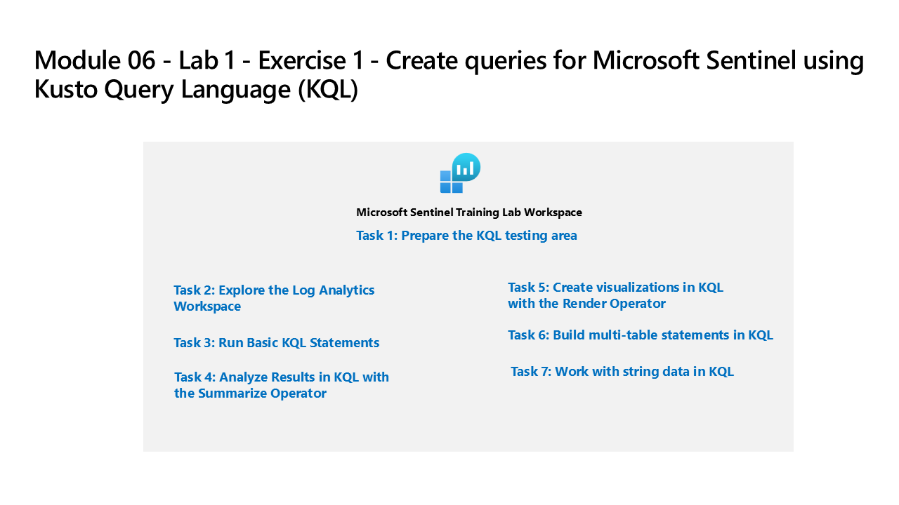

---
lab:
  title: '演習 1: Kusto クエリ言語 (KQL) を使用して Microsoft Sentinel のクエリを作成する'
  module: Learning Path 5 - Create queries for Microsoft Sentinel using Kusto Query Language (KQL)
  description: あなたは、Microsoft Sentinel を実装しようとしている会社で働いているセキュリティ運用アナリストです。 悪意のあるアクティビティを検索し、視覚化を表示し、脅威ハンティングを実行するためにログ データ分析を行う責任があります。 ログ データのクエリを実行するには、Kusto クエリ言語 (KQL) を使用します。
  duration: 45 minutes
  level: 300
  islab: true
  primarytopics:
    - Microsoft Sentinel
    - Kusto Query Language (KQL)
---

# ラーニング パス 5 - ラボ 1 - 演習 1 - Kusto 照会言語 (KQL) を使用して Microsoft Sentinel のクエリを作成する

## ラボのシナリオ



あなたは、Microsoft Sentinel を実装しようとしている会社で働いているセキュリティ運用アナリストです。 悪意のあるアクティビティを検索し、視覚化を表示し、脅威ハンティングを実行するためにログ データ分析を行う責任があります。 ログ データのクエリを実行するには、Kusto クエリ言語 (KQL) を使用します。

>**重要:** ラーニング パス #5 のラボ演習は、*スタンドアロン*環境にあります。 ラボを完了する前に終了した場合は、構成手順をもう一度実行し直す必要があります。

<!--- >**Note:** This lab profile takes >15 minutes to fully build as Microsoft Sentinel is being predeployed in your Azure subscription with the name **SentinelWorkspace-01**. --->

<!--- >**Tip:** This lab involves entering many KQL scripts into Microsoft Sentinel. The scripts were provided in a file at the beginning of this lab. An alternate location to download them is:  <https://github.com/MicrosoftLearning/SC-200T00A-Microsoft-Security-Operations-Analyst/tree/master/Allfiles> --->

### このラボの推定所要時間: 45 分

### タスク 1: Defender XDR で KQL を使用してログ データのクエリを実行する

1. Microsoft Edge ブラウザーで、Defender XDR (`https://security.microsoft.com`) に移動します。

1. **[サインイン]** ダイアログ ボックスで、ラボ ホスティング プロバイダーから提供された**テナントの電子メール** アカウントをコピーして貼り付け、**[次へ]** を選択します。

1. **[パスワードの入力]** ダイアログ ボックスで、ラボ ホスティング プロバイダーから提供された**テナントパスワード**をコピーして貼り付け、**[サインイン]** を選択します。

    >**注:**  パスワードの代わりに "一時アクセス パス" (TAP) を入力するように求められる場合があります。**

1. Microsoft Defender ナビゲーション メニューで、下にスクロールし、**[調査と対応]** セクションを展開します。

1. **[ハンティング]** セクションを展開して、**[高度なハンティング]** を選びます。

   >**重要:** 最初に KQL クエリをメモ帳に貼り付けて、そこから *[新しいクエリ 1]* ログ ウィンドウにコピーしてエラーを回避してください。

   >**注:** "security.microsoft.com は次のことを求めています。 クリップボードにコピーしたテキストや画像の参照" というメッセージが表示されたら、**[許可]** を選択します。

1. [新しいクエリ] タブで、次のクエリを入力し、**[クエリを実行]** ボタンを選択します。** 下部のウィンドウにクエリ結果が表示されます。

    ```KQL
    SecurityEvent_CL
    ```

    >**注:**  *SecurityEvent_CL* テーブルは、Microsoft Sentinel Training Lab Solution によって作成されるカスタム テーブルです。 それに含まれるサンプル データを使って、KQL ステートメントの記述を練習できます。

1. 既定の結果では、"タイムライン可視化" グラフがレンダリングされます。**

1. "タイムライン可視化" グラフを折りたたんで画面領域を増やし、最初のレコードの横にある **[>]** まで下にスクロールして、行の情報を展開します。**

### タスク 2:基本的なKQL ステートメントを実行する

このタスクでは 基本的なKQL ステートメントを構築します。

>**重要:** 各クエリで、クエリ ウィンドウから前のステートメントをクリアするか、最後に開いたタブの後にある **+** を選択して新しいクエリ ウィンドウを開きます (最大 25 個)。

1. 次のステートメントは、テーブル内のすべての列を検索して値を見つける **search** 演算子を示しています。

1. ラボの残りの部分では、[時間の範囲] を既定の **[直近 24 時間]** から **[過去 7 日間]** に変更します。**

1. クエリ ウィンドウで、次のステートメントを入力し、**[実行]** を選択します。

    ```KQL
    search "Computer"
    ```

    >**注:**  特定のテーブルや修飾句なしで *Search* 演算子を使用することは、テーブル固有および列固有のテキスト フィルター処理よりも効率性が下がります。 "クエリ実行中に予期せぬエラーが発生しました。" というエラーメッセージを受け取った場合は、詳細情報を得るために **[完全なクエリの詳細を見る]** リンクを選択してください。

1. 次のステートメントは、**in** 句でリストされたテーブル全体を検索する **search** 演算子を示しています。 クエリ ウィンドウで、次のステートメントを入力し、**[実行]** を選択します。

    ```KQL
    search in (SecurityEvent_CL,App*) "new"
    ```

1. 次のステートメントは、特定の述語でフィルター処理する **where** 演算子を示しています。 クエリ ウィンドウで、次のステートメントを入力し、**[実行]** を選択します。

    >**重要:** **[実行]** は、次のコード ブロックから各クエリを入力した後に選択する必要があります。

    ```KQL
    SecurityEvent_CL  
    | where TimeGenerated > ago(5d)
    ```

    >**注:** *[時間の範囲]* には、TimeGenerated 列でフィルター処理しているため、 *[クエリで設定]* が表示されます。

    ```KQL
    SecurityEvent_CL  
    | where TimeGenerated > ago(5d) and EventID_s == 4624
    ```

    ```KQL
    SecurityEvent_CL  
    | where TimeGenerated > ago(5d)
    | where EventID_s == 4624  
    | where AccountType_s =~ "user"
    ```

    ```KQL
    SecurityEvent_CL  
    | where TimeGenerated > ago(5d) and EventID_s in (4624, 4625)
 
    ```

1. 次のステートメントは、**let** ステートメントを使用して *変数* を宣言する方法を示しています。 クエリ ウィンドウで、次のステートメントを入力し、**[実行]** を選択します。

    ```KQL
    let timeOffset = 1d;
    let discardEventID = 4688;
    SecurityEvent_CL
    | where TimeGenerated > ago(timeOffset*60) and TimeGenerated < ago(timeOffset)
    | where EventID_s != discardEventID
    ```

1. 次のステートメントは、**let** ステートメントを使用して *動的リスト* を宣言する方法を示しています。 クエリ ウィンドウで、次のステートメントを入力し、**[実行]** を選択します。

    ```KQL
    let suspiciousAccounts = datatable(account: string) [
      @"NA\timadmin",
      @"NT AUTHORITY\SYSTEM"
    ];
    SecurityEvent_CL
    | where TimeGenerated > ago(7d)
    | where Account_s in (suspiciousAccounts)
    ```

1. 次のステートメントは、**let** ステートメントを使用して *動的テーブル* を宣言する方法を示しています。 クエリ ウィンドウで、次のステートメントを入力し、**[実行]** を選択します。

    ```KQL
    let LowActivityAccounts =
        SecurityEvent_CL 
        | summarize cnt = count() by Account_s 
        | where cnt < 1000;
    LowActivityAccounts | where Account_s contains "sql"
    ```

### タスク 3:Summarize演算子を使用してKQLで結果を分析する

このタスクでは、データを集計する KQL ステートメントを構築します。 **summarize** は、**by** グループ列別に行をグループ化し、各グループの集計を計算します。

1. 次のステートメントは、グループ数を返す **count()** 関数を示しています。 クエリ ウィンドウで、次のステートメントを入力し、**[実行]** を選択します。

    ```KQL
    SecurityEvent_CL  
    | where TimeGenerated > ago(5d) and EventID_s == 4688  
    | summarize count() by Computer
    ```

1. 次のステートメントも **count()** 関数を示していますが、今度の例では、列に *cnt* という名前が付けられています。 クエリ ウィンドウで、次のステートメントを入力し、**[実行]** を選択します。

    ```KQL
    SecurityEvent_CL  
    | where TimeGenerated > ago(5d) and EventID_s == 4624  
    | summarize cnt=count() by AccountType_s, Computer
    ```

1. 次のステートメントは、グループ要素の個別カウントの概数を返す **dcount()** 関数を示しています。 クエリ ウィンドウで、次のステートメントを入力し、**[実行]** を選択します。

    ```KQL
    SigninLogs_CL  
    | where TimeGenerated > ago(5d)
    | summarize dcount(IPAddress)
    ```

1. 次のステートメントは、同じアカウントに対する複数のアプリケーション間での "ユーザー アカウントが無効になっています" エラーを検出するルールです。** クエリ ウィンドウで、次のステートメントを入力し、**[実行]** を選択します。

    ```KQL
    let timeframe = 30d;
    let threshold = 1;
    SigninLogs_CL
    | where TimeGenerated >= ago(timeframe)
    | where ResultDescription has "User account is disabled"
    | summarize applicationCount = dcount(AppDisplayName_s) by UserPrincipalName_s, IPAddress_s
    | where applicationCount >= threshold
    ```

1. 次のステートメントは、引数が最大化される場合に 1 つ以上の式を返す **arg_max()** 関数を示しています。 次のステートメントでは、 コンピューター *VictimPC2*の SecurityEvent_CL テーブルから最新の行が返されます。 arg_max 関数の * で、その行のすべての列を要求します。 クエリ ウィンドウで、次のステートメントを入力し、**[実行]** を選択します。

    ```KQL
    SecurityEvent_CL  
    | where Computer == "VictimPC2"
    | summarize arg_max(TimeGenerated,*) by Computer
    ```

1. 次のステートメントは、引数が最小化される場合に 1 つ以上の式を返す **arg_min()** 関数を示しています。 このステートメントでは、コンピューター *VictimPC2* の最も古い SecurityEvent_CL が結果セットとして返されます。 クエリ ウィンドウで、次のステートメントを入力し、**[実行]** を選択します。

    ```KQL
    SecurityEvent_CL  
    | where Computer == "VictimPC2"
    | summarize arg_min(TimeGenerated,*) by Computer
    ```

1. 次のステートメントは、*パイプ* の順序に基づいて結果を理解することの重要性を示しています。 クエリ ウィンドウで、次のクエリを入力し、各クエリを個別に実行します。

    1. **Query 1** には、最後のアクティビティがログインだった Account が含まれます。 最初に SecurityEvent_CL テーブルが集計されて、各 Account の最新の行が返されます。 その後、EventID_s が 4624 (ログイン) に等しい行のみが返されます。

        ```KQL
        SecurityEvent_CL  
        | summarize arg_max(TimeGenerated, *) by Account_s 
        | where EventID_s == 4624  
        ```

    1. **Query 2** には、ログインしている Account の最新のログインが含まれます。 SecurityEvent_CL テーブルは、EventID_s = 4624 のみを含むようにフィルター処理されます。 そしてこれらの結果は、Account ごとに最新のログイン行に対して集計されます。

        ```KQL
        SecurityEvent_CL  
        | where EventID_s == 4624  
        | summarize arg_max(TimeGenerated, *) by Account_s
        ```

    >**注:**  右下の "クエリの詳細" リンクを選択して、"合計 CPU" と "処理されたクエリに使用するデータ" を確認し、両方のステートメント間のデータを比較することもできます。

1. 次のステートメントは、グループ内のすべての値の *リスト* を返す**make_list()** 関数を示しています。 この KQL クエリでは、まず where 演算子を使って EventID_s をフィルター処理します。 次に、各コンピューターについて、結果がアカウントの JSON 配列になります。 結果として得られる JSON 配列には、重複するアカウントが含まれます。 クエリ ウィンドウで、次のステートメントを入力し、**[実行]** を選択します。 

    ```KQL
    SecurityEvent_CL  
    | where TimeGenerated > ago(5d)
    | where EventID_s == 4624  
    | summarize make_list(Account_s) by Computer
    ```

1. 次のステートメントは、グループ内の *個別* の値のセットを返す **make_set()** 関数を示しています。 この KQL クエリでは、まず where 演算子を使って EventID_s をフィルター処理します。 次に、各 Computer について、結果が一意の Account の JSON 配列になります。 クエリ ウィンドウで、次のステートメントを入力し、**[実行]** を選択します。 

    ```KQL
    SecurityEvent_CL  
    | where TimeGenerated > ago(5d)
    | where EventID_s == 4624  
    | summarize make_set(Account_s) by Computer
    ```

### タスク 4:レンダー演算子を使用してKQLでビジュアライゼーションを作成します

このタスクでは、KQL ステートメントによる視覚化の生成を使用します。

1. 次のステートメントは、**columnchart** 視覚化を使用する **render** 演算子を示しています (これは、結果をグラフィカル出力としてレンダリングします)。 クエリ ウィンドウで、次のステートメントを入力し、**[実行]** を選択します。 

    ```KQL
    SecurityEvent_CL  
    | where TimeGenerated > ago(5d)
    | summarize count() by Account_s
    | render columnchart
    ```

1. 次のステートメントは、結果を時系列で視覚化する**render** 演算子を示しています。 **bin()** 関数は、多くの場合、**summarize**と組み合わせて使用され、期間内のすべての値を丸めてグループ化します。 値のセットが分散している場合、その値は特定の値の小さなセットにグループ化されます。 生成された結果を組み合わせて、**timechart** を指定した **render** 演算子にそれらをパイプすると、時系列の視覚化が提供されます。 クエリ ウィンドウで、次のステートメントを入力し、**[実行]** を選択します。 

    ```KQL
    SecurityEvent_CL  
    | where TimeGenerated > ago(5d)
    | summarize count() by bin(TimeGenerated, 1m)
    | render timechart
    ```

### タスク 5:KQLでマルチテーブルステートメントを作成する

このタスクでは、マルチテーブル KQL ステートメントを構築します。

1. 以下のステートメントについて、*[クエリ]* ウィンドウで **[時間の範囲]** を **[カスタムの時間範囲]** に変更し、少なくとも 5 日間を指定します。

1. 次のステートメントは、2 つ以上のテーブルを取得し、すべての行を返す **union** 演算子を示しています。 結果を渡す方法、およびパイプ文字によってどのような影響があるかを理解することは重要です。 クエリ ウィンドウで、次のステートメントを入力し、クエリごとに **[実行]** を個別に選択して、結果を確認します。

    1. **Query 1** では、SecurityEvent_CL のすべての行と SigninLogs_CL のすべての行が返されます。

        ```KQL
        SecurityEvent_CL
        | union SigninLogs_CL
        ```

    1. **Query 2** では、1 つの行と列が返されます。これは、SigninLogs_CL のすべての行数と SecurityEvent_CL のすべての行数です。

        ```KQL
        SecurityEvent_CL
        | union SigninLogs_CL
        | summarize count()
        ```

    1. **Query 3** では、SecurityEvent_CL のすべての行と SigninLogs_CL の 1 つの (最後の) 行が返されます。 SigninLogs_CL の最後の行には、集計された合計行数の値が含まれます。

        ```KQL
        SecurityEvent_CL
        | union (SigninLogs_CL | summarize count() | project count_)
        ```

    >**注:**  結果の '空の行' は、SigninLogs_CL の集計数を示します。

1. 次のステートメントは、ワイルドカードを使用して複数のテーブルの和集合を求める **union** 演算子を示しています。 クエリ ウィンドウで、次のステートメントを入力し、**[実行]** を選択します。

    ```KQL
    union Sec*  
    | summarize count() by Type
    ```

1. 次のステートメントは、各テーブルから指定された列の値を照合することにより、2 つのテーブルの行をマージして新しいテーブルを形成する **join** 演算子を示しています。 クエリ ウィンドウで、次のステートメントを入力し、**[実行]** を選択します。

    ```KQL
    SecurityEvent_CL  
    | where EventID_s == 4624 
    | summarize LogOnCount=count() by  EventID_s, Account_s
    | project LogOnCount, Account_s
    | join kind = inner( 
     SecurityEvent_CL  
    | where EventID_s == 4634 
    | summarize LogOffCount=count() by  EventID_s, Account_s
    | project LogOffCount, Account_s
    ) on Account_s
    ```

    >**重要:** 結合で指定した最初のテーブルが、左テーブルと見なされます。 **join** 演算子の後のテーブルが右テーブルです。 テーブルの列を操作する場合、$ left.Columnnameと$ right.Column nameは、参照されるテーブルの列を区別するためのものです。 **join** 演算子では、すべての型 (flouter、inner、innerunique、leftanti、leftantisemi、leftouter、leftsemi、rightanti、rightantisemi、rightouter、rightsemi) がサポートされます。

1. *[クエリ]* ウィンドウで先に設定した **[カスタムの時間範囲]** は、そのままにすることができます。

### タスク 6: KQLで文字列データを操作する

このタスクでは、KQL ステートメントを使用して構造化および非構造化文字列フィールドを操作します。

1. 次のステートメントは、ソース文字列から正規表現の一致を取得する **extract** 関数を示しています。 抽出されたサブ文字列を指定された型に変換するオプションがあります。 クエリ ウィンドウで、次のステートメントを入力し、**[実行]** を選択します。 

    ```KQL
    print extract("x=([0-9.]+)", 1, "hello x=45.6|wo") == "45.6"
    ```

1. 次のステートメントでは、**extract** 関数を使って、SecurityEvent_CL テーブルの Account_s フィールドから Account_s の名前を取得します。 クエリ ウィンドウで、次のステートメントを入力し、**[実行]** を選択します。 

    ```KQL
    SecurityEvent_CL  
    | where EventID_s == 4672 and AccountType_s == 'User' 
    | extend Account_Name = extract(@"^(.*\\)?([^@]*)(@.*)?$", 2, tolower(Account_s))
    | summarize LoginCount = count() by Account_Name
    | where Account_Name != "" 
    | where LoginCount < 10
    ```

1. 次のステートメントは、文字列式を評価して、その値を 1 つ以上の計算列に解析する **parse** 演算子を示しています。 非構造化データを構造化するために使用されます。 クエリ ウィンドウで、次のステートメントを入力し、**[実行]** を選択します。

    ```KQL
    let Traces = datatable(EventText:string)
    [
    "Event: NotifySliceRelease (resourceName=PipelineScheduler, totalSlices=27, sliceNumber=23, lockTime=02/17/2016 08:40:01, releaseTime=02/17/2016 08:40:01, previousLockTime=02/17/2016 08:39:01)",
    "Event: NotifySliceRelease (resourceName=PipelineScheduler, totalSlices=27, sliceNumber=15, lockTime=02/17/2016 08:40:00, releaseTime=02/17/2016 08:40:00, previousLockTime=02/17/2016 08:39:00)",
    "Event: NotifySliceRelease (resourceName=PipelineScheduler, totalSlices=27, sliceNumber=20, lockTime=02/17/2016 08:40:01, releaseTime=02/17/2016 08:40:01, previousLockTime=02/17/2016 08:39:01)",
    "Event: NotifySliceRelease (resourceName=PipelineScheduler, totalSlices=27, sliceNumber=22, lockTime=02/17/2016 08:41:01, releaseTime=02/17/2016 08:41:00, previousLockTime=02/17/2016 08:40:01)",
    "Event: NotifySliceRelease (resourceName=PipelineScheduler, totalSlices=27, sliceNumber=16, lockTime=02/17/2016 08:41:00, releaseTime=02/17/2016 08:41:00, previousLockTime=02/17/2016 08:40:00)"
    ];
    Traces   
    | parse EventText with * "resourceName=" resourceName ", totalSlices=" totalSlices:long * "sliceNumber=" sliceNumber:long * "lockTime=" lockTime ", releaseTime=" releaseTime:date "," * "previousLockTime=" previousLockTime:date ")" *  
    | project resourceName, totalSlices, sliceNumber, lockTime, releaseTime, previousLockTime
    ```

1. 次のステートメントは、文字列フィールドに格納された JSON を操作する演算子を示しています。 多くのログでは、データを JSON 形式で送信します。このため、JSON データをクエリ可能なフィールドに変換する方法を知っておく必要があります。 クエリ ウィンドウで、次のステートメントを入力し、**[実行]** を選択します。

    ```KQL
    SigninLogs_CL 
    | extend AuthDetails =  parse_json(AuthenticationDetails_s) 
    | extend AuthMethod =  AuthDetails[0].authenticationMethod 
    | extend AuthResult = AuthDetails[0].["authenticationStepResultDetail"] 
    | project AuthMethod, AuthResult, AuthDetails 
    ```

1. 次のステートメントは、動的配列を行に変換する **mv-expand** 演算子を示しています (複数値の展開)。

    ```KQL
    SigninLogs_CL 
    | mv-expand AuthDetails = parse_json(AuthenticationDetails_s) 
    | project AuthDetails
    ```

1. 最初の行を [>] を選択して展開し、 *[AuthDetails]* の横のものにも繰り返し、展開された結果を確認します。

1. 次のステートメントは、サブクエリを各レコードに適用し、すべてのサブクエリの結果の和集合を返す **mv-apply** 演算子を示しています。

    ```KQL
    SigninLogs_CL 
    | mv-apply AuthDetails = parse_json(AuthenticationDetails_s) on
    (where AuthDetails.authenticationMethod == "Password")
    ```

**関数**は、保存された名前をコマンドとして使用して、他のログ クエリで使用できるログ クエリです。 

1. **関数**を作成するには、クエリを実行した後、**[保存]** ボタンを選択し、ドロップダウンから **[関数として保存]** を選択します。 

1. **[関数名]** ボックスに、目的の名前 (例: *PrivLogins* ) を入力します。

    >**注:** 関数の*学生のユーザー名*に基づく名前を使用して、他のクエリでの識別と使用を容易にすることをお勧めします。

1. **[場所]** フィールドで、ドロップダウン メニューから *[マイ関数]* または *[共有関数]* を選択します。 **[新しいフォルダー]** リンクを選択して、新しいフォルダーを作成することもできます。

1. **[保存]** を選択します。 

1. 折りたたまれている場合は、*[サイド パネル]* を展開し、ドロップダウンを使用して *[関数]* を選択して、*[マイ関数]* または *[共有関数]* で関数を保存したフォルダーを選択します。 先ほど作成した関数が表示されるはずです。

1. この関数は、関数のエイリアスを使用することで、KQL で使用できます。

    ```KQL
    PrivLogins  
    ```

## これでラボは完了です
