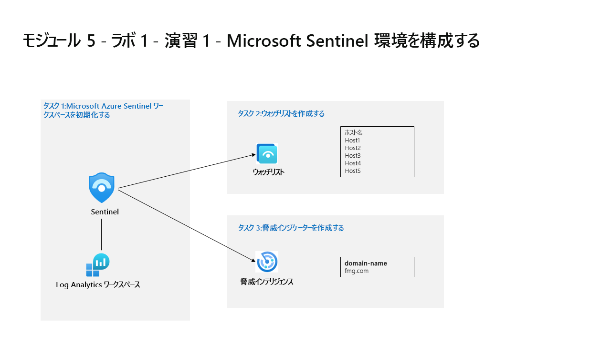

---
lab:
  title: 演習 1 - Microsoft Sentinel 環境を構成する
  module: Learning Path 5 - Configure your Microsoft Sentinel environment
---

# ラーニング パス 5 - ラボ 1 - 演習 1 - Microsoft Sentinel 環境を構成する

## ラボのシナリオ



あなたは、Microsoft Sentinel を実装しようとしている会社で働いているセキュリティ運用アナリストです。 コストを最小限に抑え、コンプライアンス規制を満たし、セキュリティ チームが日常の職務を遂行するのに最も管理しやすい環境を提供するという会社の要件を満たすように、Microsoft Sentinel 環境を設定する責任があります。

>**メモ:** このラボをご自分のペースでクリックして進めることができる、 **[ラボの対話型シミュレーション](https://mslabs.cloudguides.com/guides/SC-200%20Lab%20Simulation%20-%20Configure%20your%20Microsoft%20Sentinel%20environment)** が用意されています。 対話型シミュレーションとホストされたラボの間に若干の違いがある場合がありますが、示されている主要な概念とアイデアは同じです。 


### タスク 1:Microsoft Azure Sentinel ワークスペースを初期化する

このタスクでは、Microsoft Sentinel ワークスペースを作成します。

1. 管理者として **WIN1** 仮想マシンにログインします。パスワードは **Pa55w.rd** です。  

1. Microsoft Edge ブラウザーを開きます。

1. Edge ブラウザーで、Azure portal (https://portal.azure.com ) に移動します。

1. **[サインイン]** ダイアログ ボックスで、ラボ ホスティング プロバイダーから提供された**テナントの電子メール** アカウントをコピーして貼り付け、 **[次へ]** を選択します。

1. **[パスワードの入力]** ダイアログ ボックスで、ラボ ホスティング プロバイダーから提供された**テナントのパスワード**をコピーして貼り付け、 **[サインイン]** を選択します。

1. Azure portal の検索バーに「*Sentinel*」と入力してから、**[Microsoft Sentinel]** を選択します。

1. **[+ 作成]** を選択します。

1. 次に、前に作成した Log Analytics ワークスペース (*uniquenameDefender* など) を選択し、**[追加]** を選択します。 アクティブ化には数分かかることがあります。

    >**注:**  ここに Log Analytics ワークスペースが表示されない場合は、モジュール 3、演習 1、タスク 2 を参照して作成してください。

1. **Microsoft Sentinel** では、**[全般]** セクションの *[ニュースとガイド]* に、*Microsoft Sentinel の無料試用版がアクティブ化済み*であることを示す通知が表示されます。 **[OK]** ボタンをクリックします。

1. 新しく作成された Microsoft Sentinel ワークスペースをナビゲートして、ユーザーインターフェイスオプションに慣れてください。

### タスク 2:ウォッチリストを作成する

このタスクでは、Microsoft Sentinel でウォッチリストを作成します。

1. Windows 10 の画面下部の検索ボックスに *Notepad* と入力します。 結果から、**[Notepad]** を選択します。

1. *Hostname* と入力し、新しい行を入力します。

1. メモ帳の 2 行目から、次のホスト名を 1 行に 1 つずつコピーします。

    ```Notepad
    Host1
    Host2
    Host3
    Host4
    Host5
    ```

1. メニューから **[ファイル] - [名前を付けて保存]** を選択し、ファイルに *[HighValue.csv]* という名前を付けて、ファイルの種類を **[すべてのファイル (*.*)]** に変更し、**[保存]** を選択します。 **ヒント:** ファイルは *[ドキュメント]* フォルダーに保存できます。

1. メモ帳を閉じます。

1. Microsoft Sentinel で、[構成] 領域の **[ウォッチリスト]** オプションを選択します。

1. コマンド バーから **[+ 新規]** を選択します。

1. ウォッチリスト ウィザードで、次のように入力します。

    |全般設定|値|
    |---|---|
    |名前|**HighValueHosts**|
    |説明|**High Value Hosts**|
    |ウォッチリスト エイリアス|**HighValueHosts**|

1. **[次へ: ソース >]** を選択します。

1. *[ファイルのアップロード]* で **[ファイルを参照]** を選択し、作成した *HighValue.csv* ファイルを参照します。

1. *[検索キー]* フィールドで、 **[ホスト名]** を選択します。

1. **[次へ: 確認と作成 >]** を選択します。

1. 入力した設定を確認し、 **[作成]** を選びます。

1. 画面が [ウォッチリスト] ページに戻ります。

1. *HighValueHosts* ウォッチリストを選択し、右側のペインで **[ログに表示]** を選択します。

    >**重要:** ウォッチリストが表示されるまでに最大 10 分かかる場合があります。 **次のタスクを続けて行い、このコマンドは次のラボで実行してください**。
    
    >**注:**  独自のKQLステートメントで_GetWatchlist（ 'HighValueHosts'）を使用して、リストにアクセスできるようになりました。 参照する列は*Hostname*になります。

1. 右上にある [x] を選択して *[ログ]* ウィンドウを閉じ、 **[OK]** を選択して保存されていない変更を破棄します。


### タスク 3:脅威インジケーターを作成する

このタスクでは、Microsoft Sentinel でインジケーターを作成します。

1. Microsoft Sentinel で、[脅威の管理] 領域の **[脅威インテリジェンス]** オプションを選択します。

1. コマンド バーから **[+ 新規追加]** を選択します。

1. *[種類]* ドロップダウンで使用できるさまざまなインジケーターの種類を確認します。 **domain-name** を選択します。 

1. [ドメイン] に、ドメイン名を入力します (例: 「*contoso.com*」と入力します)。

1. *[脅威の種類]* で、 **[+ 追加]** を選択し、 **[悪意のあるアクティビティ]** を入力します。 **適用**を選択します。

1. **[Description](説明)** を入力します。

1. **[名前]** には、ドメインに使われているのと同じ値を入力します。

1. **[有効開始日]** フィールドを今日の日付に設定します。

1. **[適用]** を選びます。

1. [全般] 領域で **[ログ]** オプションを選択します。 その方がよければ、[常にクエリを表示する] オプションを無効にし、*[クエリ]* ウィンドウを閉じて KQL ステートメントを実行します。

1. 以下の KQL ステートメントを実行します。

    ```KQL
    ThreatIntelligenceIndicator
    ```

    >**注:** インジケーターが表示されるまで、最大 5 分かかる場合があります。

1. 結果を右にスクロールして、DomainName 列を表示します。 次の KQL ステートメントを実行して、DomainName 列だけを表示することもできます。 

    ```KQL
    ThreatIntelligenceIndicator 
    | project DomainName
    ```


### タスク 4:ログ保持期間の構成

このタスクでは、SecurityEvent テーブルの保持期間を変更します。

1. Microsoft Sentinel で、 **[構成]** 領域の下の *[設定]* オプションを選択します。

1. **[ワークスペースの設定]** を選択します。

1. Log Analytics ワークスペースの、 *[設定]* 領域の下で **[テーブル]** オプションを選択します。

1. **SecurityEvent** テーブルを検索して選択し、省略記号ボタン (...) を選択します。

1. **[テーブルの管理]** を選択します。

1. *[合計保有期間]* で **[180 日]** を選択します。 なお、 *[アーカイブ期間]* は、(既定の) *[対話型保持期間]* から 30 日間が使用されるため 150 日間のみです。

1. **[保存]** をクリックして変更を適用します。


## これでラボは完了です。
