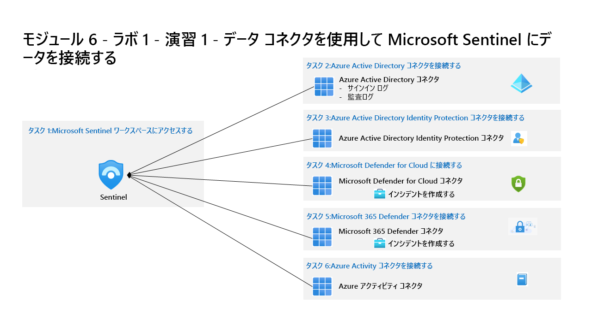

---
lab:
  title: 演習 1 - データ コネクタを使用して Microsoft Sentinel にデータを接続する
  module: Learning Path 6 - Connect logs to Microsoft Sentinel
---

# ラーニング パス 6 - ラボ 1 - 演習 1 - データ コネクタを使用して Microsoft Sentinel にデータを接続する

## ラボのシナリオ

あなたは、Microsoft Sentinel を実装した会社で働いているセキュリティ運用アナリストです。 組織内の多くのデータ ソースからのログ データを接続する方法について学習する必要があります。 組織には、Microsoft 365、Microsoft 365 Defender、Azure リソース、Azure 以外の仮想マシンなどからのデータがあります。最初に、Microsoft のソースに接続します。

>                **メモ:** このラボをご自分のペースでクリックして進めることができる、 **[ラボの対話型シミュレーション](https://mslabs.cloudguides.com/guides/SC-200%20Lab%20Simulation%20-%20Connect%20data%20to%20Microsoft%20Sentinel%20using%20data%20connectors)** が用意されています。 対話型シミュレーションとホストされたラボの間に若干の違いがある場合がありますが、示されている主要な概念とアイデアは同じです。 

### タスク 1:Microsoft Sentinel ワークスペースにアクセスする

このタスクでは、Microsoft Sentinel ワークスペースにアクセスします。

1. 管理者として **WIN1** 仮想マシンにログインします。パスワードは **Pa55w.rd** です。  

1. Microsoft Edge ブラウザーを開きます。

1. Edge ブラウザーで、Azure portal (https://portal.azure.com ) に移動します。

1. **サインイン** ダイアログ ボックスで、ラボ ホスティング プロバイダーから提供された**テナントの電子メール** アカウントをコピーして貼り付け、**[次へ]** を選択します。

1. **[パスワードの入力]** ダイアログ ボックスで、ラボ ホスティング プロバイダーから提供された**テナントパスワード**をコピーして貼り付け、**[サインイン]** を選択します。

1. Azure portal の検索バーに「*Sentinel*」と入力してから、**[Microsoft Sentinel]** を選択します。

1. 前のラボで作成した Microsoft Sentinel ワークスペースを選択します。

### タスク 2: Microsoft Defender for Cloud コネクタを接続する

このタスクでは、Microsoft Defender for Cloud コネクタを接続します。

1. [データ コネクタ] タブで、一覧から **Microsoft Defender for Cloud** コネクタを探して選択します。

1. コネクタ情報ブレードで **[コネクタ ページを開く]** を選択します。

1. 構成領域の [サブスクリプション] で、[Azure Pass - スポンサー プラン] サブスクリプションのチェック ボックスを**オン**にし、 **[状態]** オプションを右側にスライドします。

    >**注:** 切断に戻る場合は、ラーニング パス 3、演習 1、タスク 1 を確認して、アカウントに適切なアクセス許可を割り当ててください。

1. [状態] が **[接続済み]** になり、[双方向の同期] が [有効] になるはずです。** **

1. 下にスクロールし、[Create incidents - Recommended!](インシデントの作成 - 推奨) 領域で、 **[有効]** を選択します。 

    >**注:** このオプションを選ぶと、このコネクタに関する分析ルールが自動的に作成されます。 ここで有効にしなくても、後で *[分析]* ブレードを使って、手動で追加したり、構成を変更したりできます。

### タスク 3: Azure Activity コネクタを接続する

このタスクでは、Azure Activity コネクタを接続します。

1. [データ コネクタ] タブで、一覧から **Azure Activity** コネクタを探して選択します。

1. コネクタ情報ブレードで **[コネクタ ページを開く]** を選択します。

1. 構成 領域で、下にスクロールして、2. 診断設定の新しい... で **Azure Policy の割り当て ウィザードの起動>** を選択します。

1. **[基本]** タブで、 **[スコープ]** の下にある省略記号ボタン [...] を選択し、ドロップダウン リストから [Azure Pass - スポンサーシップ] サブスクリプションを選択して、 **[選択]** をクリックします。

1. **[パラメーター]** タブを選択し、 **[プライマリ Log Analytics ワークスペース]** ドロップダウン リストから自分の *uniquenameDefender* ワークスペースを選択します。

1. **[修復]** タブを選択し、 **[修復タスクの作成]** チェック ボックスをオンにします。 このアクションにより、Log Analytics ワークスペースに情報を送信するサブスクリプション構成が適用されます。

1. **[確認と作成]** ボタンを選択して構成を確認します。

1. **[作成]** を選択して完了します。

## 演習 2 に進みます。
