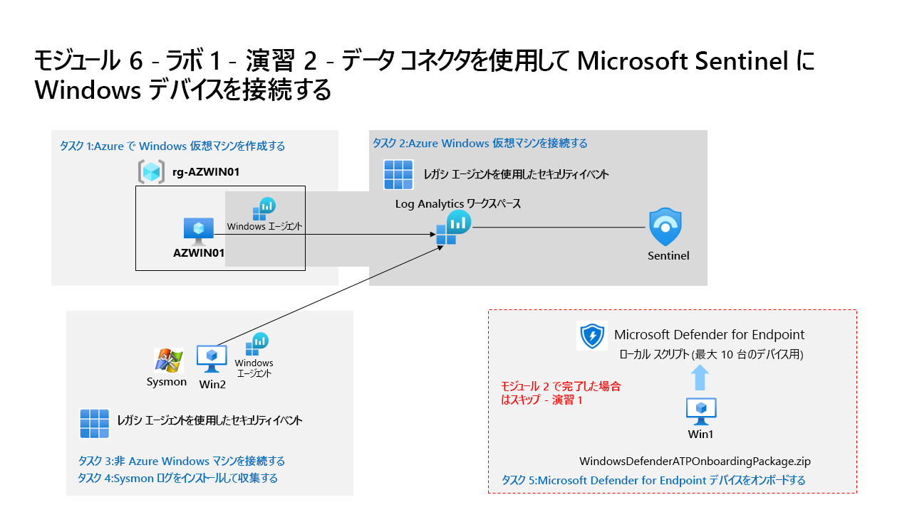

---
lab:
  title: 演習 2 - データ コネクタを使用して Microsoft Sentinel に Windows デバイスを接続する
  module: Module 6 - Connect logs to Microsoft Sentinel
ms.openlocfilehash: 30ebc048c00a28680d7539692c442a2c399a8c01
ms.sourcegitcommit: f8918eddeaa7a7a480e92d0e5f2f71143c729d60
ms.translationtype: HT
ms.contentlocale: ja-JP
ms.lasthandoff: 07/08/2022
ms.locfileid: "147037996"
---
# モジュール 6 - ラボ 1 - 演習 2 - データ コネクタを使用して Microsoft Sentinel に Windows デバイスを接続する

## ラボのシナリオ

あなたは、Microsoft Sentinel を実装した会社で働いているセキュリティ運用アナリストです。 組織内の多くのデータ ソースからのログ データを接続する方法について学習する必要があります。 データの次のソースは、オンプレミス環境や他のパブリック クラウドなど、Azure の内部および外部にある Windows 仮想マシンです。

### タスク 1:Azure で Windows 仮想マシンを作成する

このタスクでは、Azure で Windows 仮想マシンを作成します。

1. 管理者として WIN1 仮想マシンにログインします。パスワードは **Pa55w.rd**。  

1. Edge ブラウザーで、Azure portal (https://portal.azure.com ) に移動します。

1. **[サインイン]** ダイアログ ボックスで、ラボ ホスティング プロバイダーから提供された **テナントの電子メール** アカウントをコピーして貼り付け、**[次へ]** を選択します。

1. **[パスワードの入力]** ダイアログ ボックスで、ラボ ホスティング プロバイダーから提供された **テナント パスワード** をコピーして貼り付け、**[サインイン]** を選択します。

1. **[+ リソースの作成]** を選択します。 **ヒント:** 既に Azure Portal にいた場合は、上部のバーから *[Microsoft Azure]* を選択してホームに移動する必要があることがあります。

1. **[サービスとマーケットプレースの検索]** ボックスに「*Windows 10*」と入力し、ドロップダウン リストから **[Microsoft Window 10]** を選択します。

1. *[プラン]* ドロップダウン リストを開き、**[Windows 10 Enterprise バージョン 21H2]** を選択します。 **[事前設定された構成で開始する]** を選択して続行します。

1. **[開発/テスト]** を選択してから、**[VM の作成を続行する]** を選びます。

1. *[リソース グループ]* で **[新規作成]** を選択し、[名前] に「RG-AZWIN01」と入力して **[OK]** を選択します。

    >**注:**  これは、追跡目的の新しいリソース グループとなります。 

1. *[仮想マシン名]* に、「AZWIN01」と入力します。

1. *[リージョン]* の既定値は **[(米国) 米国東部]** のままにします。

1. 下にスクロールして、仮想マシンの *[サイズ]* を確認します。 空の場合は、**[すべてのサイズを表示]** を選択し、*[Azure ユーザーが最もよく使用]* で VM のサイズを 1 つを選択し、**[選択]** をクリックします。

1. 任意の ''*ユーザー名*'' を入力します。 **ヒント:** admin や root のような予約語は避けてください。

1. 任意の ''*パスワード*'' を入力します。 **ヒント:** テナント パスワードを再利用する方が簡単な場合があります。 これはリソース タブにあります。

1. ページの下部まで下にスクロールし、*[ライセンス]* の下にあるチェックボックスをオンにして、対象ライセンスがあることを確認します。

1. **[確認と作成]** を選択し、検証に合格するまで待ちます。

1. **［作成］** を選択します リソースが作成されるのを待ちますこれには数分かかることがあります。

### タスク 2:Azure Windows 仮想マシンを接続する

このタスクでは、Azure Windows 仮想マシンを Microsoft Sentinel に接続します。

1. Azure portal の検索バーに「*Sentinel*」と入力し、**[Microsoft Sentinel]** を選択します。

1. 先ほど作成した Microsoft Sentinel ワークスペースを選択します。

1. [データ コネクタ] タブで、 **[AMA 使用した Windows セキュリティ イベント]** コネクタを検索し、リストからそれを選択します。

1. [コネクタ情報] ブレードで **[コネクタ ページを開く]** を選択します。

1. *[構成]* セクションで、 **[データ収集の作成]** 規則を選択します。
1. ルール名に「**AZWIN01DCR**」と入力して、 **[次へ:リソース]** を選択します。
1. **[リソースの追加]** を選択します。
1. **rg-azwin01** を展開し、**AZWIN01** を選択します。
1. **[適用]** を選択します。
1. **[次へ: 収集]** 、 **[次へ:確認と作成]** の順に選択します。
1. **[作成] をクリックします**
1. 数分待ってから **[更新]** を選択すると、新しいデータ収集規則が一覧表示されます。

### タスク 3:非 Azure Windows マシンを接続する

このタスクでは、Azure Arc をインストールし、非 Azure Windows 仮想マシンを Microsoft Sentinel に接続します。  

>**重要:** 次の手順は、以前に作業していたものとは異なるマシンで行います。 仮想マシン名の参照を探します。

>**重要:** *AMA を使用した Windows セキュリティ イベント* データ コネクタには非 Azure デバイス用の Azure Arc が必要です。 

1. 管理者として、次のパスワードを使用して WIN2 仮想マシンにログインします: **Pa55w.rd**。  

1. Microsoft Edge ブラウザーを開きます。

1. ブラウザーを開き、前のラボで使っていた資格情報を使用して、Azure Portal (https://portal.azure.com ) にログインします。

1. **サインイン** ダイアログ ボックスで、ラボ ホスティング プロバイダーから提供された **テナントの電子メール** アカウントをコピーして貼り付け、**[次へ]** を選択します。

1. **[パスワードの入力]** ダイアログ ボックスで、ラボ ホスティング プロバイダーから提供された **テナントのパスワード** をコピーして貼り付け、 **[サインイン]** を選択します。

1. Azure portal の検索バーに「*Arc*」と入力し、**[Azure Arc]** を選択します。

1. ナビゲーション ウィンドウの **[インフラストラクチャ]** の下にある **[サーバー]** を選択します。

1. **[+ 追加]** を選択します。

1. 単一サーバーの追加セクションで **[スクリプトの生成]** を選択します。

1. **[次へ]** を選択して [リソースの詳細] タブに移動します。

1. 先ほど作成したリソース グループを選択します。 **ヒント:** *RG-Defender*

    >**注:**  リソース グループをまだ作成していない場合は、別のタブを開き、リソース グループを作成して最初からやり直します。

1. *[サーバーの詳細]* と *[接続方法]* のオプションを確認します。 既定値のままにして **[次へ]** を選択し、[タグ] タブに移動します。

1. **[次へ]** を選択して、[スクリプトのダウンロードと実行] タブに移動します。

1. **[登録]** オプションが利用できる場合は、 **[登録]** を選択します (ステップ *[1. サブスクリプションを登録]* の下)。

    >**注:**  処理のために少なくとも 3 分待ちます。

1. 下にスクロールし、 **[ダウンロード]** ボタンを選択します。 **ヒント:** ブラウザーでダウンロードがブロックされた場合は、ブラウザーでダウンロードを許可するように対処してください。 Edge ブラウザーで、必要に応じて省略記号ボタン ([...]) を選択し、**[保存]** を選択します。 

1. Windows の [スタート] ボタンを右クリックし、**[Windows PowerShell (管理者)]** を選択します。

1. UAC プロンプトが表示された場合は、「*Administrator*」を "ユーザー名" として、「*Passw0rd!*」を "パスワード" として入力します。

1. 「cd C:\Users\Admin\Downloads」と入力します。

1. *Set-ExecutionPolicy -ExecutionPolicy Unrestricted* を入力しEnterキーを押します。

1. [すべてにはい] の場合は「**A**」を入力し、Enter キーを押します。

1. 「*.\OnboardingScript.ps1*」と入力し、Enter キーを押します。  

    >**重要:** *用語 .\OnboardingScript.ps1 が認識されません...* というエラーが表示された場合は、タスク 4 を WINServer 仮想マシンで行っていることを確認してください。 他の問題として、複数回ダウンロードしたためにファイルの名前が変更された可能性があります。実行中のディレクトリで *".\OnboardingScript (1).ps1"* またはその他のファイル番号を検索してください。

1. **R** を入力して 1 回実行し、Enter キーを押します (これには数分かかる場合があります)。

1. Edge ブラウザーに戻って新しいタブを開き、アドレス バーに「https://microsoft.com/devicelogin」と入力します。

1. [Windows PowerShell] ウィンドウに戻り、スクリプトの最後の行で "... コードの入力" の後に表示されている、エージェントを認証するためのコードをコピーします。

1. Edge ブラウザーに戻り、**[コード]** ボックスに貼り付けて、**[次へ]** を選択します。 ご自分のテナント管理者アカウントを選択し、*[Azure Connected Machine Agent にサインインしますか?]* ウィンドウで **[続行]** を選択します。 

1. Windows PowerShell ウィンドウに戻り、"リソースが Azure に正常にオンボードされました" というメッセージが表示されるまで待ちます。 **注:**  新しい認証コードを含むメッセージ行が表示された場合は、最後の 3 つの手順を繰り返す必要があります。

1. スクリプトをダウンロードした Azure portal ページに戻り、 **[閉じる]** を選択します。 **[Azure Arc を使用してサーバーを追加]** を閉じて、Azure Arc の **[サーバー]** ページに戻ります。

1. WIN2 の名前が表示されるまで、 **[更新]** を選択します。

    >**注:**  この処理には数分かかります。

1. Azure portal の検索バーに「*Sentinel*」と入力し、**[Microsoft Sentinel]** を選択します。

1. 先ほど作成した Microsoft Sentinel ワークスペースを選択します。

1. [データ コネクタ] タブで、 **[AMA 使用した Windows セキュリティ イベント]** コネクタを検索し、リストからそれを選択します。

1. [コネクタ情報] ブレードで **[コネクタ ページを開く]** を選択します。

1. *[構成]* セクションで、 **[データ収集の作成]** 規則を選択します。
1. ルール名に「**WIN2**」と入力し、 **[次へ:リソース]** を選択します。
1. **[リソースの追加]** を選択します。
1. **rg-defender** (または作成したリソース グループ) を展開し、**WIN2** を選択します。
1. **[適用]** を選択します。
1. **[次へ: 収集]** 、 **[次へ:確認と作成]** の順に選択します。
1. **[作成] をクリックします**
1. 数分待ってから **[更新]** を選択すると、新しいデータ収集規則が一覧表示されます。

### タスク 4:Microsoft Defender for Endpoint デバイスをオンボードする

このタスクでは、デバイスを Microsoft Defender for Endpoint にオンボードします。

>**非常に重要:** このコースの「モジュール 2 - 演習 1」のラボを完了し、かつこれまでにも Virtual Machines を保存してきた場合は、このタスクを省略できます。 それ以外の場合は、WIN1 マシンを Defender for Endpoint にもう一度オンボードする必要があります。

>**重要:** 次の手順は、以前に作業していたものとは異なるマシンで行います。 仮想マシン名の参照を探します。

1. 管理者として WIN1 仮想マシンにログインします。パスワードは **Pa55w.rd**。  

1. Edge ブラウザーで、Microsoft 365 Defender ポータル (https://security.microsoft.com) ) に移動し、現在ポータルにいない場合は、**テナントの電子メール** 資格情報を使用してログインします。

1. 左側のメニュー バーから **[設定]** を選択し、設定 ページから **[エンドポイント]** を選択します。

1. デバイス管理セクションで **[オンボーディング]** を選択します。

1. **[オンボーディング パッケージのダウンロード]** を選択します。

1. ダウンロードした.zipファイルを解凍します。

1. **管理者** としてWindowsコマンドプロンプトを実行し、表示されるユーザーアカウント制御プロンプトに同意します。

1. 管理者として抽出したばかりの WindowsDefenderATPLocalOnboardingScript.cmd ファイルを実行します。 **注:**  既定では、ファイルは c:\users\admin\downloads ディレクトリにあるはずです。 スクリプトの質問に対して [Y] と回答します。 

1. ポータルの [オンボーディング] ページで、検出テスト スクリプトをコピーして、オープン コマンド ウィンドウで実行します。 新しい **[管理者: コマンド プロンプト]** ウィンドウを開く必要があるかもしれません。その場合は、Windows 検索バーで「*CMD*」と入力し、**[管理者として実行]** を選択します。

1. エンドポイント 領域の Microsoft 365 Defender ポータルで、**デバイス インベントリ** を選択します。 お使いになっているデバイスがリストに表示されます。

## 演習 3 に進む
