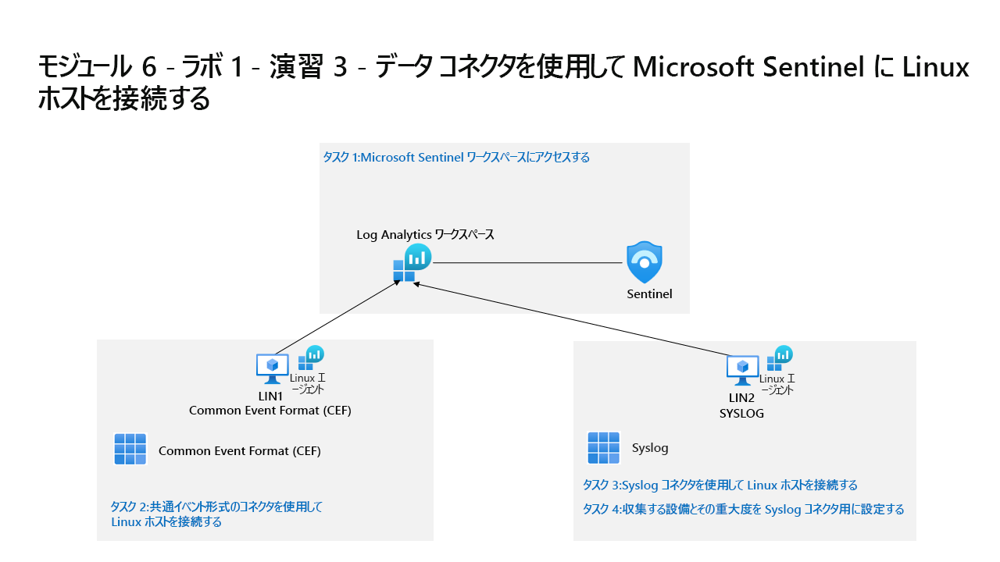

---
lab:
  title: 演習 3 - データ コネクタを使用して Microsoft Sentinel に Linux ホストを接続する
  module: Learning Path 6 - Connect logs to Microsoft Sentinel
---

# ラーニング パス 6 - ラボ 1 - 演習 3 - データ コネクタを使用して Microsoft Sentinel に Linux ホストを接続する

## ラボのシナリオ



あなたは、Microsoft Sentinel を実装した会社で働いているセキュリティ運用アナリストです。 組織内の多くのデータ ソースからのログ データを接続する方法について学習する必要があります。 次のデータのソースは、レガシ エージェントを介した Common Event Format (CEF) と Syslog コネクタを使用した Linux 仮想マシンです。

>                **メモ:** このラボをご自分のペースでクリックして進めることができる、 **[ラボの対話型シミュレーション](https://mslabs.cloudguides.com/guides/SC-200%20Lab%20Simulation%20-%20Connect%20Linux%20hosts%20to%20Microsoft%20Sentinel%20using%20data%20connectors)** が用意されています。 対話型シミュレーションとホストされたラボの間に若干の違いがある場合がありますが、示されている主要な概念とアイデアは同じです。

>**重要:** 別の仮想マシンで実行される次のタスク内の手順があります。 仮想マシン名の参照を探します。

### タスク 1:Microsoft Sentinel ワークスペースにアクセスする

このタスクでは、Microsoft Sentinel ワークスペースにアクセスします。

1. 管理者として **WIN1** 仮想マシンにログインします。パスワードは **Pa55w.rd** です。  

1. 新しい Microsoft Edge ブラウザーを起動します。

1. Edge ブラウザーで、Azure portal (https://portal.azure.com ) に移動します。

1. **サインイン** ダイアログ ボックスで、ラボ ホスティング プロバイダーから提供された**テナントの電子メール** アカウントをコピーして貼り付け、**[次へ]** を選択します。

1. **[パスワードの入力]** ダイアログ ボックスで、ラボ ホスティング プロバイダーから提供された**テナントパスワード**をコピーして貼り付け、**[サインイン]** を選択します。

1. Azure portal の検索バーに「*Sentinel*」と入力してから、**[Microsoft Sentinel]** を選択します。

1. 前のラボで作成した Microsoft Sentinel ワークスペースを選択します。


### タスク 2:共通イベント形式のコネクタを使用して Linux ホストを接続する

このタスクでは、レガシ エージェントを介した Common Event Format (CEF) コネクタを使用して Linux ホストを Microsoft Sentinel に接続します。

1. Microsoft Sentinel の左側のメニューで、 *[コンテンツ管理]* セクションまで下にスクロールし、 **[コンテンツ ハブ]** を選択します。

1. *[コンテンツ ハブ]* で、「**Common Event Format**」ソリューションを検索し、一覧から選択します。

1. *Common Event Format* ソリューションのページで、 **[インストール]** を選択します。

1. インストールが完了したら、 **[管理]** を選択します

    >**注:** *Common Event Format* ソリューションでは、*AMA 経由の Common Events Format (CEF)* と *Common Events Format (CEF)* データ コネクタの両方がインストールされます。

1. *Common Events Format (CEF)* データ コネクタを選択し、コネクタ情報ブレードの **[コネクタ ページを開く]** を選択します。

1. *[構成]* セクションの *[手順]* タブで、「*1.2 Linux マシンへの CEF コレクターのインストール*」に示されているコマンドをクリップボードにコピーします。

1. **LIN1** 仮想マシンを起動します。 ラボ ホスト側によって提供されるユーザー名とパスワードを使用してログインします。 **ヒント:** ログイン プロンプトを表示するには、Enter キーを押す必要があります。 

1. LIN1 サーバー IP アドレスを書き留めます。 例として次のスクリーンショットをご覧ください。

    

1. **WIN1** 仮想マシンに戻ります。 スタート メニュー アイコンを右クリックし、管理者として Windows PowerShell を起動し、 **[Windows PowerShell (管理者)]** を選択します。 **[はい]** を選択し、表示される [ユーザー アカウント制御] ウィンドウでアプリを実行できるようにします。 **ヒント:** 前の演習で Windows PowerShell ウィンドウが既に開いている可能性があります。

1. 次の PowerShell コマンドを入力し、特定の Linux サーバー情報に合わせて調整し、Enter キーを押します。

    ```PowerShell
    ssh insert-your-linux-IP-address-here -l insert-linux-user-name-here
    ```

1. *[はい]* を入力して接続を確認し、ユーザーのパスワードを入力して、Enter キーを押します。 画面は次のようになります。

    

1. これで、前の手順の「*1.2 Linux マシンへの CEF コレクターのインストール*」のコマンドに貼り付ける準備ができました。 Azure のスクリプトがクリップボードにあることを確認してください。 PowerShell で、トップ バーを右クリックし、**[編集]**、**[貼り付け]** の順に選択します。 

1. 貼り付けてから Enter キーを押す前に、次に示すように、文字 **3** を *python* という単語に追加します。

    


1. スクリプトが調整されたら、Enter キーを押します。 スクリプトは Linux サーバーに対してリモートで実行されます。 スクリプトが適切に処理されると、次の画面のようになります。

    

1. 「**exit**」と入力して、LIN1 へのリモート シェル接続を閉じます。


### タスク 3:Syslog コネクタを使用して Linux ホストを接続する

このタスクでは、Linux ホストを Syslog コネクタを使用して Microsoft Sentinel に接続します。

1. Microsoft Sentinel ポータルが開いている Microsoft Edge ブラウザーに戻り、右上隅にある [x] を選択して [レガシ エージェントを介した Common Event Format (CEF)] データ コネクタ ページを閉じます。

1. 1. Microsoft Sentinel の左側のメニューで、 *[コンテンツ管理]* セクションまで下にスクロールし、 **[コンテンツ ハブ]** を選択します。

1. *[コンテンツ ハブ]* で、「**Syslog**」ソリューションを検索し、一覧から選択します。

1. *Syslog* のソリューション ページで、 **[インストール]** を選択します。

1. インストールが完了したら、 **[管理]** を選択します

    >**注:** *Syslog* ソリューションでは、*Syslog* データ コネクタ、5 つの分析ルール、9 つのハンティング クエリ、1 つのブックがインストールされます。

1. *Syslog* データ コネクタを選択し、コネクタ情報ブレードの **[コネクタ ページを開く]** を選択します

1. *[構成]* セクションで、 **[Azure 以外の Linux マシンにエージェントをインストールする]** を展開します。

1. **非 Azure Linux マシン用のエージェントをダウンロードしてインストールする**リンクを選択します。

    >**注:**  Log Analytics ワークスペースに、''*2 台の Windows コンピューターが接続されている*'' ことが示されるはずです。 これは、以前に接続された WINServer および AZWIN01 仮想マシンに対応しています。

1. **[Linux サーバー]** のタブを選択します。

    >**注:**  Log Analytics ワークスペースに、''*1 台の Linux コンピューターが接続されている*'' ことが示されるはずです。 これは、以前に CEF コネクタを使用して接続された LIN1 (ubuntu1) 仮想マシンに対応しています。

1. **[Log Analytics エージェントの手順]** を選択します。

1. *Linux 用のダウンロードおよびオンボード エージェント*領域のコマンドをクリップボードにコピーします。

1. LIN2 仮想マシンを起動します。 ラボ ホスト側によって提供されるユーザー名とパスワードを使用してログインします。 **ヒント:** ログイン プロンプトを表示するには、Enter キーを押す必要があります。

1. LIN2 サーバー IP アドレスを書き留めます。 例として次のスクリーンショットをご覧ください。

    

1. **WIN1** 仮想マシンに戻ります。 前のタスクで使用した Windows PowerShell を選択します。

1. 次の PowerShell コマンドを入力し、特定の Linux サーバー情報に合わせて調整し、Enter キーを押します。

    ```PowerShell
    ssh insert-your-linux-IP-address-here -l insert-linux-user-name-here
    ```

1. *[はい]* を入力して接続を確認し、ユーザーのパスワードを入力して、Enter キーを押します。 画面は次のようになります。

    

1. これで、前の手順の *[Linux 用エージェントのダウンロードとオンボード]* のコマンドに貼り付ける準備ができました。 スクリプトがクリップボードにあることを確認してください。 PowerShell で、トップ バーを右クリックし、**[編集]**、**[貼り付け]** の順に選択します。

1. スクリプトが貼り付けられたら、Enter キーを押します。 スクリプトは Linux サーバーに対してリモートで実行されます。 Wait

1. 終了したら、「**exit**」と入力して、LIN2 へのリモート シェル接続を閉じます。


### タスク 4:収集する設備とその重大度を Syslog コネクタ用に設定する

このタスクでは、Syslog収集機能を構成します。

1. Microsoft Sentinel ポータルが開いている Edge ブラウザーに戻り、右上隅にある [x] を 2 回選択して [Log Analytics ワークスペース] ページと [Syslog] データ コネクタ ページを閉じます。

1. Microsoft Sentinel ポータルで、 *[構成]* の下の **[設定]** を選択し、 **[ワークスペースの設定]** タブをクリックします。

1. *[クラシック]* 領域で、 **[レガシ エージェントの管理]** を選びます。

1. **[Syslog]** タブを選択します。

1. **[+ 設備の追加]** ボタンを選択します。

1. *[施設名]* ドロップダウン メニューから [**認証]** を選択します。

1. **[+ 設備の追加]** ボタンをもう一度選択します。

1. *[施設名]* のドロップダウン メニューから **syslog** を選択します。

1. **[適用]** を選択して変更を保存します。

## 演習 4 に進む
