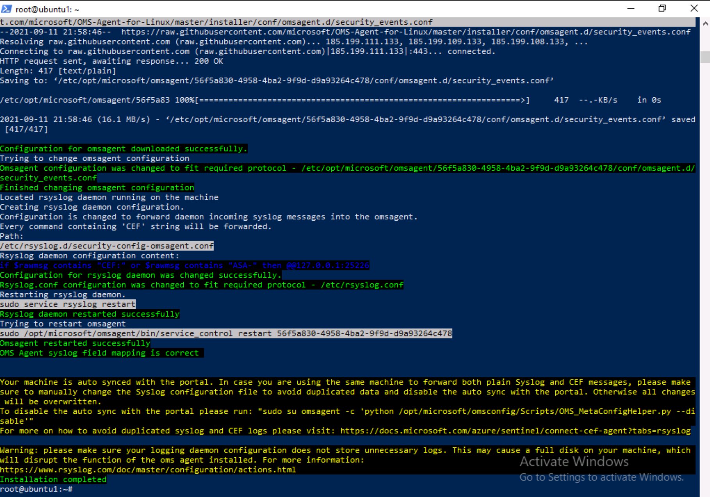

---
lab:
  title: 演習 3 - データ コネクタを使用して Microsoft Sentinel に Linux ホストを接続する
  module: Module 6 - Connect logs to Microsoft Sentinel
ms.openlocfilehash: bf3774978dc5c6cef158d5f1288577854000d944
ms.sourcegitcommit: a90325f86a3497319b3dc15ccf49e0396c4bf749
ms.translationtype: HT
ms.contentlocale: ja-JP
ms.lasthandoff: 04/07/2022
ms.locfileid: "141493971"
---
# <a name="module-6---lab-1---exercise-3---connect-linux-hosts-to-microsoft-sentinel-using-data-connectors"></a>モジュール 6 - ラボ 1 - 演習 3 - データ コネクタを使用して Microsoft Sentinel に Linux ホストを接続する

## <a name="lab-scenario"></a>ラボのシナリオ


あなたは、Microsoft Sentinel を実装した会社で働いているセキュリティ運用アナリストです。 組織内の多くのデータ ソースからのログ データを接続する方法について学習する必要があります。 次のデータソースは、共通イベント形式 (CEF) と Syslog コネクタを使用した Linux 仮想マシンです。


>**重要:** 別の仮想マシンで実行される次のタスク内の手順があります。 仮想マシン名の参照を探します。

### <a name="task-1-access-the-microsoft-sentinel-workspace"></a>タスク 1:Microsoft Sentinel ワークスペースにアクセスする

このタスクでは、Microsoft Sentinel ワークスペースにアクセスします。

1. 管理者として WIN1 仮想マシンにログインします。パスワードは **Pa55w.rd**。  

1. 新しい Microsoft Edge ブラウザーを起動します。

1. Edge ブラウザーで、Azure portal (https://portal.azure.com ) に移動します。

1. **サインイン** ダイアログ ボックスで、ラボ ホスティング プロバイダーから提供された **テナントの電子メール** アカウントをコピーして貼り付け、「**次へ**」を選択します。

1. **パスワードの入力** ダイアログ ボックスで、ラボ ホスティング プロバイダーから提供された **テナントパスワード** をコピーして貼り付け、「**サインイン**」を選択します。

1. Azure portal の検索バーに「*Sentinel*」と入力してから、 **[Microsoft Sentinel]** を選択します。

1. 前のラボで作成した Microsoft Sentinel ワークスペースを選択します。


### <a name="task-2-connect-a-linux-host-using-the-common-event-format-connector"></a>タスク 2:共通イベント形式のコネクタを使用して Linux ホストを接続する

このタスクでは、共通イベント形式 (CEF) コネクタを使用して Linux ホストを Microsoft Sentinel に接続します。

1. Microsoft Sentinel の [構成] 領域から **[データ コネクタ]** を選択します。 [データ コネクタ] タブで、リストから **[Common Event Format(CEF)]** コネクタを選択します。

1. コネクタ情報ブレードで「**コネクタページを開く**」を選択します。

1. *[構成]* で、「*1.2 Linux マシンへの CEF コレクターのインストール*」に示されているコマンドをクリップボードにコピーします。

1. LIN1 仮想マシンを起動します。 ラボ ホスト側によって提供されるユーザー名とパスワードを使用してログインします。 **ヒント:** ログイン プロンプトを表示するには、Enter キーを押す必要があります。 

1. LIN1 サーバー IP アドレスを書き留めます。 例として次のスクリーンショットをご覧ください。

    

1. WIN1 仮想マシンに戻ります。 スタート メニュー アイコンを右クリックし、管理者としてコマンドプロンプト起動します。

1. 次のコマンドを入力し、特定の Linux サーバー情報に合わせて調整し、Enter キーを押します。

   ```PowerShell
   ssh IPアドレス -l linuxのユーザーID（root）
   ```

1. *[Yes]* を入力して接続を確認し、ユーザーのパスワードを入力して、Enter キーを押します。 画面は次のようになります。

    

1. 前の手順の「*1.2 Linux マシンへの CEF コレクターのインストール*」でコピーしたコマンドをコマンドプロンプトに貼り付けます。

1. 貼り付けてから Enter キーを押す前に、次に示すように、*python* の後に **3** を追加します。

    


1. スクリプトが調整されたら、Enter キーを押します。 スクリプトは Linux サーバーに対してリモートで実行されます。 スクリプトが適切に処理されると、次の画面のようになります。

    

1. 「**exit**」と入力して、LIN1 へのリモート シェル接続を閉じます。


### <a name="task-3-connect-a-linux-host-using-the-syslog-connector"></a>タスク 3:Syslog コネクタを使用して Linux ホストを接続する

このタスクでは、Linux ホストを Syslog コネクタを使用して Microsoft Sentinel に接続します。

1. Microsoft Sentinel ポータルが開いている Edge ブラウザーに戻り、右上隅にある [x] を選択して [Common Event Format(CEF)] データ コネクタ ページを閉じます。 

1. [データ コネクタ] タブで、一覧から **Syslog** コネクタを探して選択します。

1. コネクタ情報ブレードで「**コネクタページを開く**」を選択します。

1. *[構成]* で、 **[Install agent on a non-Azure Linux Machine]** セクションを開きます。

1. **Azure 以外の Linux マシン用のエージェントをダウンロードしてインストールする** リンクを選択します。 

    >**注:**  Log Analytics ワークスペースに、''*3 台の Windows コンピューターが接続されている*'' ことが示されるはずです。 これは、以前に接続された WIN2、WINServer および AZWIN01 仮想マシンに対応しています。

1. 「**Linuxサーバー**」のタブを選択します。

    >**注:**  Log Analytics ワークスペースに、''*1 台の Linux コンピューターが接続されている*'' ことが示されるはずです。 これは、以前に CEF コネクタを使用して接続された LIN1 (ubuntu1) 仮想マシンに対応しています。

1. *Linux 用エージェントをダウンロードおよびオンボードする* 領域のコマンドをクリップボードにコピーします。

1. LIN2 仮想マシンを起動します。 ラボ ホスト側によって提供されるユーザー名とパスワードを使用してログインします。 **ヒント:** ログイン プロンプトを表示するには、Enter キーを押す必要があります。

1. LIN2 サーバー IP アドレスを書き留めます。 例として次のスクリーンショットをご覧ください。

    

1. WIN1 仮想マシンに戻ります。 前のタスクで使用した Windows PowerShell を選択します。

1. 次の PowerShell コマンドを入力し、特定の Linux サーバー情報に合わせて調整し、Enter キーを押します。

    ```PowerShell
    ssh insert-your-linux-IP-address-here -l insert-linux-user-name-here
    ```

1. *[はい]* を入力して接続を確認し、ユーザーのパスワードを入力して、Enter キーを押します。 画面は次のようになります。

    

1. これで、前の手順の *[Linux 用エージェントのダウンロードとオンボード]* のコマンドに貼り付ける準備ができました。 スクリプトがクリップボードにあることを確認してください。 PowerShell で、トップ バーを右クリックし、「**編集**」、「**貼り付け**」の順に選択します。

1. スクリプトが貼り付けられたら、Enter キーを押します。 スクリプトは Linux サーバーに対してリモートで実行されます。 Wait

1. 終了したら、「**exit**」と入力して、LIN2 へのリモート シェル接続を閉じます。


### <a name="task-4-configure-the-facilities-you-want-to-collect-and-their-severities-for-the-syslog-connector"></a>タスク 4:収集する設備とその重大度を Syslog コネクタ用に設定する

このタスクでは、Syslog収集機能を構成します。

1. Microsoft Sentinel ポータルが開いている Edge ブラウザーに戻り、右上隅にある [x] を 2 回選択して [Log Analytics ワークスペース] ページと [Syslog] データ コネクタ ページを閉じます。

1. Microsoft Sentinel ポータルで、 *[構成]* の下の **[設定]** を選択し、 **[ワークスペースの設定]** タブをクリックします。

1. **[設定]** 領域で **[レガシ エージェントの管理]** を選択します。

1. 「**Syslog**」タブを選択します。

1. 「 **+ ファシリティの追加**」ボタンを選択します。

1. 「*ファシリティ名*」ドロップダウン メニューから「**auth**」を選択します。

1. **[+ ファシリティの追加]** ボタンをもう一度選択します。

1. *[ファシリティ名]* ドロップダウン メニューから **[authpriv]** を選択します。

1. **[適用]** を選択して変更を保存します。

## <a name="proceed-to-exercise-4"></a>演習 4 に進む
