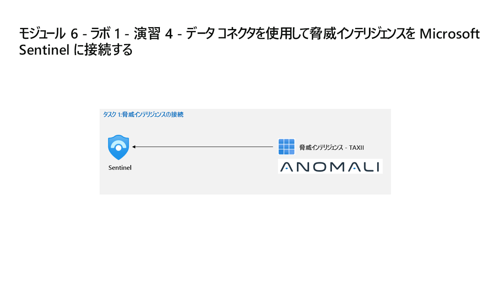

---
lab:
  title: 演習 4 - データ コネクタを使用して Defender XDR を Microsoft Sentinel に接続する
  module: Learning Path 6 - Connect logs to Microsoft Sentinel
---

# ラーニング パス 6 - ラボ 1 - 演習 4 - データ コネクタを使用して Defender XDR を Microsoft Sentinel に接続する

## ラボのシナリオ

あなたは、Microsoft Defender XDR と Microsoft Sentinel の両方を展開した会社で働いているセキュリティ運用アナリストです。 Microsoft Sentinel を Defender XDR に接続する統合セキュリティ運用プラットフォームを準備する必要があります。 次の手順では、Defender XDR コンテンツ ハブ ソリューションをインストールし、Defender XDR データ コネクタを Microsoft Sentinel に展開します。

>**重要:** Azure の Microsoft Sentinel ポータルと Microsoft Defender XDR 内の Sentinel には機能の違いがあることに注意してください **[ポータルの機能の違い](https://learn.microsoft.com/azure/sentinel/microsoft-sentinel-defender-portal#capability-differences-between-portals)**。

### タスク 1:Defender XDR を接続する

このタスクでは、Microsoft Defender XDR コネクタを展開します。

1. 管理者として WIN1 仮想マシンにログインします。パスワードは**Pa55w.rd**。  

1. Microsoft Edge ブラウザーで、Azure portal (<https://portal.azure.com>) に移動します。

1. **[サインイン]** ダイアログ ボックスで、ラボ ホスティング プロバイダーから提供された**テナントの電子メール** アカウントをコピーして貼り付け、**[次へ]** を選択します。

1. **[パスワードの入力]** ダイアログ ボックスで、ラボ ホスティング プロバイダーから提供された**テナントパスワード**をコピーして貼り付け、**[サインイン]** を選択します。

1. Azure portal の検索バーに「*Sentinel*」と入力してから、**[Microsoft Sentinel]** を選択します。

1. 先ほど作成した Microsoft Sentinel ワークスペースを選択します。

1. Microsoft Sentinel の左側のメニューで、 **[コンテンツ管理]** セクションまで下にスクロールし、 **[コンテンツ ハブ]** を選択します。

1. *[コンテンツ ハブ]* で、**Microsoft Defender XDR** ソリューションを検索し、リストから選択します。

1. *Microsoft Defender XDR* ソリューションの詳細ページで、**[インストール]** を選択します。

1. インストールが完了したら、**Microsoft Defender XDR** ソリューションを検索して選択します。

1. *Microsoft Defender XDR* ソリューションの詳細ページで、**[管理]** を選択します

1. *[Microsoft Defender XDR]* データ コネクタ チェック ボックスをオンにし、**[コネクタ ページを開く]** を選択します。

1. *[手順]* タブの *[構成]* セクションで、*[これらの製品の Microsoft インシデント作成ルールをすべてオフにすることを**** お勧めします]* のチェック ボックスをオフにし、**[インシデントとアラートを接続する]** ボタンを選択します。

1. 接続が成功したことを示すメッセージが表示されるはずです。

### タスク 2:Microsoft Sentinel と Microsoft Defender XDR を接続する

このタスクでは、Microsoft Sentinel ワークスペースを Microsoft Defender XDR に接続します。

>**注:**  Microsoft Defender XDR ポータルの Microsoft Sentinel はパブリック プレビュー段階であり、ユーザー インターフェイスのエクスペリエンスと手順はラボの指示とは異なる場合があります。

1. "管理者" として **WIN1** 仮想マシンにログインします。次のパスワードを使用します: ****Pa55w.rd**。  

1. 新しい Microsoft Edge ブラウザーを起動します。

1. Edge ブラウザーで、<https://security.microsoft.com> の Microsoft Defender XDR ポータルに移動します。

1. **サインイン** ダイアログ ボックスで、ラボ ホスティング プロバイダーの提供した管理者ユーザー名のテナント電子メール アカウントをコピーして貼り付け、**[次へ]** を選択します。

1. **パスワードの入力**ダイアログ ボックスで、ラボ ホスティング プロバイダーの提供した管理者のテナント パスワードをコピーして貼り付け、**サインイン**します。

    >**ヒント:** 管理者のテナントのメール アカウントとパスワードは、[リソース] タブで確認できます。

1. **Defender XDR** ポータルの **[ホーム]** 画面の上部に、"SIEM と XDR を 1 か所で取得する" というメッセージのバナーが表示されるはずです。** **[ワークスペースの接続]** ボタンを選択します。

1. [ワークスペースの選択] ページで、先ほど作成した **Microsoft Sentinel** ワークスペースを選択します。**

    >**ヒント:***uniquenameDefender* のような名前になるはずです。

1. **[次へ]** ボタンを選択します。

    >**注:** [次へ] ボタンが無効になっているか灰色表示されており、Microsoft Sentinel ワークスペースが Defender XDR に "オンボードされていない" ことを示すエラー メッセージが表示される場合は、同期に 5 分から 10 分かかる可能性があるため、Defender XDR ポータル ページを更新してみてください。****

1. [変更の確認] ページで、"ワークスペース" の選択が正しいことを確認し、「ワークスペースが接続されているときに想定されること」セクションの下の箇条書き項目を確認します。****** **関連付け**ボタンを選択します。

1. "ワークスペースを接続しています" というメッセージの後に、"ワークスペースが正常に接続されました" というメッセージが表示されるはずです。****

1. **閉じる**ボタンを選択します。

1. **Defender XDR** ポータルの **[ホーム]** 画面の上部に、"統合された SIEM と XDR の準備ができました" というメッセージのバナーが表示されるはずです。** **[ハンティングの開始]** ボタンを選択します。

1. [高度なハンティング] に、"Sentinel のコンテンツを調べる" よう求めるメッセージが表示されるはずです。** 左側のメニュー ペインで、対応するタブの下にある *Microsoft Sentinel* テーブル、関数、クエリをメモします。

1. 左側のメイン メニュー ペインが折りたたまれている場合はそれを展開し、新しい **Microsoft Sentinel** メニュー項目を展開します。 [脅威の管理]、[コンテンツ管理]、[構成] の選択項目が表示されるはずです。******

 >**注**: Microsoft Sentinel と Microsoft Defender XDR の同期が完了するまでに数分かかる場合があるため、たとえば、インストールされているすべての*データ コネクタ*が表示されない場合があります。

## ラボを完了しました:「ラーニング パス 7: ラボ 1: 演習 2: Microsoft Sentinel でプレイブックを作成する」に進んでください
