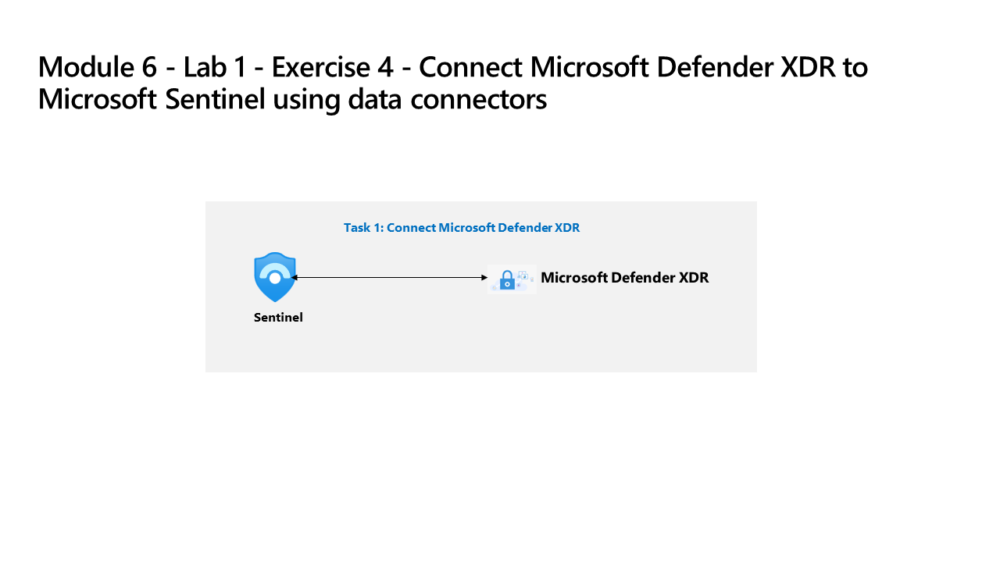

---
lab - Do not use. Temporarily not operational!:
  title: 演習 4 ‐ データ コネクタを使用して Microsoft Sentinel に脅威インテリジェンスを接続する
  module: Module 6 - Connect logs to Microsoft Sentinel
---

# モジュール 6 - ラボ 1 - 演習 4 - データ コネクタを使用して脅威インテリジェンスを Microsoft Sentinel に接続する

## ラボのシナリオ

あなたは、Microsoft Sentinel を実装した会社で働いているセキュリティ運用アナリストです。 組織内の多くのデータ ソースからのログ データを接続する方法について学習する必要があります。 最後に、既知の脅威を検出して優先順位を付ける機能を強化するために、脅威インテリジェンス フィードを接続します。

### タスク 1:脅威インテリジェンスの接続

このタスクでは、脅威インテリジェンス プロバイダーを脅威インテリジェンス - TAXII コネクタに接続します。

1. 管理者として WIN1 仮想マシンにログインします。パスワードは**Pa55w.rd**。  

1. Edge ブラウザーで、Azure portal (<https://portal.azure.com>) に移動します。

1. **[サインイン]** ダイアログ ボックスで、ラボ ホスティング プロバイダーから提供された**テナントの電子メール** アカウントをコピーして貼り付け、 **[次へ]** を選択します。

1. **[パスワードの入力]** ダイアログ ボックスで、ラボ ホスティング プロバイダーから提供された**テナントのパスワード**をコピーして貼り付け、 **[サインイン]** を選択します。

1. Azure portal の検索バーに「*Sentinel*」と入力し、**[Microsoft Sentinel]** を選択します。

1. 先ほど作成した Microsoft Sentinel ワークスペースを選択します。

1. [データ コネクタ] タブで、 **[脅威インテリジェンス - TAXII]** コネクタを検索します。

1. コネクタ情報ブレードで **[コネクタページを開く]** を選択します。

1. *[構成]* 領域の **[フレンドリ名 (サーバー)]** フィールドに「*PhishURLs*」と入力します。

1. API ルートの URL に「<https://limo.anomali.com/api/v1/taxii2/feeds/>」と入力します。

1. コレクション ID に「**107**」と入力します。

1. ユーザー名に「**guest**」と入力します。

1. パスワードに「**guest**」と入力します。

1. ここで **[追加]** ボタンを選択します。  フィッシング URL はプルされ、ThreatIntelligenceIndicator テーブルに入力されます。

>**注:**  別のコレクションを追加する場合は、Edge ブラウザーで <https://limo.anomali.com/api/v1/taxii2/feeds/collections/> を開き、ゲスト ユーザー名とパスワードを使用して、使用可能な別の ID を確認します。

## これでラボは完了です
