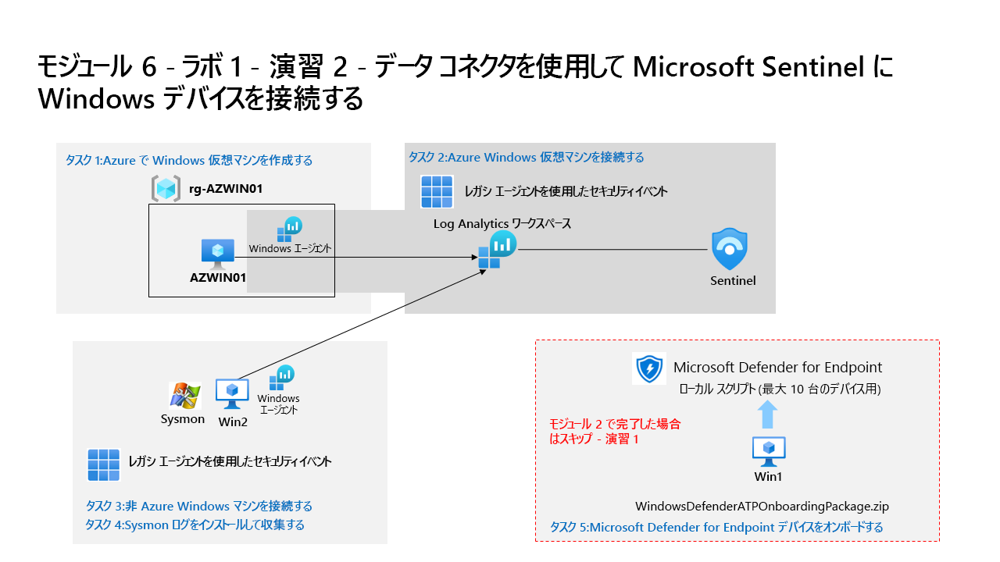

---
lab:
  title: 演習 2 - データ コネクタを使用して Microsoft Sentinel に Windows デバイスを接続する
  module: Learning Path 7 - Connect logs to Microsoft Sentinel
  description: あなたは Microsoft Sentinel を実装した企業で働いているセキュリティ運用アナリストです。 組織内の多くのデータ ソースからのログ データを接続する方法について学習する必要があります。 データの次のソースは、オンプレミス環境や他のパブリック クラウドなど、Azure の内部および外部にある Windows 仮想マシンです。
  duration: 30 minutes
  level: 200
  islab: true
  primarytopics:
    - Microsoft Defender
    - Microsoft Sentinel
    - Windows
---

# ラーニング パス 7 - ラボ 1 - 演習 2 - データ コネクタを使用して Microsoft Sentinel に Windows デバイスを接続する

## ラボのシナリオ



あなたは Microsoft Sentinel を実装した企業で働いているセキュリティ運用アナリストです。 組織内の多くのデータ ソースからのログ データを接続する方法について学習する必要があります。 データの次のソースは、オンプレミス環境や他のパブリック クラウドなど、Azure の内部および外部にある Windows 仮想マシンです。

>**重要:** ラーニング パス #7 のラボ演習はスタンドアロンの共有環境にあります。** 他の受講者も同じ環境を使用します。 あなたは、誰がこれらのタスクを実行するかについて他の受講者と調整する必要があります。 まず、先に進む前に、この環境が既に構成されているかどうかを調べます。 また、ラボを完了せずに終了する場合は、構成の再実行が必要になります。

### このラボの推定所要時間: 30 分

### タスク 1:Azure で Windows 仮想マシンを作成する

このタスクでは、Azure で Windows 仮想マシンを作成します。

>**注:** ラボ ホスティング プロバイダーは、Azure 仮想マシンを作成するための別の手順を提供する場合があります。 その場合は、以下の手順ではなく、これらの手順に従ってください。

1. 提供された資格情報を使用して管理者として **WIN1** 仮想マシンにサインインします。

1. Microsoft Edge ブラウザーで、Azure portal (`https://portal.azure.com` ) に移動します。

1. **サインイン** ダイアログ ボックスで、ラボ ホスティング プロバイダーから提供された**テナントの電子メール** アカウントをコピーして貼り付け、**[次へ]** を選択します。

1. **[パスワードの入力]** ダイアログ ボックスで、ラボ ホスティング プロバイダーから提供された**テナントパスワード**をコピーして貼り付け、**[サインイン]** を選択します。

    >**注:**  パスワードの代わりに "一時アクセス パス" (TAP) を入力するように求められる場合があります。** これはリソース タブにも表示されます。TAP を入力する画面が表示された場合は、値をコピーして貼り付けて **[サインイン]** を選択してください。

1. **[+ リソースの作成]** を選択します。 **ヒント:** 既に Azure portal にいた場合は、上部のバーから *[Microsoft Azure]* を選択してホームに移動する必要があることがあります。

1. **[サービスとマーケットプレースの検索]** ボックスに「*Windows 11*」と入力し、ドロップダウン リストから **[Window 11]** を選択します。

1. **[Window 11]** のボックスを選択します。

1. [プラン] ドロップダウン リストを開いて **[Windows 11 Enterprise バージョン 24H2]** を選択します。**

1. **[事前設定された構成で開始する]** を選択して続行します。

1. **[開発/テスト]** を選択してから、**[VM の作成を続行する]** を選びます。

    >**注:** 次の 2 つのステップで、一意の名前を持つ Azure リソースを作成する必要があります。 確実に一意にするために、自分のイニシャルとランダムな数の組み合わせを使うことをお勧めします。たとえばリソース グループは *RG-XXXXX123*、仮想マシンは *AZWIN-XXXXX123* などとします。

2. *[サブスクリプション]* ドロップダウン リストから、適切なサブスクリプションを選択します。

3. [リソース グループ] の **[新規作成]** を選択し、[名前] に「RG-*XXXXX123*」と入力して **[OK]** を選択します。**

    >**注:**  これは、追跡目的の新しいリソース グループとなります。 

4. [仮想マシン名] に「AZWIN-*XXXXX123*」と入力します。**

5. *[リージョン]* の既定値は **[(米国) 米国東部]** のままにします。

6. 下にスクロールして、仮想マシンの [イメージ] を確認します。** 空の場合は、**[Windows 11 Enterprise バージョン 24H2]** を選択します。

7. 仮想マシンの [サイズ] を確認します。** 空の場合は、**[すべてのサイズを表示]** を選択し、一覧表示されている最初の (D シリーズ) VM サイズを選択し、**[選択]** を選択します。

    >**注:** 次のメッセージが表示される場合: *This image is not supported for Azure Automanage. To disable this feature,navigate to the Management tab. Otherwise, select a supported image.* (このイメージは Azure Automanage ではサポートされていません。この機能を無効にするには、[管理] タブに移動してください。それ以外の場合は、サポートされているイメージを選択してください。) [管理] タブに移動し、"Automanage" を無効にします。 その後、作成プロセスは成功するようになります。

8. 下にスクロールし、選んだ [ユーザー名] を入力します。** **ヒント:** 予約語 (admin や root など) は避けて、*Student* ユーザー名 (例: *Student-xxxxxxx*) の使用を検討してください。

9. 任意の ''*パスワード*'' を入力します。 **ヒント:** LabUser パスワードを再利用する方が簡単な場合があります。 これは [リソース] タブにあります。2 回入力する必要がある場合があります。

10. ページの下部まで下にスクロールし、*[ライセンス]* の下にあるチェックボックスをオンにして、対象ライセンスがあることを確認します。

11. **[確認と作成]** を選択し、検証に合格するまで待ちます。

    >**注:** "ネットワーク" 検証エラーがある場合は、そのタブを選び、その内容を確認してから、 **[確認と作成]** をもう一度選びます。**

12. **［作成］** を選択します リソースが作成されるのを待ちますこれには数分かかることがあります。

### タスク 2: オンプレミスのサーバーを Azure に接続する

このタスクでは、オンプレミスのサーバーを Azure サブスクリプションに接続します。 Azure Arc は、このサーバーにプレインストールされています。 サーバーは、後で Microsoft Sentinel で検出と調査を行うシミュレートされた攻撃を実行するために次の演習で使用されます。

>**重要:** 以降のステップは、これまでとは異なるマシンで行います。

1. 管理者として **WINServer** 仮想マシンにログインします。パスワードは **Passw0rd!** です。 必要に応じて。  

    >**注:** 前述のように、Azure Arc は **WINServer** マシンにプレインストールされています。 これで、このマシンを Azure サブスクリプションに接続します。

1. **WINServer** マシンで、**検索**アイコンを選択し、**cmd** と入力します。

1. 検索結果の*コマンド プロンプト*を右クリックし、**[管理者として実行]** をクリックします。

1. コマンド プロンプト ウィンドウで、次のコマンドを入力します。 *Enter キーを押さないでください*

    ```cmd
    azcmagent connect -g "SentinelStatic" -l "CentralUS" -s "Subscription ID string"
    ```

1. **サブスクリプション ID 文字列** を、ラボ ホスト (*リソース タブ) から提供された *サブスクリプション ID* に置き換えます。 引用符は保持してください。

1. **Enter** を入力してコマンドを実行します (これには数分かかる場合があります)。

    >**注**: *[このファイルを開く方法を選んでください]* というブラウザー選択ウィンドウが表示される場合は、**[Microsoft Edge]** を選択します。

1. **[サインイン]** ダイアログ ボックスに、ラボ ホスティング プロバイダーから提供された**テナントのメール アドレス**と**テナントのパスワード**を入力して、**[サインイン]** を選択します。 *認証が完了*したというメッセージが表示されるまで待ち、ブラウザー タブを閉じて、*コマンド プロンプト* ウィンドウに戻ります。

1. コマンドの実行が完了したら、*コマンド プロンプト* ウィンドウを開いたままにし、次のコマンドを入力して接続が成功したことを確認します。

    ```cmd
    azcmagent show
    ```

1. コマンド出力で、*Agent status* が **Connected** であることを確認します。

### タスク 3: Azure Windows 仮想マシンを接続する

このタスクでは、Azure Windows 仮想マシンを Microsoft Sentinel に接続します。

>**注:** お使いの Azure サブスクリプションには、Microsoft Sentinel が **sentinelworkspace-01** という名前で事前にデプロイされており、必要な "コンテンツ ハブ" ソリューションもインストールされています。**

1. 提供された資格情報を使用して管理者として **WIN1** 仮想マシンにサインインします。  

1. 必要に応じて、Microsoft Edge ブラウザーを開いて Defender XDR (`https://security.microsoft.com`) に移動し、用意された資格情報でサインインします。

1. Microsoft Defender のナビゲーション メニューで、下スクロールして **[Microsoft Sentinel]** セクションを展開します。

1. **[コンテンツ管理]** セクションを展開して **[コンテンツ ハブ]** を選択します。

1. **[コンテンツ ハブ]** で、「**Windows セキュリティ イベント**」ソリューションを検索し、一覧から選択します。

1. **Windows セキュリティ イベント** のソリューション ページで、**[管理]** を選択します。

    >**注:** "Windows セキュリティ イベント" ソリューションでは、"AMA を使用した Windows セキュリティ イベント" と "レガシ エージェントを使用したセキュリティ イベント" データ コネクタの両方がインストールされます。** ** ** さらに、2 つのブック、20 個の分析ルール、43 個のハンティング クエリがインストールされます。

1. "AMA を使用した Windows セキュリティ イベント" データ コネクタを選択し、コネクタ情報ブレードの **[コネクタ ページを開く]** を選択します。****

1. [セットアップ] タブで、[構成] セクションまで下にスクロールし、**[+データ収集ルールの作成]** ボタンを選択します。********

1. [ルール名] に一意の名前を入力します。**ヒント:** "学生" のユーザー名と番号 (例: **AZWINXXXXXXXDCR**) を使用することを検討してください。入力したら **[次へ: リソース]** を選択します。****

1. *[リソース]* タブの *[スコープ]* の下の *[MOC サブスクリプション]* を展開します。

    >**ヒント:***[スコープ]* 列の前にある ">" を選択することで、*[スコープ]* 階層全体を展開できます。

1. **RG-AZWIN01** を展開し、**AZWIN01** を選択します。

1. **[次へ: 接続]** を選択します。

1. 別のセキュリティ イベント コレクション オプションを確認します。 [すべてのセキュリティ イベント] のままにして、 **[次へ: 確認と作成]** を選びます。**

1. **[作成]** を選んで、データ収集ルールを保存します。

1. 少し待ってから **[更新]** を選択すると、新しいデータ収集規則が一覧表示されます。

### タスク 4: 非 Azure Windows マシンを接続する

このタスクでは、Azure Arc に接続された非 Azure Windows 仮想マシンを、Microsoft Sentinel に追加します。  

   >**注:** "AMA を使用した Windows セキュリティ イベント" データ コネクタには非 Azure デバイス用の Azure Arc が必要です。**

1. Microsoft Sentinel ワークスペースの "AMA を使用した Windows セキュリティ イベント" データ コネクタの構成にいることを確認します。**

1. [構成] セクションで、**AZWINXXXXXXXDCR** というデータ収集ルールを編集するために鉛筆アイコンを選択します。********

1. **[次へ: リソース]** を選択し、*[リソース]* タブの *[スコープ]* の下の *[MOC サブスクリプション]* を展開します。

    >**ヒント:***[スコープ]* 列の前にある ">" を選択することで、*[スコープ]* 階層全体を展開できます。

1. **[SentinelStatic]** (またはあなたが作成したリソース グループ) を展開して、**[WINServer]** を選びます。

    >**重要:** WINServer が表示されない場合は、このサーバーに Azure Arc をインストールしたラーニング パス 3、演習 1、タスク 4 を参照してください。

1. **[次へ: 収集]** 、 **[次へ: 確認と作成]** の順に選択します。

1. *[検証に成功しました]* が表示されたら、 **[作成]** を選択します。

## 演習 3 に進む
