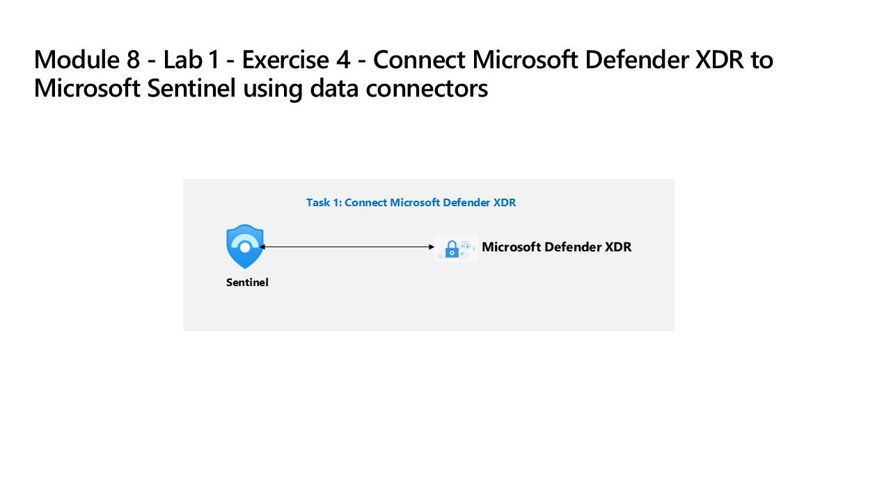

---
lab:
  title: 演習 4 - データ コネクタを使用して Defender XDR を Microsoft Sentinel に接続する
  module: Learning Path 7 - Connect logs to Microsoft Sentinel
  description: このタスクでは、Microsoft Defender XDR コネクタを展開します。
  duration: 40 minutes
  level: 200
  islab: true
  primarytopics:
    - Microsoft Defender
    - Microsoft Defender XDR
    - Microsoft Sentinel
---

# ラーニング パス 7 - ラボ 1 - 演習 4 - データ コネクタを使用して Defender XDR を Microsoft Sentinel に接続する

## ラボのシナリオ

あなたは、Microsoft Defender XDR と Microsoft Sentinel の両方を展開した会社で働いているセキュリティ運用アナリストです。 Microsoft Sentinel を Defender XDR に接続する統合セキュリティ運用プラットフォームを準備する必要があります。 次の手順では、Defender XDR コンテンツ ハブ ソリューションをインストールし、Defender XDR データ コネクタを Microsoft Sentinel に展開します。

>**注:** この演習の環境は、製品から生成されたシミュレーションです。 シミュレーションには制限があるため、ページ上のリンクが有効にならない場合があり、指定されたスクリプトに該当しないテキストベースの入力はサポートされない場合があります。 "This feature is not available within the simulation" (この機能はシミュレーション内では使用できません) というポップアップ メッセージが表示されます。 これが発生したら、[OK] を選択し、演習の手順を続行してください。

この演習では*対話型ガイド*を使用して、次のタスクの実行をシミュレートします。

- 新しい Microsoft Sentinel ワークスペースを Microsoft Defender XDR に接続します。
- 既存の Microsoft Sentinel ワークスペースを Microsoft Defender XDR に接続します。
- Microsoft Defender XDR ポータルで Microsoft Sentinel の機能を確認します。

### タスク 1: 新しい Microsoft Sentinel ワークスペースを Defender XDR に接続する

この対話型ガイドでは、完了までに約 10 分かかりますが、新しい Microsoft Sentinel ワークスペースを Defender XDR にオンボードします。

開始するには、下の画像を選択してください。

### タスク 2: 既存の Microsoft Sentinel ワークスペースを Defender XDR に接続する

この対話型ガイドでは、完了までに約 10 分かかりますが、既存の Microsoft Sentinel ワークスペースを Defender XDR に接続します。

開始するには、下の画像を選択してください。

Microsoft Sentinel を Microsoft Defender XDR に接続するためのシミュレーション演習を完了しました。 Microsoft Defender ポータルで Microsoft Sentinel の機能を確認できるようになりました。

>**注:**  他の Microsoft Sentinel 機能を自由に探索して比較できます。ただし、これはシミュレーションであるため、Microsoft Defender ポータルで Microsoft Sentinel を探索する機能は制限されています。 実際の環境では、Microsoft Defender ポータルで Microsoft Sentinel の完全な機能を探索できます。

## ラボを完了しました。ラーニング パス 9 - ラボ 1 - 演習 1 - Microsoft セキュリティ規則を変更するに進んでください
