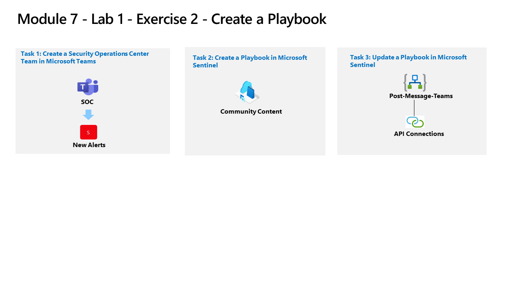

---
lab:
  title: 演習 2 - プレイブックを作成する
  module: Module 7 - Create detections and perform investigations using Microsoft Sentinel
ms.openlocfilehash: 8017ba4ba215da42fce83151d80756e441e480df
ms.sourcegitcommit: a90325f86a3497319b3dc15ccf49e0396c4bf749
ms.translationtype: HT
ms.contentlocale: ja-JP
ms.lasthandoff: 04/07/2022
ms.locfileid: "141493932"
---
# モジュール 7 - ラボ 1 - 演習 2 - プレイブックを作成する

## ラボのシナリオ

あなたは、Microsoft Sentinel を実装した会社で働いているセキュリティ運用アナリストです。 Microsoft Sentinel を使って脅威を検出および軽減する方法を学習する必要があります。 ここで、Microsoft Sentinel からルーチンとして実行できるアクションに応答して修復する必要があります。

プレイブックを使用すると、脅威への対応を自動化および調整したり、内部と外部両方の他のシステムと統合したり、分析ルールまたは自動化ルールによってそれぞれトリガーされた場合に、特定のアラートやインシデントに応答して自動的に実行されるように設定できます。 

### タスク 1:Microsoft Teams でセキュリティ オペレーション センター チームを作成する

このタスクでは、このラボ用のMicrosoft Teamsを作成します。

1. 管理者として WIN1 仮想マシンにログインします。パスワードは **Pa55w.rd**。  

1. Edge ブラウザーで、新しいタブを開き、Microsoft Teams ポータル (https://teams.microsoft.com) ) に移動します。

1. **[サインイン]** ダイアログ ボックスで、ラボ ホスティング プロバイダーから提供された **テナントの電子メール** アカウントをコピーして貼り付け、 **[次へ]** を選択します。

1. **[パスワードの入力]** ダイアログ ボックスで、ラボ ホスティング プロバイダーから提供された **テナントのパスワード** をコピーして貼り付け、 **[サインイン]** を選択します。

1. 表示される可能性のある Teams ポップアップをすべて閉じます。

1. まだ選択されていない場合は、左側のメニューの **[Teams]** を選択し、下部にある **[Join or create a team/チームに参加、またはチームを作成します]** を選択します。

1. メイン ウィンドウで **[Create a team/チームの作成]** ボタンを選択します。

1. **[From scratch/最初から]** ボタンを選択します。

1. 「**Private/プライベート**」ボタンを選択します。

1. チームに名前を付けます: 「**SOC**」と入力し、 **[Create/作成]** ボタンを選択します。

1. **Add members to SOC/SOC にメンバーを追加** 画面で、**Skip/スキップ** ボタンを選択します。 

1. [Teams] ブレードを下にスクロールし、新しく作成された SOC チームを見つけ、名前の右側にある **[...]** を選択し、 **[Add channel/チャネルの追加]** を選択します。

1. **New alert/新しいアラート** のチャネル名を入力し、「**Add/追加**」ボタンを選択します。

### タスク 2:Microsoft Sentinel プレイブックを作成する

このタスクでは、Microsoft Sentinel でプレイブックとして使用されるロジック アプリを作成します。

1. Edge ブラウザーで、Azure portal (https://portal.azure.com ) に移動します。

1. **[サインイン]** ダイアログ ボックスで、ラボ ホスティング プロバイダーから提供された **テナントの電子メール** アカウントをコピーして貼り付け、 **[次へ]** を選択します。

1. **[パスワードの入力]** ダイアログ ボックスで、ラボ ホスティング プロバイダーから提供された **テナントのパスワード** をコピーして貼り付け、 **[サインイン]** を選択します。

1. Azure portal の検索バーに「*Sentinel*」と入力してから、 **[Microsoft Sentinel]** を選択します。

1. 別のタブで、以下の URL にアクセスする。

  https://github.com/Azure/Azure-Sentinel/tree/master/Solutions/Teams/Playbooks/Post-Message-Teams
  
1. readme.md ボックスで、*[Quick Deployment]* オプションの 2 番目の **[Deploy with alert trigger]/(アラート トリガーを使用してデプロイする)** まで下にスクロールし、 **[Deploy to Azure]** ボタンを選択します。  

    >**非常に重要**: 必ず Deploy with **alert** trigger (2 つ目) を選択してください。

1. [Azure サブスクリプション] が選択されていることを確認します。

1. リソース グループで、 **[新規作成]** を選択し、「*RG-Playbooks*」と入力し、 **[OK]** を選択します。

1. *[リージョン]* の既定値は **[(米国) 米国東部]** のままにします。

1. *プレイブック名* が "PostMessageTeams-OnAlert" であることを確認し、 **[確認と作成]** を選択します。 **ヒント:** 名前が異なる場合は、GitHub に戻り、 **[アラート トリガーを使用してデプロイ]** プレイブックを選択します。

1. ここで **[作成]** を選択します。 

    >**注:**  次のタスクに進む前に、デプロイが完了するまで待機します。

### タスク 3:Microsoft Sentinel プレイブックを更新する

このタスクでは、作成した新しいプレイブックを適切な接続情報で更新します。

1. Azure portal の検索バーに「*Sentinel*」と入力してから、 **[Microsoft Sentinel]** を選択します。

1. Microsoft Sentinel ワークスペースを選択します。

1. *[構成]* 領域から **[オートメーション]** を選択し、 **[アクティブなプレイブック]** タブを選択します。

1. **PostMessageTeams-OnAlert** プレイブックを選択します。 **ヒント:** プレイブックが表示されない場合は、Ctrl + F5 キーを押して Azure portal ページを更新します。

1. *PostMessageTeams-OnAlert* の Logic App ページで、コマンド メニューの **[編集]** を選択します。

1. *最初の* ブロック、 **[Microsoft Sentinel Alert]** を選択します。

1. **[接続を変更してください]** リンクを選択します。

1. **[新規追加]** を選択し、 **[サインイン]** を選択します。 新しいウィンドウで、メッセージが表示されたら、Azure サブスクリプション管理者の資格情報を選択します。 ブロックの最後の行に "admin@xxxxxxxxxxx.onmicrosoft.com に接続しました" と表示されます。

1. 次に、*2 番目の* ブロック、 **[Alert - Get incidnet]** を選択します。

1. **[接続を変更してください]** リンクを選択します。

1. *[表示名]* で、Azure 管理者ユーザー名を持つ接続を選択します。 

1. 次に、*3 番目の* ブロック、 **[接続]** を選択します。

1. **[新規追加]** を選択し、メッセージが表示されたら Azure 管理者の資格情報を選択します。 

1. ブロックの名前が **[Post a message（V3）]** に変更されたことを確認してください。 *[チーム]* フィールドの最後にある **[X]** を選択して内容をクリアします。 フィールドは、Microsoft Teams から利用可能な Teams のリストを含むドロップダウンに変更されます。 **[SOC]** を選択します。

1. *[チャネル]* フィールドでも同じ操作を行い、フィールドの末尾にある **[X]** を選択して内容をクリアします。 フィールドがドロップダウンに変更され、SOC チームのチャネルの一覧が表示されます。 「**New alert/新しいアラート**」を選択します。

1. コマンド バーの **「保存」** を選択します。

これらはのちのラボで使用します。

## 演習 3 に進む
