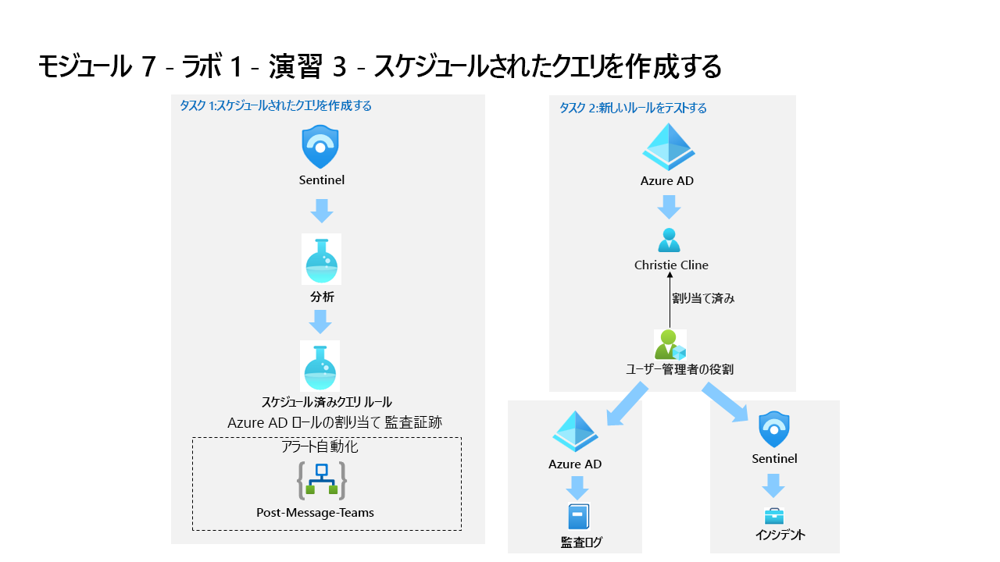

---
lab:
  title: 演習 3 - テンプレートからスケジュールされたクエリを作成する
  module: Learning Path 7 - Create detections and perform investigations using Microsoft Sentinel
---

# ラーニング パス 7 - ラボ 1 - 演習 3 - テンプレートからスケジュールされたクエリを作成する

## ラボのシナリオ

あなたは Microsoft Sentinel を実装した企業で働いているセキュリティ運用アナリストです。 Azure Sentinel を使って脅威を検出および軽減する方法を学習する必要があります。 データ ソースを Microsoft Sentinel に接続した後、環境内の脅威や異常な動作を検出するのに役立つカスタム分析ルールを作成します。

分析ルールでは、環境全体にわたる特定のイベントまたは一連のイベントを検索したり、特定のイベントしきい値または条件に達したときはユーザーに警告したり、SOC でトリアージと調査を行うためのインシデントを生成したり、自動化された追跡および修復プロセスを使用して脅威に対応したりします。

>                **メモ:** このラボをご自分のペースでクリックして進めることができる、 **[ラボの対話型シミュレーション](https://mslabs.cloudguides.com/guides/SC-200%20Lab%20Simulation%20-%20Create%20a%20scheduled%20query)** が用意されています。 対話型シミュレーションとホストされたラボの間に若干の違いがある場合がありますが、示されている主要な概念とアイデアは同じです。 

### タスク 1:スケジュールされたクエリの作成

このタスクでは、スケジュールされたクエリを作成し、前の演習で作成した Teams チャネルに接続します。

1. 管理者として WIN1 仮想マシンにログインします。パスワードは**Pa55w.rd**。  

1. **[サインイン]** ダイアログ ボックスで、ラボ ホスティング プロバイダーから提供された**テナントの電子メール** アカウントをコピーして貼り付け、 **[次へ]** を選択します。

1. **[パスワードの入力]** ダイアログ ボックスで、ラボ ホスティング プロバイダーから提供された**テナントのパスワード**をコピーして貼り付け、 **[サインイン]** を選択します。

1. Azure portal の検索バーに「*Sentinel*」と入力してから、**[Microsoft Sentinel]** を選択します。

1. Microsoft Sentinel ワークスペースを選択します。

1. 構成領域から **[分析]** を選択します。

1. コマンド バーの [規則のテンプレート] タブにいることを確認し、 **[New CloudShell User] (新しい CloudShell ユーザー)** 規則を検索します。**

1. ルールの概要ブレードで、 *[データ ソース: Azure アクティビティ]* の下にある緑色のアイコンを調べて、データを受信していることを確認します。

    >**注:** その表示が接続状態になっていない場合は、ラーニング パス 6、ラボ演習 1 のタスク 3 を完了していることを確認します。

1. **[ルールの作成]** を選んで続けます。

1. 分析ルール ウィザードの [全般] タブで、[重大度] を **[中]** に変更します。** **

1. **[次へ: ルール ロジックを設定 >]** ボタンを選択します。

1. ルール クエリで、 **[クエリ結果の表示]** を選びます。 結果やエラーは表示されないはずです。

1. 右上の **[X]** を選択して *[ログ]* ウィンドウを閉じ、 **[OK]** を選択して変更を破棄して保存し、ウィザードに戻ります。

1. 下にスクロールし、 *[クエリのスケジュール設定]* で次のように設定します。

    |設定|値|
    |---|---|
    |クエリの実行間隔|5 分|
    |次の時間分の過去のデータを参照します|1 日|

    >**注:**  同じデータに対して意図的に多くのインシデントを生成しています。 これにより、ラボはこれらのアラートを使用できるようになります。

1. *[アラートのしきい値]* 領域では、アラートですべてのイベントを登録するため、値はそのままにしておきます。

1. *[イベントのグループ化]* 領域では、 **[すべてのイベントを単一のアラートにグループ化する]** オプションを選択したままにしておきます。これは、クエリから、上記の指定されたアラートのしきい値よりも多くの結果が返される場合に限り、実行するたびに単一のアラートを生成する必要があるためです。

1. 下部にある **[次: インシデント設定 >]** ボタンを選択します。 

1. *[インシデント設定]* タブで、既定のオプションを確認します。

1. 下部にある **[次: 自動応答 >]** ボタンを選択します。

1. [自動応答] タブの [Automation rules] (自動化ルール) で、 **[新規追加]** を選びます。** **

1. *[Automation ルール名]* に「**Tier 2**」と入力します。

1. *[アクション]* で、 **[所有者の割り当て]** を選択します。

1. 次に、 **[自分に割り当てる]** を選択します。 次に、 **[+ アクションの追加]** を選択します。

1. *[次に]* ドロップダウン メニューを使って、 **[プレイブックの実行]** を選択します

1. 2 つ目のドロップダウン メニューが表示され、プレイブックのアクセス許可に関する "情報 (i)" メッセージと **[Manage playbook permissions] (プレイブックのアクセス許可の管理) リンク**が示されます**

    >**注:** アクセス許可が構成されるまで、プレイブックはドロップダウン リストにグレー表示されます。

1. **[Manage playbook permissions] (プレイブックのアクセス許可の管理) リンク**を選択します

1. *[アクセス許可の管理]* ページで、前のラボで作成した **RG-Playbooks** リソース グループを選択し、 **[適用]** を選択します。

1. ドロップダウン メニューから、前の演習で作成したプレイブック **PostMessageTeams-OnIncident** を選択します。

1. **[適用]** を選択します

1. **[次へ: 確認と作成 >]** ボタンを選択します。
  
1. **[保存]** を選択します。

### タスク 2: 新しいルールをテストする

このタスクでは、新しいスケジュールされたクエリ ルールをテストします。

1. Azure portal の上部バーで、Cloud Shell に対応するアイコン **>_** を選びます。 ディスプレイの解像度が低すぎる場合は、最初に省略記号アイコン **[...]** の選択が必要な場合があります。

1. **[Powershell]** を選んで、 **[ストレージの作成]** を選びます。 Cloud Shell がプロビジョニングされるまで待ちます。

1. Azure Cloud Shell ウィンドウを閉じます。

1. Azure portal の検索バーに「アクティビティ」と入力し、 **[アクティビティ ログ]** を選びます。**

1. [操作名] の項目に **[ストレージ アカウント キーの一覧表示]** と **[Update Storage Account Create] (ストレージ アカウントの作成の更新)** が表示されていることを確認します。** これらは、前に確認した KQL クエリがアラートを生成するために一致する操作です。 **ヒント:** **[最新の情報に更新]** を選んで一覧を更新することが必要な場合があります。

1. Azure portal の検索バーに「*Sentinel*」と入力してから、**[Microsoft Sentinel]** を選択します。

1. Microsoft Sentinel ワークスペースを選択します。

1. **[脅威の管理]** の *[インシデント]* メニュー オプションを選択します。

1. **[インシデントの自動更新]** トグルを選択します。

1. 新しく作成したインシデントが表示されます。

    >**注:** インシデントをトリガーするイベントは、処理に 5 分以上かかることがあります。 次の演習に進んでください。このビューには後で戻ります。

1. インシデントを選択し、右側のブレードの情報を確認します。

1. Microsoft Edge ブラウザーでタブを選択して、Microsoft Teams に戻ります。 閉じた場合は、単に新しいタブを開いて「https://teams.microsoft.com」と入力します。 *SOC* Teams に移動し、*[新しいアラート]* チャネルを選択して、インシデントに関するメッセージ投稿を確認します。

## 演習 4 に進む
