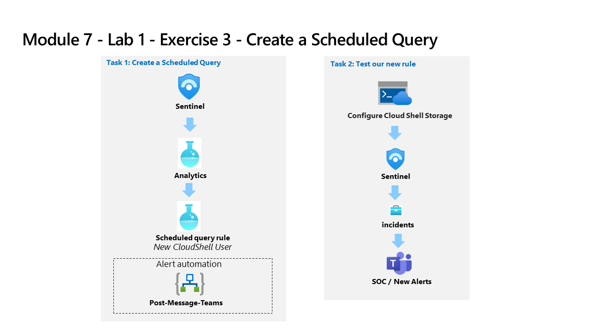

---
lab:
  title: 演習 3 - スケジュールされたクエリを作成する
  module: Module 7 - Create detections and perform investigations using Microsoft Sentinel
ms.openlocfilehash: 6e8d5655639433928d1c52d7c49077dead6121b4
ms.sourcegitcommit: a90325f86a3497319b3dc15ccf49e0396c4bf749
ms.translationtype: HT
ms.contentlocale: ja-JP
ms.lasthandoff: 04/07/2022
ms.locfileid: "141493989"
---
# <a name="module-7---lab-1---exercise-3---create-a-scheduled-query"></a>モジュール 7 - ラボ 1 - 演習 3 - スケジュールされたクエリを作成する

## <a name="lab-scenario"></a>ラボのシナリオ



あなたは、Microsoft Sentinel を実装した会社で働いているセキュリティ運用アナリストです。 Azure Sentinel を使って脅威を検出および軽減する方法を学習する必要があります。 データ ソースを Microsoft Sentinel に接続した後、環境内の脅威や異常な動作を検出するのに役立つカスタム分析ルールを作成します。

分析ルールでは、環境全体にわたる特定のイベントまたは一連のイベントを検索したり、特定のイベントしきい値または条件に達したときはユーザーに警告したり、SOC でトリアージと調査を行うためのインシデントを生成したり、自動化された追跡および修復プロセスを使用して脅威に対応したりします。


### <a name="task-1-create-a-scheduled-query"></a>タスク 1:スケジュールされたクエリの作成

このタスクでは、スケジュールされたクエリを作成し、前の演習で作成した Teams チャネルに接続します。

1. 管理者として WIN1 仮想マシンにログインします。パスワードは **Pa55w.rd**。  

1. **[サインイン]** ダイアログ ボックスで、ラボ ホスティング プロバイダーから提供された **テナントの電子メール** アカウントをコピーして貼り付け、 **[次へ]** を選択します。

1. **[パスワードの入力]** ダイアログ ボックスで、ラボ ホスティング プロバイダーから提供された **テナントのパスワード** をコピーして貼り付け、 **[サインイン]** を選択します。

1. Azure portal の検索バーに「*Sentinel*」と入力してから、 **[Microsoft Sentinel]** を選択します。

1. Microsoft Sentinel ワークスペースを選択します。

1. 構成領域から「**分析**」を選択します。

1. **[+ 作成]** ボタンを選択してから、 **[スケジュールされたクエリ ルール]** を選びます。

1. 分析ルール ウィザードの [全般] タブで、*Azure AD Role Assignment Audit Trail* という名前を入力します。

1. [戦術] では、 **[Persistence(永続化)]** を選択します。

1. [重要度] では、 **[低]** を選択します。

1. **[次へ: ルール ロジックを設定 >]** ボタンを選択します。

1. **ルールのクエリ**に、次のKQLステートメントを貼り付けます。

    >**警告:** ラボの仮想マシンへの貼り付け機能を使用すると、余分な (パイプ) 文字が追加される場合があります。 必ず最初にメモ帳に貼り付けてから、あらためてコピペしてください。

    ```KQL
    AuditLogs  
    | where isnotempty(InitiatedBy.user.userPrincipalName) and Result == 'success' and OperationName contains "member to role" and AADOperationType startswith "Assign"
    | extend InitiatedByUPN = tostring(InitiatedBy.user.userPrincipalName)
    | extend InitiatedFromIP = tostring(InitiatedBy.user.ipAddress)
    | extend TargetUser = tostring(TargetResources.[0].userPrincipalName)
    | extend TargetRoleName = tostring(TargetResources.[0].modifiedProperties.[1].newValue)
    | project TimeGenerated, InitiatedByUPN, InitiatedFromIP, TargetUser, TargetRoleName, AADOperationType, OperationName
    ```

1. **[View query results](クエリ結果の表示)** をクリックします。 結果やエラーは表示されないはずです。 エラーが表示される場合は、前の KQL ステートメントと同じようにクエリが表示されていることを確認してください。 右上の **[X]** を選択して *[ログ]* ウィンドウを閉じ、 **[OK]** を選択して変更を破棄して保存し、ウィザードに戻ります。

1. [分析ルール ウィザード - 新しいスケジュールされたルールの作成] ブレードの *[アラート エンリッチメント]* 領域で、 **[エンティティ マッピング]** を選び、次の値を選択します。 

    - *[エンティティの型]* ドロップダウン リストで、 **[Account]** を選択します。
    - *[ID]* が表示されているドロップダウン リストをクリックして、 **[FullName]** を選択します。
    - *[値]* ドロップダウン リストで、 **[InitiatedByUPN]** を選択します。

1. その後、 **[新しいエンティティの追加]** を選び、次の値を選択します。

    - *[エンティティの型]* ドロップダウン リストで、 **[IP]** を選択します。
    - *[ID]* ドロップダウン リストで、 **[Address]** を選択します。
    - *[値]* ドロップダウン リストで、 **[InitiatedFromIP]** を選択します。

1. 下にスクロールし、 *[クエリのスケジュール設定]* で次のように設定します。

    |設定|値|
    |---|---|
    |クエリの実行間隔|5 分|
    |過去のデータを見る|1 日|

    >**注:**  同じデータに対して意図的に多くのインシデントを生成しています。 これにより、ラボはこれらのアラートを使用できるようになります。

1. *[アラートのしきい値]* 領域では、アラートですべてのイベントを登録するため、値はそのままにしておきます。

1. *[イベントのグループ化]* 領域では、 **[すべてのイベントを単一のアラートにグループ化する]** オプションを選択したままにしておきます。これは、クエリから、上記の指定されたアラートのしきい値よりも多くの結果が返される場合に限り、実行するたびに単一のアラートを生成する必要があるためです。

1. 下部にある **[次: インシデント設定 >]** ボタンを選択します。 

1. *[インシデント設定]* タブで、既定のオプションを確認します。

1. 下部にある **[次: 自動応答 >]** ボタンを選択します。

1. *[アラートのオートメーション（クラシック）]* 領域で、前の演習で作成したプレイブック *PostMessageTeams-OnAlert* を選択します。

1. 下部にある **[次: 確認 >]** ボタンを選択します。
  
1. **［作成］** を選択します


### <a name="task-2-test-our-new-rule"></a>タスク 2:新しいルールをテストする

このタスクでは、新しいスケジュールされたクエリルールをテストします

1. Azureポータルの検索バーに「*Azure Active Directory*」と入力します。 「**Azure Active Directory**」を選択します。

1. [管理] 領域で **[ユーザー]** を選択し、[ユーザー - すべてのユーザー] ページが表示されるようにします。

1. リストで **[Christie Cline]** ユーザーを選択し、[Christie Cline - プロファイル] ページが表示されるようにします。

1. [管理] 領域で **[割り当てられたロール]** を選択し、[Christie Cline - 割り当てられたロール] ページが表示されるようにします。

1. コマンド バーから **[+ 割り当ての追加]** を選択します。

1. *[割り当ての追加]* ページの *[メンバーシップ]* タブで、 *[ロールの選択]* ドロップダウンリストから **[ユーザー管理者]** を選択します。 その後、 **[次へ >]** を選択します。

1. *[設定]* タブで既定の *[割り当ての種類]* を確認してから、 **[割り当て]** を選択します。 割り当ての完了に失敗した場合は、やり直してください。

1. 右上にある [x] を 2 回選択して、[Christie Cline - 割り当てられたロール] および [ユーザー - すべてのユーザー] ページを閉じます。

1. [Contoso - 概要] Azure Active Directory ページで、 *[監視]* の **[監査ログ]** を選択します。

1. **[データ設定のエクスポート]** を選択します。 Microsoft Sentinel の "Azure Active Directory" データ コネクタにより、Log Analytics ワークスペースにデータを送信するように構成が正しく設定されていることを確認します。これを行うには、 *[診断設定]* の情報を確認します。

1. 以前に Sentinel 用に作成した ''*Log Analytics ワークスペース*'' の *[診断設定]* エントリがあることを確認します。

1. 右上にある [x] を選択して、ページを閉じます。

1. [Contoso - 監査ログ] に戻り、 **[更新]** を選択します。これは、 *[カテゴリ: RoleManagement]* のエントリ (以前行ったロールの変更を示す) が表示されるまで行います。

1. Azure portal の検索バーに「*Sentinel*」と入力してから、 **[Microsoft Sentinel]** を選択します。

1. Microsoft Sentinel ワークスペースを選択します。

1. **インシデント** メニュー オプションを選択します。

    >**注:**  トリガーされたアラートの処理には 5 分以上かかる場合があります。 次の演習を続けて、後でこのポイントに戻ることができます。 [インシデント] ページを自動更新するには、 **[インシデントの自動更新]** トグルをオンにします。

1. 新しく作成したインシデントが表示されます。 インシデントを選択し、右側のブレードの情報を確認します。

1. Edge ブラウザーでタブを選択して、Microsoft Teams に戻ります。 閉じた場合は、単に新しいタブを開いて「 https://teams.microsoft.com 」と入力します。 *SOC* Teams に移動し、 *[新しいアラート]* チャネルを選択して、インシデントに関するメッセージ投稿を確認します。

## <a name="proceed-to-exercise-4"></a>演習 4 に進む
