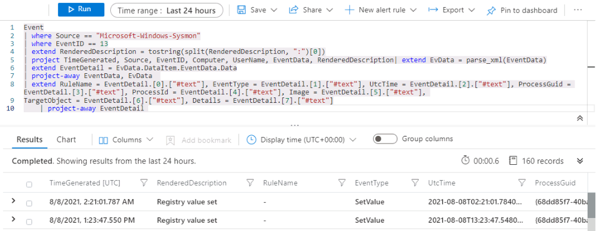
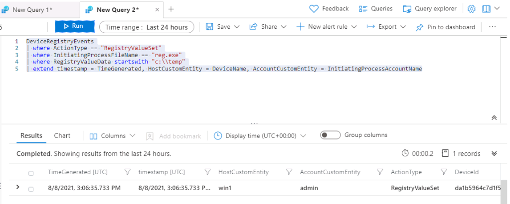

---
lab:
  title: 演習 6 - 検出を作成する
  module: Module 7 - Create detections and perform investigations using Microsoft Sentinel
ms.openlocfilehash: 6a6ca8f11f933f4e43a7c48b065bd646d0e4c501
ms.sourcegitcommit: 175df7de88c9a609f8caf39840664bf992c5b6dc
ms.translationtype: HT
ms.contentlocale: ja-JP
ms.lasthandoff: 02/05/2022
ms.locfileid: "138025472"
---
# <a name="module-7---lab-1---exercise-6---create-detections"></a>モジュール 7 - ラボ 1 - 演習 6 - 検出を作成する

## <a name="lab-scenario"></a>ラボのシナリオ

あなたは、Microsoft Sentinel を実装した会社で働いているセキュリティ運用アナリストです。 Log Analytics KQL クエリを使用し、そこから、環境内の脅威や異常な動作を検出するのに役立つカスタム分析ルールを作成します。

分析ルールでは、環境全体にわたる特定のイベントまたは一連のイベントを検索したり、特定のイベントしきい値または条件に達したときはユーザーに警告したり、SOC でトリアージと調査を行うためのインシデントを生成したり、自動化された追跡および修復プロセスを使用して脅威に対応したりします。


### <a name="task-1-attack-1-detection-with-sysmon"></a>タスク 1:Sysmon による攻撃 1 の検出

このタスクでは、セキュリティ イベント コネクタと Sysmon がインストールされているホストで **攻撃 1** の検出を作成します。

>**重要:** 次の手順は、以前に作業していたものとは異なるマシンで行います。 仮想マシン名の参照を探します。

1. 管理者として WIN1 仮想マシンにログインします。パスワードは **Pa55w.rd**。  

1. Edge ブラウザーで、Azure portal (https://portal.azure.com ) に移動します。

1. **サインイン** ダイアログ ボックスで、ラボのホスティングプロバイダーから提供された管理者用の **テナント電子メール** アカウントをコピーして貼り付け、 **[次へ]** を選択します。

1. **パスワードの入力** ダイアログ ボックスで、ラボ ホスティング プロバイダーから提供された管理者用の **テナントパスワード** をコピーして貼り付け、 **[サインイン]** を選択します。

1. Azure portal の検索バーに「*Sentinel*」と入力してから、 **[Microsoft Sentinel]** を選択します。

1. 先ほど作成した Microsoft Sentinel ワークスペースを選択します。

1. [全般] セクションから **[ログ]** を選択し、ログの *[時間範囲]* が **[過去 24 時間]** に設定されていることを確認します。

1. まず、データが保存されている場所を確認する必要があります。 以下の KQL ステートメントを **実行** します。

    ```KQL
    search "temp\\startup.bat"
    ```

1. 結果には、次の 3 つの異なるテーブルからのデータが示されます。

    - *DeviceProcessEvents*。 出典:Defender for Endpoint コネクタ。
    - *DeviceRegistryEvents*。 出典:Defender for Endpoint コネクタ。
    - *Event*。 出典:Log Analytics エージェント、Sysmon/Operational Windows イベント ログ (エージェント構成)。
    - *SecurityEvent*。 出典:Log Analytics エージェント、セキュリティ Windows イベント ログ (既定値)。

    さまざまなソースからデータを受け取るので、後で ''*結合*'' できる 2 つの KQL ステートメントを作成する必要があります。 最初の調査では、それぞれを個別に確認していきます。

    >**注:**  まれに、最初のデータ読み込みプロセスに予想よりも時間がかかります。 その場合、テーブルは数時間、結果に表示されません。 ここで *Event* テーブルのみが表示されている場合は続行できます。これは、ここで使用するものであるためです。

1. 分析する最初のデータ ソースは、Windows ホストからの Sysmon です。 次の KQL ステートメントを **実行** して、*Event* テーブルからの結果のみを表示します。

    ```KQL
    search in (Event) "temp\\startup.bat"
    ```

1. 最初の行を展開して、レコードに関連するすべての列を表示します。 *EventData* や *ParameterXml* などのいくつかのフィールドには、構造化データとして格納された複数のデータ項目があります。 これにより、特定のフィールドでのクエリが困難になります。 

1. そのため、各行からのデータを解析する KQL ステートメントを作成し、意味のあるフィールドを使用できるようにする必要があります。 GitHub の Microsoft Sentinel コミュニティでは、Parsers フォルダーに多くの例があります。 Edge ブラウザーで別のタブを開き、「 **https://github.com/Azure/Azure-Sentinel** 」と入力します。

1. **Parsers** フォルダーを選択し、次に **Sysmon** フォルダーを選択します。

1. Sysmon-v12.0.txtファイルを選択し確認します。

1. 以下のように、ファイルの先頭にあるコメントのすぐ後に、次の *let* ステートメントがあり、*Event* テーブルに対してクエリを実行し、*EventData* という名前の変数に格納していることがわかります。

    >**注:**  次のコード スニペットは、コピーして実行するのではなく、手順 16 のクエリをより深く理解するためのものです。

    ```
    let EventData = Event
    | where Source == "Microsoft-Windows-Sysmon"
    | extend RenderedDescription = tostring(split(RenderedDescription, ":")[0])
    | project TimeGenerated, Source, EventID, Computer, UserName, EventData, RenderedDescription
    | extend EvData = parse_xml(EventData)
    | extend EventDetail = EvData.DataItem.EventData.Data
    | project-away EventData, EvData  ;
    ```

1. 以下のように、ファイルのさらに下に、別の *let* ステートメントがあり、*EventID == 13* を探し、*EventData* 変数を入力として使用していることがわかります。

    >**注:**  次のコード スニペットは、コピーして実行するのではなく、手順 16 のクエリをより深く理解するためのものです。

    ```
    let SYSMON_REG_SETVALUE_13=()
    {
        let processEvents = EventData
        | where EventID == 13
        | extend RuleName = EventDetail.[0].["#text"], EventType = EventDetail.[1].["#text"], UtcTime = EventDetail.[2].["#text"], ProcessGuid = EventDetail.[3].["#text"], ProcessId = EventDetail.[4].["#text"], Image = EventDetail.[5].["#text"], TargetObject = EventDetail.[6].["#text"], Details = EventDetail.[7].["#text"]
        | project-away EventDetail  ;
        processEvents;
    };
    ```

1. これは良いスタートのように見えます。 上記の 2 つのステートメントを使用して、独自の KQL ステートメントを作成し、Event テーブル内の Sysmon を使ってすべてのレジストリ キー セット値行を表示します。 Microsoft Sentinel Edge ブラウザーのタブに戻り、次の KQL クエリを **実行** します。

    >**重要:** 最初に KQL クエリを *[メモ帳]* に貼り付け、そこから *[新しいクエリ 1]* ログ ウィンドウにコピーしてエラーを回避してください。

    ```KQL
    Event | where Source == "Microsoft-Windows-Sysmon"
    | where EventID == 13
    | extend RenderedDescription = tostring(split(RenderedDescription, ":")[0])
    | project TimeGenerated, Source, EventID, Computer, UserName, EventData, RenderedDescription
    | extend EvData = parse_xml(EventData)
    | extend EventDetail = EvData.DataItem.EventData.Data
    | project-away EventData, EvData  
    | extend RuleName = EventDetail.[0].["#text"], EventType = EventDetail.[1].["#text"], UtcTime = EventDetail.[2].["#text"], ProcessGuid = EventDetail.[3].["#text"], ProcessId = EventDetail.[4].["#text"], Image = EventDetail.[5].["#text"], TargetObject = EventDetail.[6].["#text"], Details = EventDetail.[7].["#text"]
    | project-away EventDetail 
    ```

   

1. ここから引き続き検出ルールを作成できますが、このクエリは、他の検出ルールの KQL ステートメントで再利用できるように見えます。 [ログ] ウィンドウで、 **[保存]** 、 **[関数として保存]** の順に選択します。 *[関数として保存]* ブレードで、次のように入力します。

    |設定|値|
    |---|---|
    |関数名|**Event_Reg_SetValue**|
    |従来のカテゴリ|**Sysmon**|

1. **[保存]** を選択し、 **[+]** 記号を選択して新しい [ログ クエリ] タブを開きます。 

1. 次の KQL ステートメントを **実行** して、新しく作成した関数をテストします。

    ```KQL
    Event_Reg_SetValue
    ```

1. 現在のデータ収集によっては、多くの行を受け取る可能性があります。 これは予期されることです。 次のタスクは、特定のシナリオにフィルターをかけることです 次の KQL ステートメントを **実行** して、現在確認できる特定のレコードを返して、行を特定するために変更できる内容を確認します。

    ```KQL
    Event_Reg_SetValue | search "startup.bat"
    ```

1. 結果から、脅威アクターが reg.exe を使用してレジストリ キーにキーを追加し、プログラムが C:\temp にあることがわかりました。次のステートメントを **実行** し、クエリの *search* 演算子を *where* 演算子に置き換えます。

    ```KQL
    Event_Reg_SetValue | where Image contains "reg.exe"
    | where Details startswith "C:\\TEMP"
    ```

1. これは良いスタートです アラートについてできるだけ多くのコンテキストを提供することにより、セキュリティ運用アナリストを支援することが重要です。 これには、調査グラフで使用するエンティティの投影が含まれます。 次のクエリを **実行** します。

    ```KQL
    Event_Reg_SetValue | where Image contains "reg.exe"
    | where Details startswith "C:\\TEMP"
    | extend timestamp = TimeGenerated, HostCustomEntity = Computer, AccountCustomEntity = UserName
    ```

1. 適切な検出ルールができたので、[ログ] ウィンドウで、コマンド バーの **[+ 新しいアラート ルール]** を選んでから、 **[Azure Sentinel アラートの作成]** を選択します。 これにより、「モジュール 7 - 演習 3」で作成したものと同じような、新しいスケジュールされたルールが作成されます。

1. これで [分析ルール ウィザード] が起動します。 *[全般]* タブで、次のように入力します。

    |設定|値|
    |---|---|
    |名前|**Sysmon Startup RegKey**|
    |説明|**c:\temp の Sysmon Startup Regkey**|
    |方針|**永続化**|
    |Severity|**高**|

1. **Next:ルールのロジックを設定 >** を選択します。 

1. *[ルール ロジックの設定]* タブの *[ルール クエリ]* には、 *[アラート エンリッチメント - エンティティ マッピング]* の下のエンティティだけでなく、KQL クエリが既に設定されているはずです。 **[-> 現在のデータでテストする]** を選択して、現在の構成で 1 日に受信できるアラートの数を確認します。

1. 下にスクロールし、 *[クエリのスケジュール設定]* で次のように設定します。

    |設定|値|
    |---|---|
    |クエリの実行間隔|5 分|
    |過去のデータを見る|1 日|

    >**注:**  同じデータに対して意図的に多くのインシデントを生成しています。 これにより、ラボはこれらのアラートを使用できるようになります。 この構成の変更により、受信されるアラートの数が増えます。

1.  **[-> 現在のデータでテストする]** をもう一度選択して、変更された構成で 1 日に受信できるアラートの数を確認します。

1. 残りのオプションは既定値のままにします。 **[次へ: インシデント設定>]** ボタンを選択します。

1. *[インシデント設定 (プレビュー)]* タブについては、既定値のままにし、 **[次へ: 自動応答 >]** ボタンを選択します。

1. *[自動応答]* タブでは、 *[アラートの自動化]* で **[PostMessageTeams-OnAlert]** を選んでから、 **[次へ: 確認 >]** ボタンを選択します。

1. *[確認]* タブで、 **[作成]** ボタンを選択して新しいスケジュール化された分析ルールを作成します。


### <a name="task-2-attack-1-detection-with-defender-for-endpoint"></a>タスク 2:エンドポイントのDefenderによる攻撃1の検出

このタスクでは、Microsoft Defender for Endpoint が構成されたホストで **攻撃 1** の検出を作成します。

1. Microsoft Sentinel ポータルで、[全般] セクションから **[ログ]** を選択します (このページから移動した場合)。

1. 次の KQL ステートメントをもう一度 **実行** して、このデータがあるテーブルを呼び出します。

    ```KQL
    search "temp\\startup.bat"
    ```

1. この検出は、Defender forEndpointからのデータに焦点を当てます。 以下の KQL ステートメントを **実行** します。

    ```KQL
    search in (Device*) "temp\\startup.bat"
    ```

1. テーブル *DeviceRegistryEvents* は、データが既に正規化されており、簡単にクエリを実行できるように見えます。 行を展開して、レコードに関連するすべての列を表示します。

    >**重要:** 結果に *DeviceRegistryEvents* テーブルが表示されない場合は、次のクエリの代替手段として、*DeviceProcessEvents* テーブルを代わりに使用します。 したがって、以下に示す 2 つの例のいずれかを使用します。

1. 結果から、脅威アクターが reg.exe を使用してレジストリ キーにキーを追加し、プログラムが C:\temp にあることがわかりました。次のステートメントを **実行** し、クエリの *search* 演算子を *where* 演算子に置き換えます。

    ```KQL
    DeviceRegistryEvents | where ActionType == "RegistryValueSet"
    | where InitiatingProcessFileName == "reg.exe"
    | where RegistryValueData startswith "c:\\temp"
    ```

1. または、*DeviceProcessEvents* テーブルを使用して、次の KQL クエリを **実行** することもできます。

    ```KQL
    DeviceProcessEvents | where ActionType == "ProcessCreated"
    | where FileName == "reg.exe"
    | where ProcessCommandLine contains "c:\\temp"
    ```

1. アラートについてできるだけ多くのコンテキストを提供することにより、セキュリティオペレーションセンターアナリストを支援することが重要です。 これには、調査グラフで使用するエンティティの投影が含まれます。 次のクエリを **実行** します。

    ```KQL
    DeviceRegistryEvents
    | where ActionType == "RegistryValueSet"
    | where InitiatingProcessFileName == "reg.exe"
    | where RegistryValueData startswith "c:\\temp"
    | extend timestamp = TimeGenerated, HostCustomEntity = DeviceName, AccountCustomEntity = InitiatingProcessAccountName
    ```

   

1. または、*DeviceProcessEvents* テーブルを使用して、次の KQL クエリを **実行** することもできます。

    ```KQL
    DeviceProcessEvents | where ActionType == "ProcessCreated"
    | where FileName == "reg.exe"
    | where ProcessCommandLine contains "c:\\temp"
    | extend timestamp = TimeGenerated, HostCustomEntity = DeviceName, AccountCustomEntity = InitiatingProcessAccountName
    ```

1. 適切な検出ルールができたので、[ログ] ウィンドウで、コマンド バーの **[+ 新しいアラート ルール]** を選んでから、 **[Azure Sentinel アラートの作成]** を選択します。 これにより、前に作成したものと同じような、新しいスケジュールされたルールが作成されます。

1. これで [分析ルール ウィザード] が起動します。 *[全般]* タブで、次のように入力します。

    |設定|値|
    |---|---|
    |名前|**MDE Startup RegKey**|
    |説明|**c:\temp の MDE Startup Regkey**|
    |方針|**永続化**|
    |Severity|**高**|

1. **[次へ: ルール ロジックを設定]** ボタンを選択します。

1. *[ルール ロジックの設定]* タブの *[ルール クエリ]* には、 *[アラート エンリッチメント - エンティティ マッピング]* の下のエンティティだけでなく、KQL クエリが既に設定されているはずです。

1. *[クエリのスケジュール設定]* では、次のように設定します。

    |設定|値|
    |---|---|
    |クエリの実行間隔|5 分|
    |過去のデータを見る|1 日|

    >**注:**  同じデータに対して意図的に多くのインシデントを生成しています。 これにより、ラボはこれらのアラートを使用できるようになります。

1. 残りのオプションは既定値のままにします。 **[次へ: インシデント設定>]** ボタンを選択します。

1. *[インシデント設定 (プレビュー)]* タブについては、既定値のままにし、 **[次へ: 自動応答 >]** ボタンを選択します。

1. *[自動応答]* タブでは、 *[アラートの自動化]* で **[PostMessageTeams-OnAlert]** を選んでから、 **[次へ: Review]\(次へ: 確認\)** をクリックします。

1. *[確認]* タブで、 **[作成]** ボタンを選択して新しいスケジュール化された分析ルールを作成します。


### <a name="task-3-attack-2-detection-with-securityevent"></a>タスク 3:SecurityEventによる攻撃2の検出

このタスクでは、セキュリティ イベント コネクタと Sysmon がインストールされているホストで **攻撃 2** の検出を作成します。

1. Microsoft Sentinel ポータルで、[全般] セクションから **[ログ]** を選択します (このページから移動した場合)。

1. 次の KQL ステートメントを **実行** して、管理者を指すエントリを特定します。

    ```KQL
    search "administrators" | summarize count() by $table
    ```

1. 結果には異なるテーブルからのイベントが表示される場合がありますが、ここでは、SecurityEvent テーブルを調査する必要があります。 目的の EventID および Event は "4732 - セキュリティが有効なローカル グループにメンバーが追加されました" です。 これを使用して、特権グループへのメンバーの追加を特定します。 次の KQL クエリを **実行** して確認します。

    ```KQL
    SecurityEvent | where EventID == 4732
    | where TargetAccount == "Builtin\\Administrators"
    ```

1. 行を展開して、レコードに関連するすべての列を表示します。 Administrator として追加されたアカウントのユーザー名は表示されません。 問題は、ユーザー名ではなく、セキュリティ識別子 (SID) が格納されることです。 次の KQL を **実行** して、SID と、Administrators グループに追加されたユーザー名を照合します。

    ```KQL
    SecurityEvent | where EventID == 4732
    | where TargetAccount == "Builtin\\Administrators"
    | extend Acct = MemberSid, MachId = SourceComputerId  
    | join kind=leftouter (
        SecurityEvent | summarize count() by TargetSid, SourceComputerId, TargetUserName | project Acct1 = TargetSid, MachId1 = SourceComputerId, UserName1 = TargetUserName

    ) on $left.MachId == $right.MachId1, $left.Acct == $right.Acct1
    ```

   

    >**注:**  ラボで使用されるデータセットが小さいため、このKQLは期待される結果を返さない場合があります。

1. 行を拡張して、結果の列を表示します。最後のものには、KQL クエリ内で ''*投影*'' する *UserName1* 列の下に追加されたユーザーの名前が示されます。 アラートについてできるだけ多くのコンテキストを提供することにより、セキュリティ運用アナリストを支援することが重要です。 これには、調査グラフで使用するエンティティの投影が含まれます。 次のクエリを **実行** します。

    ```KQL
    SecurityEvent | where EventID == 4732
    | where TargetAccount == "Builtin\\Administrators"
    | extend Acct = MemberSid, MachId = SourceComputerId  
    | join kind=leftouter (
        SecurityEvent | summarize count() by TargetSid, SourceComputerId, TargetUserName | project Acct1 = TargetSid, MachId1 = SourceComputerId, UserName1 = TargetUserName

    ) on $left.MachId == $right.MachId1, $left.Acct == $right.Acct1
    | extend timestamp = TimeGenerated, HostCustomEntity = Computer, AccountCustomEntity = UserName1
    ```

1. 適切な検出ルールができたので、[ログ] ウィンドウで、コマンド バーの **[+ 新しいアラート ルール]** を選んでから、 **[Azure Sentinel アラートの作成]** を選択します。

1. これで [分析ルール ウィザード] が起動します。 *[全般]* タブで、次のように入力します。

    |設定|値|
    |---|---|
    |名前|**SecurityEvent Local Administrators User Add**|
    |説明|**ローカル管理者グループに追加されたユーザー**|
    |方針|**特権エスカレーション**|
    |Severity|**高**|

1. **[次へ: ルール ロジックを設定]** ボタンを選択します。 

1. *[ルール ロジックの設定]* タブの *[ルール クエリ]* には、 *[アラート エンリッチメント - エンティティ マッピング]* の下のエンティティだけでなく、KQL クエリが既に設定されているはずです。

1. *[クエリのスケジュール設定]* では、次のように設定します。

    |設定|値|
    |---|---|
    |クエリの実行間隔|5 分|
    |過去のデータを見る|1 日|

    >**注:**  同じデータに対して意図的に多くのインシデントを生成しています。 これにより、ラボはこれらのアラートを使用できるようになります。

1. 残りのオプションは既定値のままにします。 **[次へ: インシデント設定>]** ボタンを選択します。

1. *[インシデント設定 (プレビュー)]* タブについては、既定値のままにし、 **[次へ: 自動応答 >]** ボタンを選択します。

1. *[自動応答]* タブでは、 *[アラートの自動化]* で **[PostMessageTeams-OnAlert]** を選んでから、 **[次へ: Review]\(次へ: 確認\)** をクリックします。

1. *[確認]* タブで、 **[作成]** ボタンを選択して新しいスケジュール化された分析ルールを作成します。

## <a name="proceed-to-exercise-7"></a>演習 7 に進む
