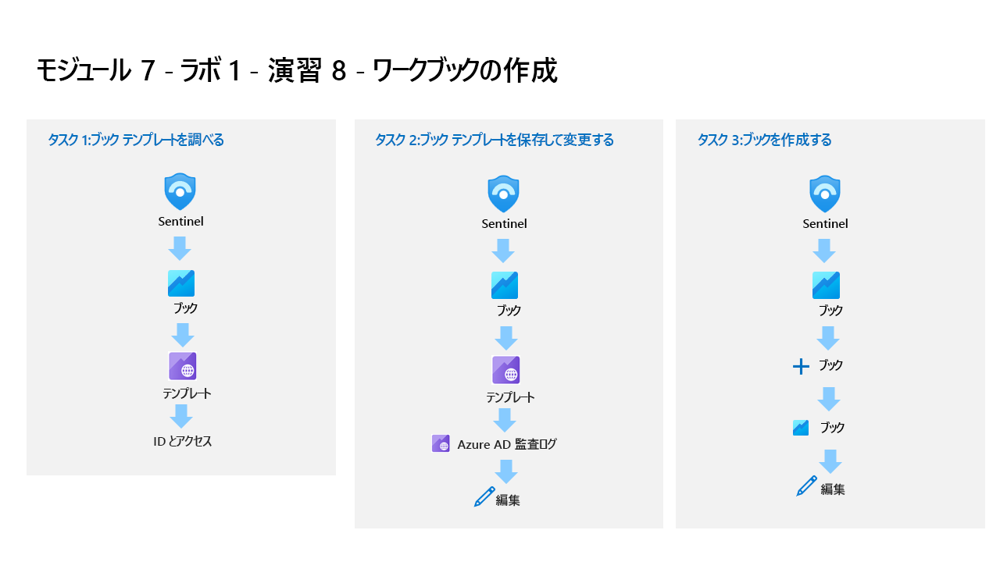

---
lab:
  title: 演習 8 - インシデントを調査する
  module: Learning Path 7 - Create detections and perform investigations using Microsoft Sentinel
---

# ラーニング パス 7 - ラボ 1 - 演習 8 - インシデントを調査する

## ラボのシナリオ

あなたは、Microsoft Sentinel を実装した会社で働いているセキュリティ運用アナリストです。 あなたはスケジュール済みおよび Microsoft セキュリティ分析ルールを既に作成しています。 Fusion と異常分析ルールも環境で有効になっています。 ここで、それらによって作成されたインシデントを調査します。

インシデントには複数のアラートを含めることができます。 これは、特定の調査に関連するすべての証拠を集計したものです。 重大度や状態など、アラートに関連するプロパティはインシデント レベルで設定されます。 検出対象となる脅威の種類と検出方法を Microsoft Sentinel に通知したら、インシデントを調査して、検出された脅威を監視できます。

>**メモ:** このラボをご自分のペースでクリックして進めることができる、 **[ラボの対話型シミュレーション](https://mslabs.cloudguides.com/guides/SC-200%20Lab%20Simulation%20-%20Investigate%20incidents)** が用意されています。 対話型シミュレーションとホストされたラボの間に若干の違いがある場合がありますが、示されている主要な概念とアイデアは同じです。 

### タスク 1:問題を調査する

このタスクでは、インシデントを調査します。

1. 管理者として WIN1 仮想マシンにログインします。パスワードは**Pa55w.rd**。  

1. Edge ブラウザーで、Azure portal (https://portal.azure.com ) に移動します。

1. **[サインイン]** ダイアログ ボックスで、ラボ ホスティング プロバイダーから提供された**テナントの電子メール** アカウントをコピーして貼り付け、 **[次へ]** を選択します。

1. **[パスワードの入力]** ダイアログ ボックスで、ラボ ホスティング プロバイダーから提供された**テナントのパスワード**をコピーして貼り付け、 **[サインイン]** を選択します。

1. Azure portal の検索バーに「*Sentinel*」と入力してから、**[Microsoft Sentinel]** を選択します。

1. 先ほど作成した Microsoft Sentinel ワークスペースを選択します。

1. **インシデント**ページを選択します。

1. インシデントの一覧を確認します。

    >**注:**  分析ルールは、同じ特定のログ エントリに対してアラートやインシデントを生成しています。 これは、ラボで使用するアラートやインシデントをさらに生成するために、 *[クエリのスケジュール設定]* 構成で行われていることに注意してください。
  
1. **[Startup RegKey]** インシデントのいずれかを選択します。

1. 開いた右側のブレードでインシデントの詳細を確認します。 下にスクロールし、 **[すべての詳細を表示]** ボタンを選択します。

1. [新しいインシデント エクスペリエンス] ポップアップが表示されたら、 **[次へ]** ボタンを選択して情報を読み取り、プロンプトに従います。

1. インシデントの左側のブレードで、状態を **[アクティブ]** に変更し、 **[適用]** を選択します。

1. *[タグ]* 領域まで下にスクロールし、[**+**] を選択して「**RegKey**」と入力し、**[OK]** を選択します。

1. 下にスクロールし、 *[コメントの書き込み...]* ボックスに「*これを調べます*」と入力し、 **[>]** アイコンを選択して新しいコメントを送信します。

1. 所有者の横にある **[<<]** アイコンを選択して、左側のブレードを非表示にします。

1. **[インシデント タイムライン]** ウィンドウを確認します。 右上にある **[インシデント アクション]** ボタンを選択した後、**[プレイブックの実行]** を選択します。 *PostMessageTeams-OnIncident* というプレイブックが表示されます。 このオプションは、プレイブックを手動で実行するのに役立ちます。

1. 右上にある **[x]** アイコンを選択して、*[インシデントでのプレイブックの実行]* ブレードを閉じます。

1. **[エンティティ]** ウィンドウを確認します。 少なくとも、前の演習の KQL クエリ内でマップした *[ホスト]* エンティティが表示されるはずです。 **ヒント:** エンティティが表示されない場合は、ページを更新します。

1. コマンド バーから新しい **[タスク (プレビュー)]** ボタンを選択します。

1. **[+ タスクの追加]** を選択し、[タイトル] ボックスに「**マシンを所有するユーザーを確認する**」と入力し、 **[保存]** を選択します。

1. 右上にある *[x]* アイコンを選択して、 **[インシデント タスク (プレビュー)]** ブレードを閉じます。

1. コマンド バーから新しい **[アクティビティ ログ]** ボタンを選択します。

1. この演習で実行したアクションを確認します。

1. 右上にある *[x]* アイコンを選択して、 **[インシデント アクティビティ ログ]** ブレードを閉じます。

1. ほぼ非表示の左側のブレードで、 **[未割り当て]** という名前のユーザー アイコンを選択します。 新しいインシデント エクスペリエンスを使用すると、ここから簡単に変更できます。

1. **[自分に割り当て]** を選び、下にスクロールして **[適用]** を選択して変更を保存します。

1. **[>>]** アイコンを選択して、左側のブレードを展開します。 次に、 **[調査]** ボタンを選択します。

    >**ヒント:** アイコンが画面に対して小さすぎる場合は、 **[+]** を選択して拡大します。

1. WINServer エンティティ アイコンを**ポイント**し、新しい "*探索クエリ*" が表示されるまで待ちます。 [*関連するアラート*] により多くのデータがあることが確認されます。 探索クエリ **[関連するアラート]** の名前を選択して調査グラフに表示するか、 **[イベント >]** を選択して KQL クエリで調査します。

1. 右上にある **[X]** アイコンを選択してクエリ ウィンドウを閉じて、 *[調査]* ページに戻ります。

1. ここで **WINServer** エンティティを選択すると、右側のウィンドウが開き、詳細情報が表示されます。 **[情報]** ページを確認します。

1. **[タイムライン]** ボタンを選択します。 インシデントをポイントし、グラフのどの項目がどの時点で発生したかを確認します。

1. **[エンティティ]** ボタンを選択し、*WINServer* に関連する *[エンティティ]* と *[アラート]* を確認します。

1. ページの右上にある **[X]** アイコンを選択して、調査グラフを閉じます。

1. インシデント ページに戻り、左側のウィンドウで **[アクティブな状態]** を選択し、 **[終了]** を選びます。 

1. *[分類を選択する]* ドロップダウンで、さまざまなオプションを確認します。 その後、 **[真陽性 - 疑わしいアクティビティ]** を選択し、 **[適用]** を選択します。

## 演習 9 に進む
