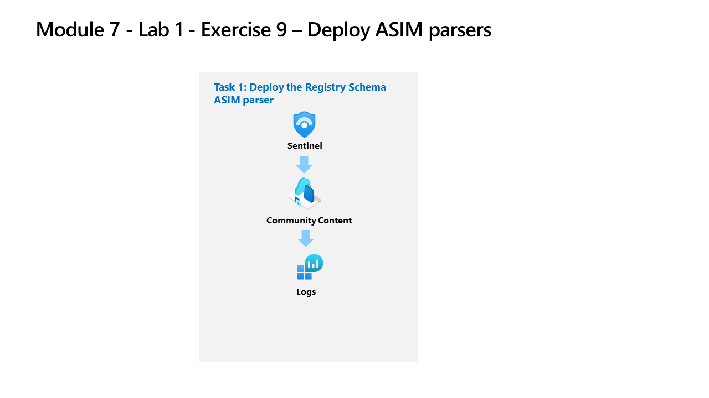

---
lab:
  title: 演習 9 - ASIM パーサーを作成する
  module: Learning Path 7 - Create detections and perform investigations using Microsoft Sentinel
---

# ラーニング パス 7 - ラボ 1 - 演習 9 - ASIM パーサーをデプロイする

## ラボのシナリオ

あなたは Microsoft Sentinel を実装した企業で働いているセキュリティ運用アナリストです。 特定の Windows レジストリ イベントに対して ASIM パーサーをモデル化する必要があります。 これらのパーサーは、「[Advanced Security Information Model (ASIM) レジストリ イベント正規化スキーマのリファレンス](https://docs.microsoft.com/en-us/azure/sentinel/registry-event-normalization-schema)」に従って、後で最終処理されます。

>**メモ:** このラボをご自分のペースでクリックして進めることができる、 **[ラボの対話型シミュレーション](https://mslabs.cloudguides.com/guides/SC-200%20Lab%20Simulation%20-%20Create%20Advanced%20Security%20Information%20Model%20Parsers)** が用意されています。 対話型シミュレーションとホストされたラボの間に若干の違いがある場合がありますが、示されている主要な概念とアイデアは同じです。 

### タスク 1:レジストリ スキーマ ASIM パーサーをデプロイする

このタスクでは、Microsoft Sentinel のデプロイに含まれているレジストリ スキーマ パーサーを確認します。

1. 管理者として WIN1 仮想マシンにログインします。パスワードは**Pa55w.rd**。  

1. Microsoft Edge ブラウザーで、Azure portal (https://portal.azure.com ) に移動します。

1. **サインイン** ダイアログ ボックスで、ラボ ホスティング プロバイダーから提供された**テナントの電子メール** アカウントをコピーして貼り付け、**[次へ]** を選択します。

1. **[パスワードの入力]** ダイアログ ボックスで、ラボ ホスティング プロバイダーから提供された**テナントパスワード**をコピーして貼り付け、**[サインイン]** を選択します。

1. Azure portal の検索バーに「*Sentinel*」と入力してから、**[Microsoft Sentinel]** を選択します。

1. 先ほど作成した Microsoft Sentinel ワークスペースを選択します。

<!--- 1. In the Edge browser, open a new tab (Ctrl+T) and navigate to the Microsoft Sentinel GitHub ASIM page <https://github.com/Azure/Azure-Sentinel/tree/master/ASIM>.

 1. On the right pane, select the **Onboard community content** link. This will open a new tab in the Edge Browser for Microsoft Sentinel GitHub content. **Hint:** You might need to scroll right to see the link. Alternatively, follow this link instead: [Microsoft Sentinel on GitHub](https://github.com/Azure/Azure-Sentinel).

    >**Note:** In the **ASIM** folder you can deploy templates that contain all ASIM parsers, but we will only focus on the Registry Schema.

<!--- 1. Scroll down and next to **Registry Event**, select the **Deploy to Azure** button.

1. For *Resource Group*, select **RG-Defender** where your Sentinel workspace resides.

1. For *Workspace*, type your Sentinel workspace name, like *uniquenameDefender*.

1. Leave the other default values and select **Review + create**.

1. Select **Create** to deploy the template. Notice the Names of the different resources. 

1. After the deployment completes return to the *Microsoft Sentinel* tab. --->

1. 左側のメニューの *[全般]* で、 **[ログ]** を選択します。

1. 必要に応じて **[>>]** を選択して、 *[スキーマとフィルター]* ブレードを開きます。

1. **[関数]** タブ ([テーブル] と [クエリ] タブの横にある) を選択します。 **ヒント:** タブを選択するには、省略記号アイコン **(...)** を選ぶ必要がある場合があります。

1. *[検索]* バーに「**レジストリ**」と入力し、*Microsoft Sentinel* の見出しの下に Microsoft Windows の *_Im_RegistryEvent_MicrosoftWindowsEventxxx* が表示されるまで、ASIM パーサー関数を下スクロールします。

    >**注:**  バージョンの変更を考慮して、ASIM パーサー関数名に xxx を使用しています。 このラボが更新された時点では、関数は _Im_RegistryEvent_MicrosoftWindowsEvent*V02* でした。

1. **_Im_RegistryEvent_MicrosoftWindowsEventxxx** ASIM 関数にカーソルを合わせ、ポップアップ ウィンドウで **[関数コードの読み込み]** を選択します。

1. イベント ID 4657 を解析している KQL を確認し、Microsoft Sentinel ワークスペース内のデータの分析を簡略化します。

    >**ヒント:** コード ウィンドウで Ctrl + f キーを押して *[検索]* を表示し、* EventID:4657* を検索する方がはるかに簡単です。

1. [スキーマとフィルター] ブレードに戻り、"Microsoft Windows イベントとセキュリティ イベントのレジストリ イベント ASIM フィルタリング パーサー" ** _Im_RegistryEvent_MicrosoftWindowsEventxxx** にホバーして、**[エディターで使用]** を選択します。****

1. ASIM 関数クエリを**実行**します。 結果やエラーは表示されないはずです。これは検証のみを目的としています。

## 演習 10 に進む