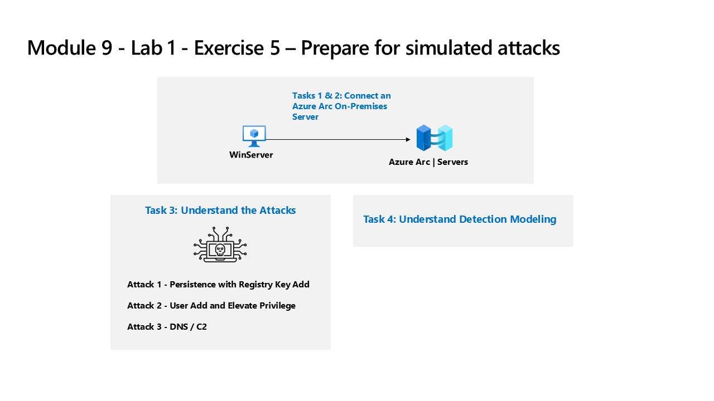

---
lab:
  title: 演習 4 - シミュレートされた攻撃を実行するための準備をする
  module: Learning Path 8 - Create detections and perform investigations using Microsoft Sentinel
  description: このタスクでは、オンプレミスのサーバーを Azure サブスクリプションに接続します。 Azure Arc は、このサーバーにプレインストールされています。 後で Microsoft Sentinel で検出と調査を行うシミュレートされた攻撃を実行するために、サーバーは次の演習で使用されます。
  duration: 30 minutes
  level: 300
  islab: true
  primarytopics:
    - Azure
    - Azure Arc
    - Microsoft Sentinel
---

# ラーニング パス 8 - ラボ 1 - 演習 4 - シミュレートされた攻撃を実行するための準備をする

## ラボのシナリオ



>**重要:** ラーニング パス #9 のラボ演習は、"スタンドアロンの共有" 環境にあります。** 他の受講者も同じ環境を使用します。 あなたは、誰がこれらのタスクを実行するかについて他の受講者と調整する必要があります。 まず、先に進む前に、この環境が既に構成されているかどうかを調べます。 また、ラボを完了せずに終了する場合は、構成の再実行が必要になります。

### このラボの推定所要時間: 30 分

### タスク 1: オンプレミスのサーバーを接続する

このタスクでは、オンプレミスのサーバーを Azure サブスクリプションに接続します。 Azure Arc は、このサーバーにプレインストールされています。 後で Microsoft Sentinel で検出と調査を行うシミュレートされた攻撃を実行するために、サーバーは次の演習で使用されます。

>**重要:** 次の手順は、以前に作業していたものとは異なるマシンで行います。 参照タブで仮想マシン名を探します。

前述のように、Azure Arc Connected Machine エージェント (azcmagent) は、**WINServer** マシンにプレインストールされています。 このマシンを Azure サブスクリプションに接続する前に、接続状態を確認します。

1. 提供された資格情報を使用して管理者として **WINServer** 仮想マシンにサインインします。

1. **WINServer** 仮想マシンで、**[検索]** アイコンを選択し、「*cmd*」 と入力します。

1. 検索結果の*コマンド プロンプト*を右クリックし、**[管理者として実行]** をクリックします。

1. [コマンド プロンプト] ウィンドウで、次のコマンドを入力して、Azure Arc エージェントの接続状態を確認します。

    ```cmd
    azcmagent show
    ```
1. コマンド出力で、[エージェントの状態] が **[接続済み]** であることを確認します。** **タスク 2** に進みます。 

1. 接続されていない場合は、Azure Arc と **WINServer** の再接続に進む前に、次の手順を実行します。

    1. *Microsoft Edge* ブラウザーで Azure portal (`https://portal.azure.com`) を開き、*SentinelStatic* リソース グループにリソースとして一覧表示されて "いない" ことを確認します。** 表示されている場合は、それを選択してリソース グループから削除します。
    
    1. **WINServer** がリソース グループから削除された後、**WINServer** コマンド プロンプトから次のコマンドを実行して、Azure Arc から切断されていることを確認します。

        ```cmd
        azcmagent disconnect --force-local-only
        ```
    1. 次の手順のために、ブラウザーとコマンド プロンプト ウィンドウを開いたままにしておきます。

1. 次のコマンドを実行して、マシンを Azure Arc に接続します。

    ```cmd
    azcmagent connect -g "SentinelStatic" -l "CentralUS" -s "Subscription ID string"
    ```
1. **サブスクリプション ID 文字列** を、ラボ ホスト (*リソース タブ) から提供された *サブスクリプション ID* に置き換えます。 引用符は保持してください。

1. *Enter* を入力してコマンドを実行します (これには数分かかる場合があります)。

    >**注**: *[このファイルを開く方法を選んでください]* というブラウザー選択ウィンドウが表示される場合は、**[Microsoft Edge]** を選択します。

1. **[サインイン]** ダイアログ ボックスに、ラボ ホスティング プロバイダーから提供された**テナントのメール アドレス**と**テナントのパスワード**を入力して、**[サインイン]** を選択します。 *認証が完了*したというメッセージが表示されるまで待ち、ブラウザー タブを閉じて、*コマンド プロンプト* ウィンドウに戻ります。

    >**注:**  パスワードの代わりに "一時アクセス パス" (TAP) を入力するように求められる場合があります。** これは、[リソース] タブにも表示されます。ダイアログが表示されたら、TAP 値をコピーして貼り付け、**[サインイン]** を選択します。

1. コマンドの実行が完了したら、*コマンド プロンプト* ウィンドウを開いたままにし、次のコマンドを入力して接続が成功したことを確認します。

    ```cmd
    azcmagent show
    ```
1. コマンド出力で、*Agent status* が **Connected** であることを確認します。

## タスク 2:非 Azure Windows マシンを接続する

このタスクでは、Azure Arc に接続されたオンプレミスのマシンを、Microsoft Sentinel に追加します。  

>**注:** お使いの Azure サブスクリプションには、Microsoft Sentinel が **sentinelworkspace-01** という名前で事前にデプロイされており、必要な "コンテンツ ハブ" ソリューションもインストールされています。**

1. 提供された資格情報を使用して管理者として **WIN1** 仮想マシンにサインインします。

1. **Microsoft Edge** ブラウザーで、**Microsoft Defender XDR** (`https://security.microsoft.com`) に移動します。

1. **[サインイン]** ダイアログ ボックスで、ラボ ホスティング プロバイダーから提供された**テナントの電子メール** アカウントをコピーして貼り付け、**[次へ]** を選択します。

1. **[パスワードの入力]** ダイアログ ボックスで、ラボ ホスティング プロバイダーから提供された**テナントパスワード**をコピーして貼り付け、**[サインイン]** を選択します。

    >**注:**  パスワードの代わりに "一時アクセス パス" (TAP) を入力するように求められる場合があります。** これはリソース タブにも表示されます。TAP を入力する画面が表示された場合は、値をコピーして貼り付けて **[サインイン]** を選択してください。

1. Microsoft Defender ナビゲーション メニューで下スクロールし、**[Microsoft Sentinel]** セクションを展開します。

1. **[構成]** セクションを展開して **[データ コネクタ]** を選択します。

1. **[データ コネクタ]** で、「**AMA を使用した Windows セキュリティ イベント**」ソリューションを検索し、一覧から選択します。

1. **[AMA を使用した Windows セキュリティ イベント]** 詳細ウィンドウで、**[コネクタ ページを開く]** を選択します。

    >**注:** "Windows セキュリティ イベント" ソリューションでは、"AMA を使用した Windows セキュリティ イベント" と "レガシ エージェントを使用したセキュリティ イベント" データ コネクタの両方がインストールされます。** ** ** さらに、2 つのブック、20 個の分析ルール、43 個のハンティング クエリがインストールされます。

1. **[構成]** セクションの [ルール] セクションで、**[データ収集ルールの作成]** を選択します。

1. DCR の規則名 (**WINSERVERDCR** など) を入力し、**[次へ: リソース >]** を選択します。

    >**注:** ルール名に一意の名前を使用する場合は、ご自分の "受講者" ユーザー名番号を使用して、**WINXXXXXXXXDCR** のように、一意にすることを検討してください。**

1. *[リソース]* タブの *[スコープ]* の下の *[サブスクリプション]* を展開します。

    >**ヒント:***[スコープ]* 列の前にある ">" を選択することで、*[スコープ]* 階層全体を展開できます。

1. **[SentinelStatic]** リソース グループを展開して、**[WINServer]** を選択します。

1. **[次へ: 収集 >]** ボタンを選択します。*[すべてのセキュリティ イベント]* はオンのままにします。

1. **[次へ: 確認と作成 >]** を選択します。

1. *[検証に成功しました]* が表示されたら、 **[作成]** を選択します。

### タスク 3: 攻撃を理解する

>**重要:この演習では、アクションを実行しません。**  これらの手順は、次の演習で実行する攻撃について説明するものにすぎません。 このページをよくお読みください。

攻撃パターンは、オープン ソース プロジェクトに基づいています。 `https://github.com/redcanaryco/atomic-red-team`

#### 攻撃 1 - レジストリ キーの追加による永続性

攻撃者は、Run レジストリ キーにプログラムを追加します。 これにより、ユーザーがログオンするたびにプログラムが実行されるため、永続化が実現します。

```
REG ADD "HKCU\SOFTWARE\Microsoft\Windows\CurrentVersion\Run" /V "SOC Test" /t REG_SZ /F /D "C:\temp\startup.bat"
```

#### 攻撃 2 - ユーザーが特権を追加および昇格

攻撃者は新しいユーザーを追加し、新しいユーザーを Administrators グループに昇格させます。 これにより、攻撃者は特権のある別のアカウントでログオンできます。

```
net user theusernametoadd /add
net user theusernametoadd ThePassword1!
net localgroup administrators theusernametoadd /add
```

#### 攻撃 3 - ドメイン ネーム サービスおよびコマンド & コントロール

攻撃者は、コマンド & コントロール (C2) サーバーに大量の DNS クエリを送信します。 この目的は、単一ソースのシステムまたは単一ターゲットのドメインからの DNS クエリの数に対して、しきい値ベースの検出をトリガーすることです。

```
param(
    [string]$Domain = "microsoft.com",
    [string]$Subdomain = "subdomain",
    [string]$Sub2domain = "sub2domain",
    [string]$Sub3domain = "sub3domain",
    [string]$QueryType = "TXT",
        [int]$C2Interval = 8,
        [int]$C2Jitter = 20,
        [int]$RunTime = 240
)
$RunStart = Get-Date
$RunEnd = $RunStart.addminutes($RunTime)
$x2 = 1
$x3 = 1 
Do {
    $TimeNow = Get-Date
    Resolve-DnsName -type $QueryType $Subdomain".$(Get-Random -Minimum 1 -Maximum 999999)."$Domain -QuickTimeout
    if ($x2 -eq 3 )
    {
        Resolve-DnsName -type $QueryType $Sub2domain".$(Get-Random -Minimum 1 -Maximum 999999)."$Domain -QuickTimeout
        $x2 = 1
    }
    else
    {
        $x2 = $x2 + 1
    }
    if ($x3 -eq 7 )
    {
        Resolve-DnsName -type $QueryType $Sub3domain".$(Get-Random -Minimum 1 -Maximum 999999)."$Domain -QuickTimeout
        $x3 = 1
    }
    else
    {
        $x3 = $x3 + 1
    }
    $Jitter = ((Get-Random -Minimum -$C2Jitter -Maximum $C2Jitter) / 100 + 1) +$C2Interval
    Start-Sleep -Seconds $Jitter
}
Until ($TimeNow -ge $RunEnd)
```

### タスク 4: 検出モデリングの理解

このラボで使用されている攻撃検出構成サイクルは、2つの特定のデータソースのみに焦点を当てている場合でも、すべてのデータソースを表します。

検出を構築するには、最初に KQL ステートメントの構築から始めます。 ホストを攻撃するため、KQL ステートメントの作成を開始するための代表的なデータがあります。

KQL ステートメントを取得したら、分析ルールを作成します。

ルールがトリガーされてアラートとインシデントが作成されたら、調査を行って、セキュリティ オペレーション アナリストの調査に役立つフィールドを提供しているかどうかを判断します。

次に、分析ルールにその他の変更を加えます。

>**注:**  一部のアラートは、ラボの目的のためだけに、より短い時間枠でトリガーされます。

## 演習 5 に進みます
