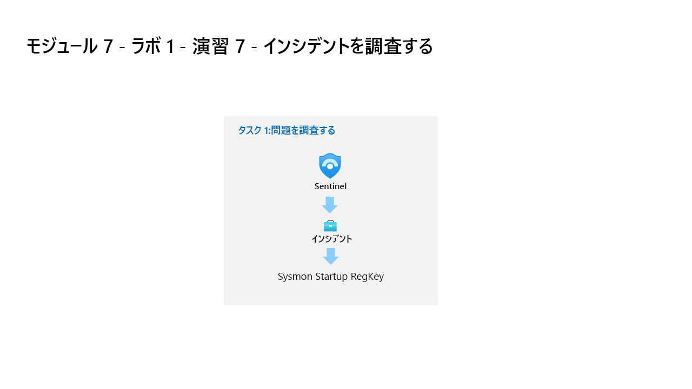

---
lab:
  title: 演習 6 - 検出を作成する
  module: Learning Path 8 - Create detections and perform investigations using Microsoft Sentinel
  description: このタスクでは、前の演習の最初の攻撃の検出を作成します。
  duration: 45 minutes
  level: 300
  islab: true
  primarytopics:
    - Microsoft Sentinel
    - Kusto Query Language (KQL)
---

# ラーニング パス 8 - ラボ 1 - 演習 6 - 検出を作成する

## ラボのシナリオ



あなたは、Microsoft Sentinel を実装した会社で働いているセキュリティ運用アナリストです。 Log Analytics KQL クエリを使用し、そこから、環境内の脅威や異常な動作を検出するのに役立つカスタム分析ルールを作成します。

分析ルールでは、環境全体にわたる特定のイベントまたは一連のイベントを検索したり、特定のイベントしきい値または条件に達したときはユーザーに警告したり、SOC でトリアージと調査を行うためのインシデントを生成したり、自動化された追跡および修復プロセスを使用して脅威に対応したりします。

>**重要:** ラーニング パス #8 のラボ演習は、*スタンドアロン*環境にあります。 ラボを完了せずに終了する場合は、構成を再実行する必要があります。

### このラボの推定所要時間: 45 分

### タスク 1: 永続化攻撃の検出

>**重要:** 次の手順は、以前に作業していたものとは異なるマシンで行います。 仮想マシン名の参照を探します。

このタスクでは、前の演習の最初の攻撃の検出を作成します。

>**注:** お使いの Azure サブスクリプションには、Microsoft Sentinel が **defenderWorkspace** という名前で事前にデプロイされており、必要な "コンテンツ ハブ" ソリューションもインストールされています。**

1. 提供された資格情報を使用して管理者として **WIN1** 仮想マシンにサインインします。

1. **Microsoft Edge** を開き、**Microsoft Defender XDR** (`https://security.microsoft.com`) に移動します。

1. **[サインイン]** ダイアログ ボックスで、ラボ ホスティング プロバイダーから提供された**テナントの電子メール** アカウントをコピーして貼り付け、**[次へ]** を選択します。

1. **[パスワードの入力]** ダイアログ ボックスで、ラボ ホスティング プロバイダーから提供された**テナントパスワード**をコピーして貼り付け、**[サインイン]** を選択します。

    >**注:**  パスワードの代わりに "一時アクセス パス" (TAP) を入力するように求められる場合があります。** これは、[リソース] タブにも表示されます。ダイアログが表示されたら、TAP 値をコピーして貼り付け、**[サインイン]** を選択します。

1. Microsoft Defender ナビゲーション メニューで、下にスクロールし、**[調査と対応]** セクションを展開します。

1. **[ハンティング]** セクションを展開して、**[高度なハンティング]** を選びます。

1. 次の KQL ステートメントをもう一度**実行**して、このデータがあるテーブルを呼び出します。

    ```KQL
    search "temp\\startup.bat"
    ```

    >**注:** イベントの結果が表示されるまでに最大 5 分かかる場合があります。 完了するまで待ちます。 表示されない場合は、前の演習で指示されているように WINServer を再起動し、ラーニング パス 6 ラボ、演習 2 のタスク #3 を完了していることを確認します。

1. テーブル *SecurityEvent* は、データが既に正規化されており、簡単にクエリを実行できるように見えます。 行を展開して、レコードに関連するすべての列を表示します。

1. 結果から、脅威アクターが reg.exe を使用してレジストリ キーにキーを追加し、プログラムが C:\temp にあることがわかりました。次のステートメントを**実行**し、クエリの *search* 演算子を *where* 演算子に置き換えます。

    ```KQL
    SecurityEvent 
    | where Activity startswith "4688" 
    | where Process == "reg.exe" 
    | where CommandLine startswith "REG" 
    ```

1. アラートについてできるだけ多くのコンテキストを提供することにより、セキュリティオペレーションセンターアナリストを支援することが重要です。 これには、調査グラフで使用するエンティティの投影が含まれます。 次のクエリを**実行**します。

    ```KQL
    SecurityEvent 
    | where Activity startswith "4688" 
    | where Process == "reg.exe" 
    | where CommandLine startswith "REG" 
    | extend timestamp = TimeGenerated, HostCustomEntity = Computer, AccountCustomEntity = SubjectUserName
    ```

1. 適切な検出ルールの KQL クエリが作成されたので、コマンド バーで **[検出ルールを作成]** を選択します。 これにより、新しいスケジュールされたルールが作成されます。

    >**注:** このオプションが表示されない場合は、結果にイベントがある行を選択していることを確認します。

1. [カスタム検出] ページが開きます。 [全般] の種類のページで、次のようにします。**

    |設定|値|
    |---|---|
    |名前|Startup RegKey|
    |説明|c:\temp の Startup RegKey|
    |カテゴリ|永続化|
    |Severity|高|

1. [ルールのクエリ] には KQL クエリが既に設定されているはずです。**

1. [頻度] については、既定の [連続 (NRT)] 設定のままにするか、ドロップダウン メニューから [カスタム] を選択し、次のように入力します。******

    |設定|値|
    |---|---|
    |クエリの実行間隔|5 分|
    |ルックバック|自動的に設定|

    >**注:**  同じデータに対して意図的に多くのインシデントを生成しています。 これにより、ラボはこれらのアラートを使用できるようになります。

1. 残りのオプションは既定値のままにします。 **[次へ]** ボタンを選択します。

1. [アラートの設定] ページの [アラートの詳細] セクションで、次のように入力します。********
    
    |設定|Value|
    |---|---|
    |アラートのタイトル|**Alert from {{Computer}}**|
    |説明|**Alert from {{Process}} at {{TimeGenerated}}**|

1. [カスタムの詳細] セクションで、次のようにキーと値のペアを入力します。****

    |Key|パラメーター|
    |:----|:----|
    |アクティビティ|EventID|

1. 次の表のパラメーターを使用して、[エンティティ マッピング] の下でエンティティを構成します。**

    |エンティティ|Identifier|列|
    |:----|:----|:----|    
    |Device|hostname|HostCustomEntity|

1. [**次へ**] を選択します。

    <!--- 1. For the *Incident settings* tab, leave the default values and select **Next: Automated response >** button. --->

1. [自動化されたアクション] ページの [実行する修復アクション] で、[デバイス] セクションを展開し、次のコマンドを選択します。**********

    - **調査パッケージの収集**
    - **調査の初期化**


1. [**次へ**] を選択します。

1. [確認と作成] ページで、検出ルールの設定を確認し、**[送信]** ボタンを選択して新しいカスタム検出ルールを作成します。****

1. ルールが正常に保存され、**[高度なハンティング]** クエリ ページに戻ったことがわかります。

     <!--- 1. Use the settings in the table to configure the automation rule.

    |Setting|Value|
    |:----|:----|
    |Automation rule name|Startup RegKey|
    |Trigger|When incident is created|
    |Actions |Run playbook|
    |playbook |Defender_XDR_Ransomware_Playbook_SecOps-Tasks|

    >**Note:** You have already assigned permissions to the playbook, so it will be available.

    1. Select **Apply**

    1. Select the **Next: Review + create >** button.
  
    1. On the *Review and create* tab, select the **Save** button to create the new Scheduled Analytics rule. --->

### タスク 2: 特権昇格攻撃の検出

このタスクでは、前の演習の 2 番目の攻撃の検出を作成します。

>**注:** WINServer マシンで 4732 イベントをログに記録するようにローカル セキュリティ ポリシーを構成しました。 これは、*[高度な監査ポリシーの構成]、[システム監査ポリシー - ローカル グループ ポリシー オブジェクト]、[アカウント管理]、[監査セキュリティ グループ管理: 成功と失敗]* で構成されます。

1. Microsoft Defender ナビゲーション メニューで、下にスクロールし、**[調査と対応]** セクションを展開します。

1. **[ハンティング]** セクションを展開して、**[高度なハンティング]** を選びます。

1. 次の KQL ステートメントを**実行**して、管理者を指すエントリを特定します。

    ```KQL
    search "administrators" 
    | summarize count() by $table
    ```

1. 結果には異なるテーブルからのイベントが表示される場合がありますが、ここでは、SecurityEvent テーブルを調査する必要があります。 目的の EventID および Event は "*4732 - A member was added to a security-enabled local group*" です。 これを使用して、特権グループへのメンバーの追加を特定します。 次の KQL クエリを**実行**して確認します。

    ```KQL
    SecurityEvent 
    | where EventID == 4732
    | where TargetAccount == "Builtin\\Administrators"
    ```

1. 行を展開して、レコードに関連するすべての列を表示します。 Administrator として追加されたアカウントのユーザー名は表示されません。 問題は、ユーザー名ではなく、セキュリティ識別子 (SID) が格納されることです。 次の KQL を**実行**して、SID と、Administrators グループに追加されたユーザー名を照合します。

    ```KQL
    SecurityEvent 
    | where EventID == 4732
    | where TargetAccount == "Builtin\\Administrators"
    | extend Acct = MemberSid, MachId = SourceComputerId  
    | join kind=leftouter (
        SecurityEvent 
        | summarize count() by TargetSid, SourceComputerId, TargetUserName 
        | project Acct1 = TargetSid, MachId1 = SourceComputerId, UserName1 = TargetUserName) on $left.MachId == $right.MachId1, $left.Acct == $right.Acct1
    ```

1. 行を拡張して、結果の列を表示します。最後のものには、KQL クエリ内で ''*投影*'' する *UserName1* 列の下に追加されたユーザーの名前が示されます。 アラートについてできるだけ多くのコンテキストを提供することにより、セキュリティ運用アナリストを支援することが重要です。 これには、調査グラフで使用するエンティティの投影が含まれます。 次のクエリを**実行**します。

    ```KQL
    SecurityEvent 
    | where EventID == 4732
    | where TargetAccount == "Builtin\\Administrators"
    | extend Acct = MemberSid, MachId = SourceComputerId  
    | join kind=leftouter (
        SecurityEvent 
        | summarize count() by TargetSid, SourceComputerId, TargetUserName 
        | project Acct1 = TargetSid, MachId1 = SourceComputerId, UserName1 = TargetUserName) on $left.MachId == $right.MachId1, $left.Acct == $right.Acct1
    | extend timestamp = TimeGenerated, HostCustomEntity = Computer, AccountCustomEntity = UserName1
    ```

1. 適切な検出ルールが作成されたので、コマンド バーで **[検出ルールを作成]** を選択します。

1. [カスタム検出] ページが開きます。

1. このルールでは、*[分析ルールの作成に変更]* オプションを使用します。 

1. ページの右上にある **[分析ルールの作成に変更]** リンクを選択します。

1. これにより、分析ルール ウィザードが開始されます。** **[全般]** ページで、次のように入力します。

    |設定|値|
    |---|---|
    |名前|**SecurityEvent Local Administrators User Add**|
    |説明|**ローカル管理者グループに追加されたユーザー**|
    |重要度|**高**|
    |MITRE ATT&CK|**特権エスカレーション**|
   

1. **[次へ: ルール ロジックを設定]** ボタンを選択します。

1. [ルールのロジックを設定] ページで、[ルールのクエリ] には KQL クエリが既に設定されているはずです。******

1.  [アラートの拡張] - [エンティティ マッピング] で、**[+ 新しいエンティティの追加]** を選択し、次の設定を使用します。**

    |エンティティ|識別子|[データ フィールド]|
    |:----|:----|:----|
    |Account|FullName|AccountCustomEntity|
    |Host|Hostname (ホスト名)|HostCustomEntity|

1. [ホスト] エンティティに **Hostname** が選択されていない場合は、**[+ 新しいエンティティの追加]** をもう一度選択して、ドロップダウン リストからそれを選択し、前の表のパラメーターを使用してフィールドを設定します。**

1. *[クエリのスケジュール設定]* では、次のように設定します。

    |設定|値|
    |---|---|
    |クエリの実行間隔|5 分|
    |次の時間分の過去のデータを参照します|1 日|

    >**注:**  同じデータに対して意図的に多くのインシデントを生成しています。 これにより、ラボはこれらのアラートを使用できるようになります。

1. 残りのオプションは既定値のままにします。 **[次へ: インシデント設定>]** ボタンを選択します。

1. **[インシデント設定]** タブについては、既定値のままにし、 **[次へ: 自動応答 >]** ボタンを選択します。

1. [自動応答] タブの [Automation rules] (自動化ルール) で、 **[新規追加]** を選びます。**** **

1. テーブルの設定を使用して、自動化ルールを構成します。

   |設定|値|
   |:----|:----|
   |自動化ルール名|SecurityEvent Local Administrators User Add|
   |トリガー|インシデント作成時|
   |アクション |プレイブックを実行する|
   |playbook |Defender_XDR_Ransomware_Playbook_SecOps-Tasks|

   >**注:** プレイブックに既にアクセス許可を割り当てているため、使用可能になります。

1. **[適用]** を選択します

1. **[次へ: 確認と作成 >]** ボタンを選択します。
  
1. **[確認と作成]** タブで、**[保存]** ボタンを選択して新しいスケジュール化された分析ルールを保存します。

## 演習 7 に進む
