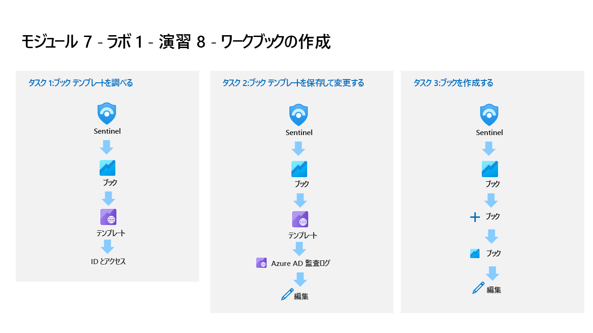

---
lab:
  title: 演習 7 - インシデントを調査する
  module: Learning Path 8 - Create detections and perform investigations using Microsoft Sentinel
  description: このタスクでは、インシデントを調査します。
  duration: 30 minutes
  level: 200
  islab: true
  primarytopics:
    - Microsoft Sentinel
---

# ラーニング パス 8 - ラボ 1 - 演習 7 - インシデントを調査する

## ラボのシナリオ

あなたは、Microsoft Sentinel を実装した会社で働いているセキュリティ運用アナリストです。 あなたはスケジュール済みおよび Microsoft セキュリティ分析ルールを既に作成しています。 Fusion と異常分析ルールも環境で有効になっています。 ここで、それらによって作成されたインシデントを調査します。

インシデントには複数のアラートを含めることができます。 これは、特定の調査に関連するすべての証拠を集計したものです。 重大度や状態など、アラートに関連するプロパティはインシデント レベルで設定されます。 検出対象となる脅威の種類と検出方法を Microsoft Sentinel に通知したら、インシデントを調査して、検出された脅威を監視できます。

>**重要:** ラーニング パス #8 のラボ演習は、*スタンドアロン*環境にあります。 ラボを完了せずに終了する場合は、構成を再実行する必要があります。

### このラボの推定所要時間: 30 分

### タスク 1:問題を調査する

このタスクでは、インシデントを調査します。

>**注:** お使いの Azure サブスクリプションには、Microsoft Sentinel が **Sentinelworkspace-01** という名前で事前にデプロイされており、必要な "コンテンツ ハブ" ソリューションもインストールされています。**

1. 提供された資格情報を使用して管理者として **WIN1** 仮想マシンにサインインします。

1. **Microsoft Edge** を開き、**Microsoft Defender XDR** (`https://security.microsoft.com`) に移動します。

1. **[サインイン]** ダイアログ ボックスで、ラボ ホスティング プロバイダーから提供された**テナントの電子メール** アカウントをコピーして貼り付け、**[次へ]** を選択します。

1. **[パスワードの入力]** ダイアログ ボックスで、ラボ ホスティング プロバイダーから提供された**テナントパスワード**をコピーして貼り付け、**[サインイン]** を選択します。

    >**注:**  パスワードの代わりに "一時アクセス パス" (TAP) を入力するように求められる場合があります。** これは、[リソース] タブにも表示されます。ダイアログが表示されたら、TAP 値をコピーして貼り付け、**[サインイン]** を選択します。

1. Microsoft Defender ナビゲーション メニューで、下にスクロールし、**[調査と対応]** セクションを展開します。

1. **[インシデントとアラート]** セクションを展開して **[インシデント]** を選択します。

1. インシデントの一覧を確認します。

    >**注:**  分析ルールは、同じ特定のログ エントリに対してアラートやインシデントを生成しています。 これは、ラボで使用するアラートやインシデントをさらに生成するために、 *[クエリのスケジュール設定]* 構成で行われていることに注意してください。
  
1. **[Startup RegKey]** インシデントのいずれかを選択します。

1. 開いたページでインシデントの詳細を確認します。

1. ツール バーから **[インシデントの管理]** を選択します。 鉛筆アイコンが表示されます。**

1. **[インシデントの管理]** ページの *[インシデント タグ]* フィールドに、「**RegKey**」と入力し、**[RegKey (新規作成)]** を選択します。

1. [割り当て先] フィールドで、ボックスを選択し、ドロップダウンから **[自分への割り当て]** を選択します。**

1. *[状態]* が **[アクティブ]** に設定されていることを確認します。 そうでない場合は、状態を **[アクティブ]** に変更します。

1. **[保存]** を選択して変更内容を適用し、ページを閉じます。

1. **[攻撃ストーリー]** タブを確認します。ツール バーから **[プレイブックの実行]** を選択します。 **ヒント:** 省略記号アイコン **[...]** を選んで表示することが必要な場合があります。

1. *PostMessageTeams-OnIncident* というプレイブックが表示されます。 このオプションは、プレイブックを手動で実行するのに役立ちます。
<!--- 1. You should see the *Defender_XDR_Ransomware_Playbook_SecOps_Tasks* playbook. This option helps you to run playbooks manually.--->

1. 右上にある **[x]** アイコンを選択して、[インシデントでプレイブックを実行する] ブレードを閉じます。**

1. **[エンティティ]** ウィンドウを確認します。 少なくとも、前の演習の KQL クエリ内でマップした *[ホスト]* エンティティが表示されるはずです。 **ヒント:** エンティティが表示されない場合は、ページを更新します。

1. ツール バーの省略記号 (**[...]**) を選択し、**[タスク]** を選択します。

1. **[+ タスクの追加]** を選択し、*[名前]* フィールドに「**マシンの所有者を確認する**」と入力し、**[保存]** を選択します。

1. 右上にある **[x]** アイコンを選択して、**[インシデント タスク]** ブレードを閉じます。

1. コマンド バーから新しい **[アクティビティ ログ]** ボタンを選択します。

1. この演習で実行したアクションを確認します。

1. 右上にある **[x]** アイコンを選択して、 **[インシデント アクティビティ ログ]** ブレードを閉じます。

1. ほぼ非表示の左側のブレードで、 **[未割り当て]** という名前のユーザー アイコンを選択します。 新しいインシデント エクスペリエンスを使用すると、ここから簡単に変更できます。

1. **[自分に割り当て]** を選び、下にスクロールして **[適用]** を選択して変更を保存します。

1. **[>>]** アイコンを選択して、左側のブレードを展開します。 次に、 **[調査]** ボタンを選択します。

    >**ヒント:** アイコンが画面に対して小さすぎる場合は、 **[+]** を選択して拡大します。

1. WINServer エンティティ アイコンを**ポイント**し、新しい "*探索クエリ*" が表示されるまで待ちます。 [*関連するアラート*] により多くのデータがあることが確認されます。 探索クエリ **[関連するアラート]** の名前を選択して調査グラフに表示するか、 **[イベント >]** を選択して KQL クエリで調査します。

1. 右上にある **[X]** アイコンを選択してクエリ ウィンドウを閉じて、 **[調査]** ページに戻ります。

1. ここで **WINServer** エンティティを選択すると、右側のウィンドウが開き、詳細情報が表示されます。 **[情報]** ページを確認します。

1. **[タイムライン]** ボタンを選択します。 インシデントをポイントし、グラフのどの項目がどの時点で発生したかを確認します。

1. **[エンティティ]** ボタンを選択し、*WINServer* に関連する *[エンティティ]* と *[アラート]* を確認します。

1. ページの右上にある **[X]** アイコンを選択して、調査グラフを閉じます。

1. インシデント ページに戻り、左側のウィンドウで **[アクティブな状態]** を選択し、 **[終了]** を選びます。 

1. **[分類を選択する]** ドロップダウンで、さまざまなオプションを確認します。 その後、 **[真陽性 - 疑わしいアクティビティ]** を選択し、 **[適用]** を選択します。

## 演習 8 に進む
