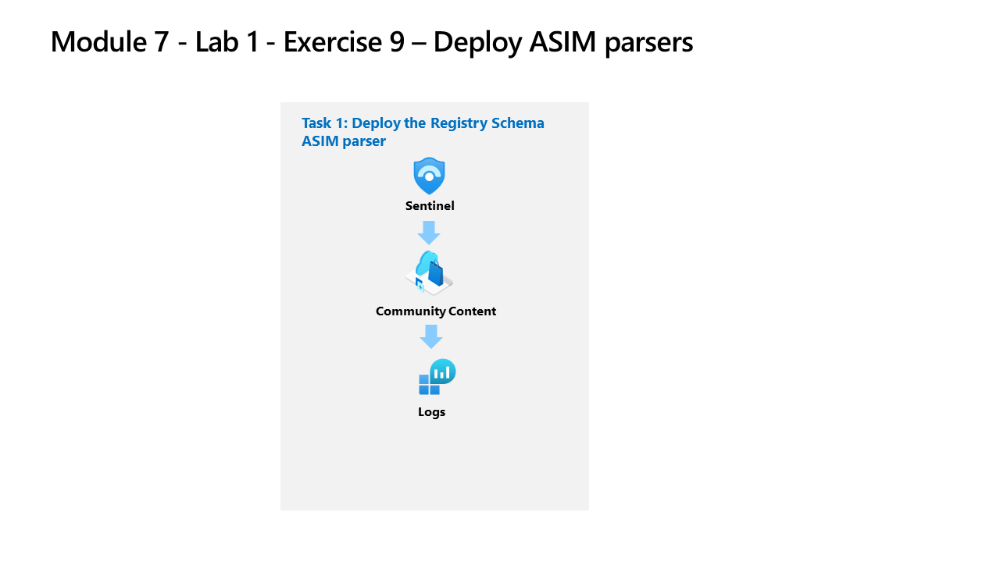

---
lab:
  title: 演習 8 - ASIM パーサーを作成する
  module: Learning Path 8 - Create detections and perform investigations using Microsoft Sentinel
  description: あなたは Microsoft Sentinel を実装した企業で働いているセキュリティ運用アナリストです。 特定の Windows レジストリ イベントに対して ASIM パーサーをモデル化する必要があります。 これらのパーサーは、「Advanced Security Information Model (ASIM) レジストリ イベント正規化スキーマのリファレンス」に従って、後で最終処理されます。
  duration: 30 minutes
  level: 200
  islab: true
  primarytopics:
    - Microsoft Sentinel
    - Kusto Query Language (KQL)
    - Advanced Security Information Model (ASIM)
---

# ラーニング パス 8 - ラボ 1 - 演習 8 - ASIM パーサーをデプロイする

## ラボのシナリオ

あなたは Microsoft Sentinel を実装した企業で働いているセキュリティ運用アナリストです。 特定の Windows レジストリ イベントに対して ASIM パーサーをモデル化する必要があります。 これらのパーサーは、「[Advanced Security Information Model (ASIM) レジストリ イベント正規化スキーマのリファレンス](https://docs.microsoft.com/azure/sentinel/registry-event-normalization-schema)」に従って、後で最終処理されます。

>**重要:** ラーニング パス #8 のラボ演習は、*スタンドアロン*環境にあります。 ラボを完了せずに終了する場合は、構成を再実行する必要があります。

### このラボの推定所要時間: 30 分

### タスク 1:レジストリ スキーマ ASIM パーサーをデプロイする

このタスクでは、Microsoft Sentinel のデプロイに含まれているレジストリ スキーマ パーサーを確認します。

>**注:** Microsoft Sentinel は既に、**sentinelworkspace-01** という名前で事前デプロイされて Microsoft Defender XDR にオンボードされており、必要な *Content Hub* ソリューションがインストール済みです。

1. 管理者として WIN1 仮想マシンにログインします。パスワードは**Pa55w.rd**。  

1. Microsoft Edge ブラウザーを開きます。

1. Edge ブラウザーで、Defender XDR (`https://security.microsoft.com`) に移動します。

1. **[サインイン]** ダイアログ ボックスで、ラボ ホスティング プロバイダーから提供された**テナントの電子メール** アカウントをコピーして貼り付け、**[次へ]** を選択します。

1. **[パスワードの入力]** ダイアログ ボックスで、ラボ ホスティング プロバイダーから提供された**テナントパスワード**をコピーして貼り付け、**[サインイン]** を選択します。

    >**注:**  パスワードの代わりに "一時アクセス パス" (TAP) を入力するように求められる場合があります。** これは、[リソース] タブにも表示されます。メッセージが表示されたら、TAP 値をコピーして貼り付け、**[サインイン]** を選択します。

1. Microsoft Defender ナビゲーション メニューで、下にスクロールし、**[調査と対応]** セクションを展開します。

1. **[ハンティング]** セクションを展開して、**[高度なハンティング]** を選びます。

1. 必要に応じて **[>]** を選択して、[スキーマと検索] ブレードを開きます。**

1. **[関数]** タブ ([クエリ] タブの横にある) を選択します。 **ヒント:** タブを選択するには、省略記号アイコン **(...)** を選ぶ必要がある場合があります。

1. *[検索]* バーに「**レジストリ**」と入力し、*Microsoft Sentinel* の見出しの下に Microsoft Windows の *_Im_RegistryEvent_MicrosoftWindowsEventxxx* が表示されるまで、ASIM パーサー関数を下スクロールします。

    >**注:**  バージョンの変更を考慮して、ASIM パーサー関数名に xxx を使用しています。 このラボが更新された時点では、関数は _Im_RegistryEvent_MicrosoftWindowsEvent*V02* でした。

1. **_Im_RegistryEvent_MicrosoftWindowsEventxxx** ASIM 関数を見つけ、省略記号アイコン **(...)** で **[関数コードの読み込み]** を選択します。

1. イベント ID 4657 を解析している KQL を確認し、Microsoft Sentinel ワークスペース内のデータの分析を簡略化します。

    >**ヒント:** コード ウィンドウで Ctrl + f キーを押して *[検索]* を表示し、* EventID:4657* を検索する方がはるかに簡単です。

1. *[ログ]* で [新しいクエリ] タブを開きます。

1. [スキーマとフィルター] ブレードに戻り、"Microsoft Windows イベントとセキュリティ イベントのレジストリ イベント ASIM フィルタリング パーサー" ** _Im_RegistryEvent_MicrosoftWindowsEventxxx** にホバーして、**[エディターで使用]** を選択します。****

1. ASIM 関数クエリを**実行**します。 前のラボの演習を完了した場合は、結果とエラー メッセージが表示されます。

## 演習 9 に進む
