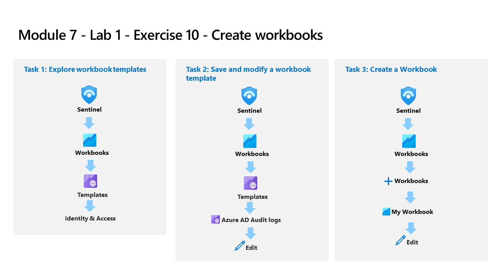

---
lab:
  title: 演習 9 - ブックを作成する
  module: Learning Path 8 - Create detections and perform investigations using Microsoft Sentinel
  description: このタスクでは、高度な視覚化を備えた新しいワークブックを作成します。
  duration: 30 minutes
  level: 200
  islab: true
  primarytopics:
    - Microsoft Sentinel
    - Sentinel Workbooks
---

# ラーニング パス 8 - ラボ 1 - 演習 9 - ブックを作成する

## ラボのシナリオ

あなたは、Microsoft Sentinel を実装した会社で働いているセキュリティ運用アナリストです。 Microsoft Sentinel にデータ ソースを接続した後、Microsoft Sentinel による Azure Monitor ブックの適用を使用して、データを視覚化および監視できます。これにより、多用途のカスタム ダッシュボードを作成できます。 

Microsoft Sentinel を使用すると、データ全体に対してカスタム ブックを作成できます。また、用意されている組み込みのブック テンプレートを使用してデータ ソースに接続すると、すぐにデータ全体の分析情報をすばやく得ることもできます。

>**重要:** ラーニング パス #8 のラボ演習は、*スタンドアロン*環境にあります。 ラボを完了せずに終了する場合は、構成を再実行する必要があります。

### このラボの推定所要時間: 30 分

### タスク 1:ブック テンプレートを調べる

このタスクでは、Microsoft Sentinel ブック テンプレートを調べます。

>**注:** お使いの Azure サブスクリプションには、Microsoft Sentinel が **sentinelworkspace-01** という名前で事前にデプロイされており、必要な "コンテンツ ハブ" ソリューションもインストールされています。**

1. 提供された資格情報を使用して管理者として **WIN1** 仮想マシンにサインインします。

1. **Microsoft Edge** ブラウザーを開き、**Microsoft Defender XDR** (`https://security.microsoft.com`) に移動します。

1. **[サインイン]** ダイアログ ボックスで、ラボ ホスティング プロバイダーから提供された**テナントの電子メール** アカウントをコピーして貼り付け、**[次へ]** を選択します。

1. **[パスワードの入力]** ダイアログ ボックスで、ラボ ホスティング プロバイダーから提供された**テナントパスワード**をコピーして貼り付け、**[サインイン]** を選択します。

    >**注:**  パスワードの代わりに "一時アクセス パス" (TAP) を入力するように求められる場合があります。** これはリソース タブにも表示されます。TAP を入力する画面が表示された場合は、値をコピーして貼り付けて **[サインイン]** を選択してください。

1. Microsoft Defender のナビゲーション メニューで、下スクロールして **[Microsoft Sentinel]** セクションを展開します。

1. **[脅威の管理]** セクションを展開し、**[Workbooks]** を選択します。

1. **[テンプレート]** タブを選択し、**[Azure アクティビティ]** テンプレート ブックを検索して選択します。

1. 右側の詳細ウィンドウで下にスクロールし、 **[テンプレートの表示]** ボタンを選択します。

1. ブックの内容を確認します。 アクティビティ ログからデータを収集して分析し、Azure サブスクリプションの操作の分析情報が表示されます。

1. *Defender XDR* のナビゲーション メニューの **[Microsoft Sentinel | 脅威の管理 | Workbooks]** ページに戻ります。

### タスク 2:ブック テンプレートを保存して変更する

このタスクでは、ブック テンプレートを保存して変更します。

1. **[テンプレート]** タブを選択し、**[Azure アクティビティ]** ブックを選択します。

1. もう一度下にスクロールし、*[Azure アクティビティ]* ブックの詳細ウィンドウで **[保存]** ボタンを選択します。

1. *[リージョン]* の既定値は **[米国東部]** のままにして、 **[OK]** を選択します。

1. **[保存されたワークブックの表示]** ボタンを選択します。

1. コマンド バーで **[編集]** を選択して、ブックの変更を有効にします。

1. **[呼び出し元のアクティビティ]** 領域まで下にスクロールし、列を書式設定する、*[アクティビティ]* 列の色を見ます。 グリッドの下にある **[編集]** ボタンを選択します。

1. **[縦方向のレイアウト]** ボタンを選択します。これは、[クエリの実行] コマンド バーの右側にあります。** **ヒント:** このボタンは、KQL クエリからのデータがある場合のみ表示されます。

1. コマンド バーの **[ビジュアル書式設定]** タブを選択します。これは*横棒グラフ*のアイコンです。

1. **[視覚化設定]** で、**[列の設定]** を展開します。

1.  **[列]** 一覧で、**[アクティビティ]** を選択します。

1. **[列レンダラー]** の値を **[ヒートマップ]** に変更します。 **[カラー パレット]** を下スクロールして **[カテゴリ別]** を選択します。

1. **[アクティビティ]** 列の変更に注意してください。

1. (上部のメニューではなく) クエリの下部にある **[編集完了]** を選択します。

1. 上部のメニューにある **[編集完了]** を選択し、**[保存]** アイコンを選択します。 

1. *Defender XDR* のナビゲーション メニューの **[Microsoft Sentinel | 脅威の管理 | Workbooks]** ページに戻ります。

1. **[マイ ブック]** タブに **Azure アクティビティ**という名前の新しいブックが表示されるはずです。

### タスク 3:ブックを作成する

このタスクでは、高度な視覚化を備えた新しいワークブックを作成します。

1. Microsoft Sentinel の **[Workbooks]** 領域に戻るはずです。

1. **[+ ブックの追加]** を選択して、新しいブックを最初から作成します。 

    >**注:**  これは新しいブックですが、スタートアップ テンプレートを使用します。

1. ブックを編集するには、上部のメイン メニューから **[編集]** を選択します。

1. ブックの段落の横にある **[編集]** ボタンを選択します。

1. **## New workbook** の上の新しい行に「 *# My workbook*」と入力します。

1. *[テキスト項目の編集: テキスト - 2]* のセクションの下部の **[編集完了]** を選択します。 ヘッダーのサイズが大きくなり、名前が変更されたことに注意してください。

1. 唯一表示されている横棒グラフの横にある **[編集]** を選択します。

1. すべてのテーブル全体のカウントの *union* ステートメントを提供する KQL ステートメントを確認します。

1. 下部のメニューの *[クエリ項目の編集: クエリ - 2]* まで下スクロールし、**[キャンセル]** を選択します。

1. 横棒グラフの *[編集]* ボタンの横にある**ドロップダウン**矢印を選択し、**[+ 追加]** を選択してから、**[データ ソースの追加 + 視覚化]** を選択します。

1. *ログ (分析) のクエリ* ボックスに、「SecurityEvent」と入力します。****

1. *[時間の範囲]* を「**過去 1 時間**」に変更します。

1. *[視覚化]* を **[時間グラフ]** に変更します。

1. コマンド バーの **[ビジュアル書式設定]** タブを選択します。これは*横棒グラフ*のアイコンです。

1. 下スクロールし、*[レイアウト設定]* の下にある **[サイズ]** を選択します。

1. **[この項目をカスタム幅にする]** ボックスを選択します。

1. *[パーセント幅]* を **[25]** に、 *[最大幅]* を **[25]** に設定します。

1. 次に、クエリのコマンド バーから **[詳細設定]** タブを選択します。

1. **[編集していないときに更新アイコンを表示する]** ボックスを選択します。

1. 新しい *[クエリ項目の編集: クエリ - 2]* の場合は、下にスクロールし、下部のメニューにある **[編集完了]** を選択します。

1. 下にスクロールし、ブックの下部で **[+ 追加]** を選択し、**[データ ソースの追加と視覚化]** を選択します。

1. クエリ ボックスに、「**SecurityEvent**」と入力します。

1. *[時間の範囲]* を「**過去 1 時間**」に変更します。

1. *[視覚化]* を **[グリッド]** に変更します。

1. コマンド バーの **[ビジュアル書式設定]** タブを選択します。これは*横棒グラフ*のアイコンです。

1. 下スクロールし、*[レイアウト設定]* の下にある **[サイズ]** を選択します。

1. **[この項目をカスタム幅にする]** ボックスを選択します。

1. *[パーセント幅]* を **[75]** に、 *[最大幅]* を **[75]** に設定します。

1. 新しい *[クエリ項目の編集: クエリ - 3]* では、下にスクロールし、下部のメニューにある **[編集完了]** を選択します。

1. ブックの上部コマンド バーで **[編集完了]** を選択します。

1. **[Save](保存) **アイコンを選択します。

1. ポップアップ ボックスで、*[タイトル]* を「**マイ ブック**」に変更します。

1. 他の値は既定値のままにします。

1. **[保存]** を選んで変更をコミットします。 

1. *Defender XDR* のナビゲーション メニューの **[Microsoft Sentinel | 脅威の管理 | Workbooks]** ページに戻ります。

1. **[ブック]** ページに戻り、 **[マイ ブック]** タブを選択します。

1. 作成したばかりのブック **My Workbook** を選択します。

1. 右側のペインで、 **[保存されたブックの表示]** を選択してブックを確認します。

## これでラボは完了です。
