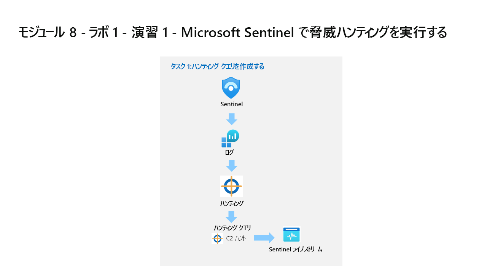
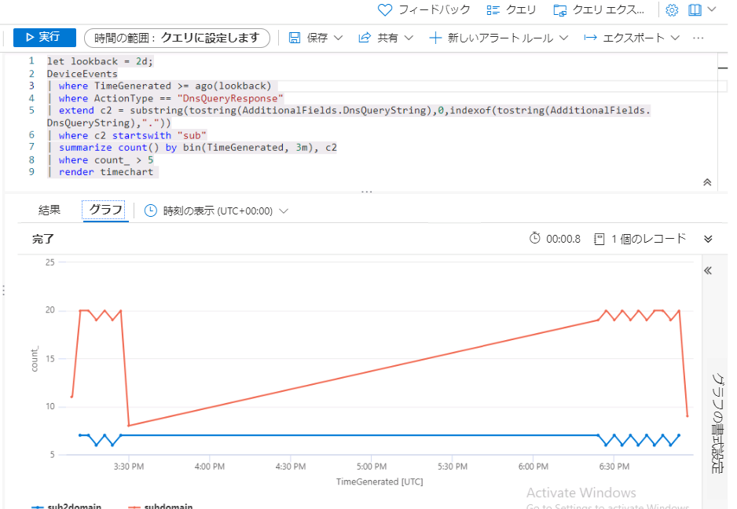
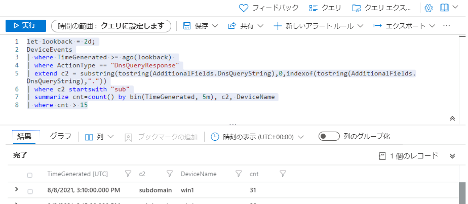

---
lab:
  title: 演習 1 - Microsoft Sentinel で脅威ハンティングを実行する
  module: Module 8 - Perform threat hunting in Microsoft Sentinel
ms.openlocfilehash: 3e2631435122423265dbef3f56f06340706abc9f
ms.sourcegitcommit: f8918eddeaa7a7a480e92d0e5f2f71143c729d60
ms.translationtype: HT
ms.contentlocale: ja-JP
ms.lasthandoff: 07/08/2022
ms.locfileid: "147038020"
---
# <a name="module-8---lab-1---exercise-1---perform-threat-hunting-in-microsoft-sentinel"></a>モジュール 8 - ラボ 1 - 演習 1 - Microsoft Sentinel で脅威ハンティングを実行する

## <a name="lab-scenario"></a>ラボのシナリオ



あなたは、Microsoft Sentinel を実装した会社で働いているセキュリティ運用アナリストです。 コマンドと制御 (C2 または C&C) 手法に関する脅威インテリジェンスを受け取りました。 その脅威に対して捜索とウォッチを実行する必要があります。

>**重要:** このラボで使用されるログ データは、前のモジュールで作成されたものです。 演習 5 の WIN1 サーバーの **攻撃 3** を参照してください。

>**注:**  前のモジュールでデータを探索するプロセスを既に経験しているため、このラボでは最初に KQL ステートメントが提供されます。 


### <a name="task-1-create-a-hunting-query"></a>タスク 1:ハンティング クエリの作成

このタスクでは、捜索クエリを作成し、結果をブックマークして、ライブ ストリームを作成します。

1. 管理者として WIN1 仮想マシンにログインします。パスワードは **Pa55w.rd**。  

1. Edge ブラウザーで、Azure portal (https://portal.azure.com ) に移動します。

1. **[サインイン]** ダイアログ ボックスで、ラボ ホスティング プロバイダーから提供された **テナントの電子メール** アカウントをコピーして貼り付け、 **[次へ]** を選択します。

1. **[パスワードの入力]** ダイアログ ボックスで、ラボ ホスティング プロバイダーから提供された **テナントのパスワード** をコピーして貼り付け、 **[サインイン]** を選択します。

1. Azure portal の検索バーに「*Sentinel*」と入力し、**[Microsoft Sentinel]** を選択します。

1. Microsoft Sentinel ワークスペースを選択します。

1. **[ログ]** を選択します。 

1. *[新しいクエリ 1]* スペースに以下の KQL ステートメントを入力します。

   >**重要:** 最初に KQL クエリをメモ帳に貼り付けて、そこから *[新しいクエリ 1]* ログ ウィンドウにコピーしてエラーを回避してください。

    ```KQL
    let lookback = 2d;
    DeviceEvents | where TimeGenerated >= ago(lookback) 
    | where ActionType == "DnsQueryResponse"
    | extend c2 = substring(tostring(AdditionalFields.DnsQueryString),0,indexof(tostring(AdditionalFields.DnsQueryString),"."))
    | where c2 startswith "sub"
    | summarize count() by bin(TimeGenerated, 3m), c2
    | where count_ > 5
    | render timechart 
    ```

    

1. 前の KQL クエリの目的は、常に C2 ビーコンの視覚化を提供することです。 bin() 内の *3m* の設定を **30s** に変更して、値のグループ化を調整し、クエリをもう一度 **実行** します。

1. それを *3m* に戻します。 次に *count_* のしきい値を **10** に変更し、クエリをもう一度 **実行** して影響を監視します。

1. これで、C2 サーバーにビーコン送信されている　DNS　リクエストが特定できました。 次に、どのデバイスがビーコンになっているかを確認します。 以下の KQL ステートメントを **実行** します。

    ```KQL
    let lookback = 2d;
    DeviceEvents | where TimeGenerated >= ago(lookback) 
    | where ActionType == "DnsQueryResponse"
    | extend c2 = substring(tostring(AdditionalFields.DnsQueryString),0,indexof(tostring(AdditionalFields.DnsQueryString),".")) 
    | where c2 startswith "sub"
    | summarize cnt=count() by bin(TimeGenerated, 5m), c2, DeviceName
    | where cnt > 15
    ```

    

    >**注:**  生成されるログ データは、WIN1 デバイスからのもののみです。

1. ウィンドウの右上にある **[X]** を選択して *[ログ]* ウィンドウを閉じ、 **[OK]** を選択して変更を破棄します。 

1. Microsoft Sentinel ワークスペースをもう一度選択し、[脅威の管理] 領域で **[ハンティング]** ページを選択します。

1. コマンド バーで **[+ 新しいクリエ**] を選択します。

1. *[カスタム クエリの作成]* ウィンドウで、*[名前]* に「**C2 Hunt**」と入力します

1. *カスタム クエリ* には、次の KQL ステートメントを入力します。

    ```KQL
    let lookback = 2d;
    DeviceEvents | where TimeGenerated >= ago(lookback) 
    | where ActionType == "DnsQueryResponse"
    | extend c2 = substring(tostring(AdditionalFields.DnsQueryString),0,indexof(tostring(AdditionalFields.DnsQueryString),"."))
    | where c2 startswith "sub"
    | summarize cnt=count() by bin(TimeGenerated, 5m), c2, DeviceName
    | where cnt > 15
    ```

1. 下にスクロールし、*[エンティティ マッピング (プレビュー)]* で次のように選択します。

    - *[エンティティの種類]* ドロップダウン リストで、**[ホスト]** を選択します。
    - *[識別子]* ドロップダウン リストで、**[HostName]** を選択します。
    - *[値]* ドロップダウン リストで、**[DeviceName]** を選択します。

1. 下にスクロールし、*[戦術と手法]* で **[コマンドと制御]** を選び、**[作成]** を選択してハンティング クエリを作成します。

1. *[Microsoft Sentinel - ハンティング]* ブレードで、先ほど作成したクエリ *C2 Hunt* をリストで探します。

1. リストから **[C2 Hunt]** を選択します。

1. 右ペインで下にスクロールし、**[クエリの実行]** ボタンを選択します。

1. 結果の数は、中央のペインの *[結果]* 列に表示されます。 または、上にスクロールし、*[結果]* ボックスで数を確認します。

1. **[結果の表示]** ボタンを選択します。 KQL クエリが自動的に実行されます。

1. 結果の最初の行のチェックボックスをオンにします。 

1. 中央のコマンド バーで、**[ブックマークの追加]** ボタンを選択します。

1. 既定で設定されている値を確認し、*[ブックマークの追加]* ブレードで **[作成]** を選択します。

1. ウィンドウの右上にある **[X]** を選択して *[ログ]* ウィンドウを閉じ、**[OK]** を選択して変更を破棄します。 

1. Microsoft Sentinel ポータルの [ハンティング] ページに戻り、中央のペインで **[ブックマーク]** タブを選択します。

1. 結果リストから、先ほど作成した **C2 Hunt** ブックマークを選択します。

1. 右側のペインで下にスクロールし、 **[調査]** ボタンを選択します。 **ヒント:** 調査グラフを表示するには数分かかる場合があります。

1. 前のモジュールで行ったのと同じように調査グラフを調べます。

1. ウィンドウの右上にある **[X]** を選択して *[調査]* グラフ ウィンドウを閉じ、**[OK]** を選択して変更を破棄します。 

1. **[クエリ]** タブを選択します。

1. もう一度 **C2 Hunt** クエリを探して選択します。

1. クエリを右クリックし、 **[ライブストリームに追加]** を選択します。 **ヒント:** これは、右にスライドし、行の末尾にある省略記号 **(...)** を選択してコンテキスト メニューを開くことで行うこともできます。

1. *[状態]* が *[実行中]* になったことを確認します。 結果が見つかった場合は、Azure Portal に通知 (ベル アイコン) が示されます。


### <a name="task-2-create-a-nrt-query-rule"></a>タスク 2:NRT クエリ ルールを作成する

このタスクでは、LiveStream を使用する代わりに、NRT 分析クエリ ルールを作成します。 NRT ルールは 1 分ごとに実行され、1 分間ルックバックされます。  NRT ルールの利点は、アラートとインシデント作成ロジックを使用できることです。


1. Microsoft Sentinel で **[分析]** ページを選択します。 

1. **[作成]** タブを選択し、 **[NRT クエリ ルール]** を選択します
1. これで [分析ルール ウィザード] が起動します。 *[全般]* タブで、次のように入力します。

    |設定|値|
    |---|---|
    |名前|**NRT C2 ハント**|
    |説明|**NRT C2 ハント**|
    |方針|**コマンドとコントロール**|
    |Severity|**高**|

1. **[次へ: ルール ロジックを設定]** ボタンを選択します。 


1. *[ルール クエリ]* に次の KQL ステートメントを入力します。

    ```KQL
    DeviceEvents | where TimeGenerated >= ago(lookback) 
    | where ActionType == "DnsQueryResponse"
    | extend c2 = substring(tostring(AdditionalFields.DnsQueryString),0,indexof(tostring(AdditionalFields.DnsQueryString),"."))
    | where c2 startswith "sub"
    | summarize cnt=count() by bin(TimeGenerated, 5m), c2, DeviceName
    | where cnt > 15
    ```

>**注:**  同じデータに対して意図的に多くのインシデントを生成しています。 これにより、ラボはこれらのアラートを使用できるようになります。

1. 残りのオプションは既定値のままにします。 **[次へ: インシデント設定>]** ボタンを選択します。

1. *[インシデント設定]* タブについては、既定値のままにし、 **[次へ: 自動応答 >]** ボタンを選択します。

1. *[自動応答]* タブでは、 *[アラートの自動化]* で **[PostMessageTeams-OnAlert]** を選んでから、 **[次へ: Review]\(次へ: 確認\)** をクリックします。

1. *[確認]* タブで、 **[作成]** ボタンを選択して新しいスケジュール化された分析ルールを作成します。


### <a name="task-3-create-a-search"></a>タスク 3:検索の作成

このタスクでは、検索ジョブを使用して C2 を検索します。 


1. Microsoft Sentinel で **[検索]** ページを選択します。 

1. **[復元]** タブを選択します。

>**注:**  ラボには復元元となるアーカイブ済みのテーブルがありません。  通常のプロセスでは、アーカイブ済みのテーブルを復元して検索ジョブに含めます。
1. **[キャンセル]** を選択します。
1. **[検索]** タブを選択します。
1. *Table* を選択し、**DeviceRegistryEvents** に変更します
1. 検索ボックスに「**reg.exe**」と入力します。  
1. **[保存した検索]** を選択します。 
1. 検索ジョブにより、**DeviceRegistryEvents_####_SRCH** という名前の新しいテーブルが作成されます。 
1. 検索ジョブが完了するまで待ちます。  状態に *[更新中]* と表示されます。 次に *[処理中]* になります。 次に *[検索が完了しました]* になります。 
1. **[検索結果の表示]** を選択します。
1. *[ログ]* で新しいタブを開きます。
1. 新しいテーブル名 **DeviceRegistryEvents_####_SRCH** を入力して実行します。

## <a name="proceed-to-exercise-2"></a>演習 2 に進みます。
