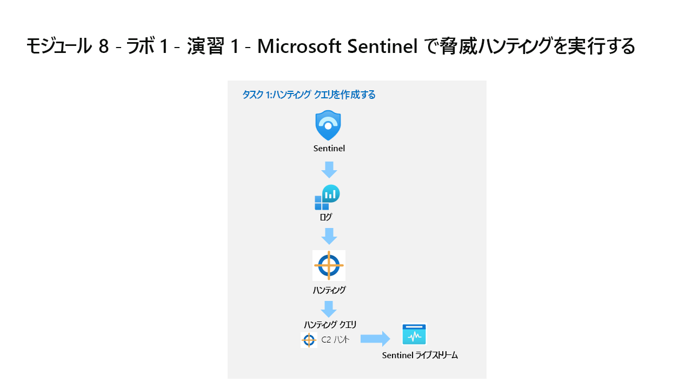

---
lab:
  title: 演習 1 - Microsoft Sentinel で脅威ハンティングを実行する
  module: Learning Path 9 - Perform threat hunting in Microsoft Sentinel
  description: ラーニング パス 9 のラボ演習で作成したログ データは、次の前提条件タスクを再実行しないとこのラボでは使用できません。
  duration: 60 minutes
  level: 300
  islab: true
  primarytopics:
    - Microsoft Sentinel
    - Azure Arc
    - Kusto Query Language (KQL)
    - Data lake
---

# ラーニング パス 09 - ラボ 1 - 演習 1 - Microsoft Defender ポータルで Microsoft Sentinel を使って脅威の捜索を実行する

## ラボのシナリオ



あなたは Microsoft Sentinel を実装した企業で働いているセキュリティ運用アナリストです。 コマンドと制御 (C2 または C&C) 手法に関する脅威インテリジェンスを受け取りました。 その脅威に対して捜索とウォッチを実行する必要があります。

>**重要:** ラーニング パス #9 のラボ演習は、*スタンドアロン*環境にあります。 ラボを完了せずに終了する場合は、構成を再実行する必要があります。

<!--- The log data created in the Learning Path 9 lab exercises will not be available in this lab without rerunning the following prerequisite tasks.

 **[Lab 09 Exercise 5](https://microsoftlearning.github.io/SC-200T00A-Microsoft-Security-Operations-Analyst/Instructions/Labs/LAB_AK_09_Lab1_Ex05_Attacks.html)**

**[Lab 09 Exercise 6](https://microsoftlearning.github.io/SC-200T00A-Microsoft-Security-Operations-Analyst/Instructions/Labs/LAB_AK_09_Lab1_Ex06_Perform_Attacks.html)** --->

### このラボの推定所要時間: 45 分から 60 分

>**注:** 次の "前提条件タスク" は事前構成されています。** これらは、参考情報としてのみ掲載しています。

### 前提条件タスク 1: オンプレミスのサーバーを接続する

このタスクでは、オンプレミスのサーバーを Azure サブスクリプションに接続します。 Azure Arc は、このサーバーにプレインストールされています。 後で Microsoft Sentinel で検出と調査を行うシミュレートされた攻撃を実行するために、サーバーは次の演習で使用されます。

>**重要:** 次の手順は、以前に作業していたものとは異なるマシンで行います。 参照タブで仮想マシン名を探します。

1. 管理者として **WINServer** 仮想マシンにログインします。パスワードは **Passw0rd!** です。 必要に応じて。  

前述のように、Azure Arc は **WINServer** マシンにプレインストールされています。 これで、このマシンを Azure サブスクリプションに接続します。

1. *WINServer* マシンで、*検索*アイコンを選択し、**cmd** と入力します。

1. 検索結果の*コマンド プロンプト*を右クリックし、**[管理者として実行]** をクリックします。

1. コマンド プロンプト ウィンドウで、次のコマンドを入力します。 *Enter キーを押さないでください*

    ```cmd
    azcmagent connect -g "SentinelStatic" -l "CentralUS" -s "Subscription ID string"
    ```

1. **サブスクリプション ID 文字列** を、ラボ ホスト (*リソース タブ) から提供された *サブスクリプション ID* に置き換えます。 引用符は保持してください。

1. **Enter** を入力してコマンドを実行します (これには数分かかる場合があります)。

    >**注**: *[このファイルを開く方法を選んでください]* というブラウザー選択ウィンドウが表示される場合は、**[Microsoft Edge]** を選択します。

1. *[サインイン]* ダイアログ ボックスに、ラボ ホスティング プロバイダーから提供された**テナントのメール アドレス**と**テナントのパスワード**を入力して、**[サインイン]** を選択します。 *認証が完了*したというメッセージが表示されるまで待ち、ブラウザー タブを閉じて、*コマンド プロンプト* ウィンドウに戻ります。

    >**注:**  パスワードの代わりに "一時アクセス パス" (TAP) を入力するように求められる場合があります。**

1. コマンドの実行が完了したら、*コマンド プロンプト* ウィンドウを開いたままにし、次のコマンドを入力して接続が成功したことを確認します。

    ```cmd
    azcmagent show
    ```

1. コマンド出力で、*Agent status* が **Connected** であることを確認します。

### 前提条件タスク 2: Azure 以外の Windows マシンを接続する

このタスクでは、Azure Arc に接続されたオンプレミスのマシンを、Microsoft Sentinel に追加します。  

>**注:** Microsoft Sentinel は既に、お使いの Azure サブスクリプション内に **'sentinelworkspace-01'** という名前で事前デプロイされており、必要な *Content Hub* ソリューションがインストールされています。

1. 管理者として **WIN1** 仮想マシンにログインします。パスワードは **Pa55w.rd** です。  

1. Microsoft Edge ブラウザーで、Defender XDR (`https://security.microsoft.com`) に移動します。

1. **[サインイン]** ダイアログ ボックスで、ラボ ホスティング プロバイダーから提供された**テナントの電子メール** アカウントをコピーして貼り付け、**[次へ]** を選択します。

1. **[パスワードの入力]** ダイアログ ボックスで、ラボ ホスティング プロバイダーから提供された**テナントパスワード**をコピーして貼り付け、**[サインイン]** を選択します。

    >**注:**  パスワードの代わりに "一時アクセス パス" (TAP) を入力するように求められる場合があります。**

1. Microsoft Defender ナビゲーション メニューで下スクロールし、**[Microsoft Sentinel]** セクションを展開します。

1. **[構成]** セクションを展開して **[データ コネクタ]** を選択します。

1. *[データ コネクタ]* で、「**AMA を使用した Windows セキュリティ イベント**」ソリューションを検索し、一覧から選択します。

1. *[AMA を使用した Windows セキュリティ イベント]* 詳細ウィンドウで、**[コネクタ ページを開く]** を選択します。

    >**注:** "Windows セキュリティ イベント" ソリューションでは、"AMA を使用した Windows セキュリティ イベント" と "レガシ エージェントを使用したセキュリティ イベント" データ コネクタの両方がインストールされます。** ** ** さらに、2 つのブック、20 個の分析ルール、43 個のハンティング クエリがインストールされます。

1. [構成] セクションの [前提条件] および [テーブル管理] で、**[+ データ収集ルールの作成]** を選択します。******

1. ルール名に「**AZWINDCR**」と入力し、[サブスクリプション] が正しいことを確認し、**[SentinelStatic]** リソース グループを選択します。**

1. **[次へ: リソース]** を選択します。

1. *[リソース]* タブの *[スコープ]* の下の *[サブスクリプション]* を展開します。

    >**ヒント:***[スコープ]* 列の前にある ">" を選択することで、*[スコープ]* 階層全体を展開できます。

1. **[SentinelStatic]** リソース グループを展開して、**[WINServer]** を選択します。

1. **[次へ: 収集]** を選択し、*[すべてのセキュリティ イベント]* を選択したままにします。

1. **[次へ: 確認と作成]** を選択します。

1. *[検証に成功しました]* が表示されたら、 **[作成]** を選択します。

### 前提条件タスク 3: DNS を使用したコマンド アンド コントロール攻撃

>**重要:** 次の手順は、以前に作業していたものとは異なるマシンで行います。 参照タブで仮想マシン名を探します。

1. 管理者として **WINServer** 仮想マシンにログインします。パスワードは **Passw0rd!** です。 必要に応じて。

1. *WINServer* マシンで、*検索*アイコンを選択し、**cmd** と入力します。

1. 検索結果の*コマンド プロンプト*を右クリックし、**[管理者として実行]** をクリックします。

1. 次のコマンドをコピーして実行し、C2 サーバーに対する DNS クエリをシミュレートするスクリプトを作成します。

    ```CommandPrompt
    notepad c2.ps1
    ```

1. **[はい]** を選択して新しいファイルを作成し、以下の PowerShell スクリプトを *c2.ps1* にコピーします。

    >**メモ:** 仮想マシン ファイルへの貼り付けでは、スクリプトの完全な長さが表示されない場合があります。 スクリプトが *c2.ps1* ファイル内で次の手順と同じであることを確認してください。

    ```PowerShell
    param(
        [string]$Domain = "microsoft.com",
        [string]$Subdomain = "subdomain",
        [string]$Sub2domain = "sub2domain",
        [string]$Sub3domain = "sub3domain",
        [string]$QueryType = "TXT",
        [int]$C2Interval = 8,
        [int]$C2Jitter = 20,
        [int]$RunTime = 240
    )
    $RunStart = Get-Date
    $RunEnd = $RunStart.addminutes($RunTime)
    $x2 = 1
    $x3 = 1 
    Do {
        $TimeNow = Get-Date
        Resolve-DnsName -type $QueryType $Subdomain".$(Get-Random -Minimum 1 -Maximum 999999)."$Domain -QuickTimeout
        if ($x2 -eq 3 )
        {
            Resolve-DnsName -type $QueryType $Sub2domain".$(Get-Random -Minimum 1 -Maximum 999999)."$Domain -QuickTimeout
            $x2 = 1
        }
        else
        {
            $x2 = $x2 + 1
        }    
        if ($x3 -eq 7 )
        {
            Resolve-DnsName -type $QueryType $Sub3domain".$(Get-Random -Minimum 1 -Maximum 999999)."$Domain -QuickTimeout
            $x3 = 1
        }
        else
        {
            $x3 = $x3 + 1
        }
        $Jitter = ((Get-Random -Minimum -$C2Jitter -Maximum $C2Jitter) / 100 + 1) +$C2Interval
        Start-Sleep -Seconds $Jitter
    }
    Until ($TimeNow -ge $RunEnd)
    ```

1. メモ帳のメニューで、 **[ファイル]** 、 **[保存]** の順に選択します。 

1. コマンド プロンプト ウィンドウに戻り、次のコマンドを入力して Enter キーを押します。

    >**注:** DNS 解決エラーが表示されます。 これは予期されることです。

    ```CommandPrompt
    Start PowerShell.exe -file c2.ps1
    ```

>**重要:** これらのウィンドウを閉じないでください。 この PowerShell スクリプトをバックグラウンドで実行させておきます。 コマンドは、数時間ログエントリを生成する必要があります。 このスクリプトの実行中に次のタスクや次の演習に進むことができます。 このタスクで作成したデータは、後で脅威の捜索ラボで使用します。 このプロセスでは、大量のデータや処理を作成することはありません。

### タスク 1:ハンティング クエリの作成

このタスクでは、ハンティング クエリと、ライブストリームを作成します。

>**注:** [高度な追求] は Microsoft Defender ポータルでのブックマークの作成をサポートしていませんが、[ハンティング ライブストリーム] で作成できます。****

1. 管理者として WIN1 仮想マシンにログインします。パスワードは**Pa55w.rd**。  

1. Microsoft Edge ブラウザーで、`https://security.microsoft.com` の Microsoft Defender XDR ポータルに移動します。

1. **[サインイン]** ダイアログ ボックスで、ラボ ホスティング プロバイダーから提供された**テナントの電子メール** アカウントをコピーして貼り付け、**[次へ]** を選択します。

1. **[パスワードの入力]** ダイアログ ボックスで、ラボ ホスティング プロバイダーから提供された**テナントパスワード**をコピーして貼り付け、**[サインイン]** を選択します。

    >**注:**  パスワードの代わりに "一時アクセス パス" (TAP) を入力するように求められる場合があります。** これは、[リソース] タブにも表示されます。ダイアログが表示されたら、TAP 値をコピーして貼り付け、**[サインイン]** を選択します。

1. Microsoft Defender ナビゲーション メニューで、下にスクロールし、**[調査と対応]** セクションを展開します。

1. **[ハンティング]** セクションを展開して、**[高度なハンティング]** を選びます。

    >**重要:** 最初に KQL クエリをメモ帳に貼り付けて、そこから *[新しいクエリ 1]* ログ ウィンドウにコピーしてエラーを回避してください。

1. [新しいクエリ] スペースに以下の KQL ステートメントを入力します。**

    ```KQL
    let lookback = 2d; 
    SecurityEvent
    | where TimeGenerated >= ago(lookback) 
    | where EventID == 4688 and Process =~ "powershell.exe"
    | extend PwshParam = trim(@"[^/\\]*powershell(.exe)+" , CommandLine) 
    | project TimeGenerated, Computer, SubjectUserName, PwshParam    
    ```

    >**注:** "security.microsoft.com は次のことを求めています。 クリップボードにコピーしたテキストや画像の参照"。というメッセージが表示されたら、**矢印**を選択します。

1. コマンド バーで、**[クエリの実行]** を選択します。

1. さまざまな結果を確認します。 これで、環境内で実行されている PowerShell 要求が特定されました。

1. *PwshParam* 列で、*"-file c2.ps1"* を示す結果のチェック ボックスをオンにします。

1. [結果] ペインのコマンド バーで、**[インシデントへのリンク]** アイコンを選択します。**

1. [インシデントへのリンク] ペインで、**[新しいインシデントの作成]** ラジオ ボタンをオンのままにします。**

1. 次のフィールドに入力します。

    |設定|Value|
    |---|---|
    |アラートのタイトル|**PowerShell C2 の追求**|
    |重要度|**高**|
    |カテゴリ|**コマンドとコントロール**|
    |MITRE 手法|**T1094: カスタム コマンドとコントロール プロトコル**|
    |説明|**PowerShell C2 の追求の結果**|
    |推奨アクション|**インシデントの修復を実行する**|

1. [**次へ**] を選択します。

1. [エンティティ マッピング] ペインの [影響を受けた資産] で **[+ 資産の追加]** を選択します。****

1. [エンティティ] で **[デバイス]** を選択し、[識別子と列] で **[ホストネーム]** と **[コンピューター]** を選択します。****

1. [**次へ**] を選択します。

1. [概要] ペインで、**[送信]** を選んでから、**[完了]** を選びます。**

1. Microsoft Defender ナビゲーション メニューで、下にスクロールし、**[調査と対応]** セクションを展開します。

1. **[インシデントとアラート]** セクションを展開して **[インシデント]** を選択します。

1. [インシデント] ペインに、**PowerShell C2 Hunt** インシデントが一覧表示されます。**

### タスク 2: Microsoft Sentinel Graph を使用した追求

1. Microsoft Defender ナビゲーション メニューで、下にスクロールし、**[調査と対応]** セクションを展開します。

1. **[ハンティング]** セクションを展開して、**[高度な追求]** を選びます。

1. [新しいグラフの作成] アイコン、または [新しいグラフ] タブを選択します。****

1. **[定義済みのシナリオで検索]** を選択します。

1. [定義済みのシナリオの検索] ペインで、**[機密データにアクセスできるユーザー]** シナリオを選択します。**

1. [シナリオの入力] で、[ターゲット ストレージ アカウント] に「**sensitivestorageaccount**」と入力します。****

1. フィルターは既定値のままにして **[実行]** を選択します。

1. グラフがレンダリングされます。 結果を確認し、機密性の高いストレージ アカウントにアクセスできるユーザーを特定します。

1. *sensitivestorageaccount* ストレージ アカウントの上にある **[Defender for Cloud]** アイコンを選択します。

    >**注**: *Defender for Cloud* アイコンが表示されていない場合は、[検出ソース] が [レイヤー] で有効になっていることを確認します。****

1. [sensitivestorageaccount 全般的な詳細] ペインで、[検出ソース] が **[Defender for Cloud]** であることを確認できます。******

1. [sensitivestorageaccount] 詳細ペインの他のタブを調べます。** [すべてのデータ] タブには、多くの詳細が含まれています。**
    >**注**: [攻撃パス] タブは、複数の攻撃がある場合にのみ設定されます。**

1. グラフ表示には、[ユーザー アカウント] ノードが *sensitivestorageaccount* ストレージ アカウントに接続され、ゴールドの王冠のアイコンが表示されます。** これは、機密データにアクセスできる "クリティカル" ユーザーです。**

1. 王冠アイコンを選択すると、[ユーザー アカウント] 詳細ウィンドウが開き、クリティカル ユーザーに関する詳細情報が表示されます。**

1. ノードで [+] アイコンを選択すると、グラフが展開され、より多くのリレーションシップが表示されます。

1. 引き続きグラフを展開し、さまざまなリレーションシップとエンティティを調べてから、次のタスクに進みます。

<!--- ### Task 3: Create a Microsoft Sentinel Hunt and Livestream
 
1. Return to the *Microsoft Sentinel* section of the Defender portal, and select the **Hunting** page under the *Threat Management* area.

1. Select the **Queries** tab and then **+ New query** from the command bar.

1. In the *Create custom query* window, for the *Name* enter **PowerShell Hunt**.

1. For the *Custom query* enter the following KQL statement:

    ```KQL
    let lookback = 2d; 
    SecurityEvent 
    | where TimeGenerated >= ago(lookback) 
    | where EventID == 4688 and Process =~ "powershell.exe"
    | extend PwshParam = trim(@"[^/\\]*powershell(.exe)+" , CommandLine) 
    | project TimeGenerated, Computer, SubjectUserName, PwshParam 
    | summarize min(TimeGenerated), count() by Computer, SubjectUserName, PwshParam 
    | order by count_ desc nulls last 
    ```

1. Scroll down and under *Entity mapping* select **+ Add new entity**.

1. In the *Entity* menu select:

    - For the *Entity type* drop-down list select **Host**.
    - For the *Identifier* drop-down list select **HostName**.
    - For the *Value* drop-down list select **Computer**.

1. Scroll down and under *Tactics & Techniques* select **Command and Control** and then select **Create** to create the hunting query.

1. In the *"Microsoft Sentinel - Hunting"* blade, search for the query you just created in the list, *PowerShell Hunt*.

1. Select **PowerShell Hunt** from the list.

1. Right-click the **PowerShell Hunt** query and select **Run**.

1. Review the number of results in the middle pane under the *Results* column.

    <!--- 1. Select the **View Results** button from the right pane. The KQL query will automatically run.
    
    1. Close the *Logs* window by selecting the **X** in the top-right of the window and select **OK** to discard the changes. 

1. Right-click the **PowerShell Hunt** query again and select **Add to livestream**. **Hint:** This also can be done by sliding right and selecting the ellipsis **(...)** at the end of the row to open a context menu.

1. Review that the *Status* is now *Running*. This is running every 30 seconds in the background and you'll receive a notification in the Defender portal (bell icon) when a new result is found.

    <!--- 1. Select the **Bookmarks** tab in the middle pane.
    
    1. Select the bookmark you created from the results list. 

1. Right-click the **PowerShell Hunt** Livestream and select **Play**. **Hint:** You can also select the ellipsis **(...)** at the end of the row to open a context menu, or select **Play** in the right detail pane.

1. On the right pane, scroll down and select the **Open Livestream** button.  

1. On the *Livestream* page, command bar, select the **Add bookmark** button.

1. Select **+ Add new entity** under *Entity mapping*.

1. For *Entity* select **Host**, then **Hostname** and **Computer** for the values.

1. For *Tactics and Techniques*, select **Command and Control**.

1. In the *Add bookmark* blade, select **Create**. We will map this bookmark next.

1. On the *Hunting* page, select the **Bookmarks** tab.

1. Select the bookmark you created from the results list.

1. In the bookmark detail pane, select **Investigate**.

1. It might take a couple of minutes to show the investigation graph.

1. Explore the Investigation graph by mousing over the elements. Notice the high number of *Related alerts* for *WINServer*.

1. Close the *Investigation* graph window by selecting the **X** in the top-right of the window. 

1. Hide the right blade by selecting the **<** icon and then scroll right until you see the ellipsis **(...)** icon.

1. Select **Add to existing incident**. All the incidents appear in the right pane.

1. Select one of the incidents and then select **Add**.

1. Scroll left to notice that the *Severity* column is now populated with the incident's data.

    <!--- ### Task 2: Create an NRT query rule
    
    In this task, instead of using a LiveStream, you'll create an NRT analytics query rule. NRT rules run every minute and lookback one minute. The benefit to NRT rules are they can use the alert and incident creation logic.
    
    1. Select the **Analytics** page under *Configuration* in Microsoft Sentinel. 
    
    1. Select the **Create** tab, then **NRT query rule**.
    
    1. This starts the "Analytics rule wizard". For the *General* tab type:
    
        |Setting|Value|
        |---|---|
        |Name|**NRT PowerShell Hunt**|
        |Description|**NRT PowerShell Hunt**|
        |Tactics|**Command and Control**|
        |Severity|**High**|
    
    1. Select **Next: Set rule logic >** button.
    
    1. For the *Rule query* enter the following KQL statement:
    
        ```KQL
        let lookback = 2d; 
        SecurityEvent 
        | where TimeGenerated >= ago(lookback) 
        | where EventID == 4688 and Process =~ "powershell.exe"
        | extend PwshParam = trim(@"[^/\\]*powershell(.exe)+" , CommandLine) 
        | project TimeGenerated, Computer, SubjectUserName, PwshParam 
        | summarize min(TimeGenerated), count() by Computer, SubjectUserName, PwshParam
        ```
    
    1. Select **View query results >** to make sure your query doesn't have any errors.
    
    1. Close the *Logs* window by selecting the **X** in the top-right of the window and select **OK** to discard the changes. 
    
    1. Select **Test with current data** under *Results simulation*. Notice the expected number of *Alerts per day*.
    
    1. Under *Entity mapping* select:
    
        - For the *Entity type* drop-down list select **Host**.
        - For the *Identifier* drop-down list select **HostName**.
        - For the *Value* drop-down list select **Computer**.
    
    1. Scroll down and select **Next: Incident settings>** button.
    
    1. For the *Incident settings* tab, leave the default values and select the **Next: Automated Response >** button.
    
    1. On the *Automated response* tab, select the **Next: Review and create >** button.
    
    1. On the *Review and create* tab, select the **Save** button to create and save the new Scheduled Analytics rule.--->

### タスク 3: データ レイク KQL ジョブを作成する

このタスクでは、C2 攻撃を探すデータ レイク KQL ジョブを作成します。

>**注:**: "KQL ジョブ" 機能を使用すると、データ レイクで KQL クエリを実行し、特定のパターンや異常を継続的に監視するジョブを作成できます。**

1. Microsoft Sentinel で [データ レイクの探索] を展開し、**[ジョブ]** を選択します。**

1. **[新しい KQL ジョブの作成]** リンクを選択します。

1. [新しい KQL ジョブの作成] ウィザードが開きます。**

    >**注:** "適用される従量課金の請求" メッセージを確認します。**

1. [ジョブ名] フィールドに、ジョブの名前を入力します。**

1. [分析レベルの宛先テーブル] セクションで、[宛先のワークスペース] ドロップダウン メニューから **SentinelWorkspace-01** ワークスペースを選択します。****

    >**注:** *_KQL_CL* は、カスタム ログの既定の付加要素です。

1. [新しいテーブルの作成] ラジオ ボタンを選択したままにして、新しいテーブル名に「**C2ATTACKHUNT**」と入力します。**

1. **[次へ]** ボタンを選択します。

1. [クエリの確認] ページで、次の KQL クエリを入力します。**

    ```KQL
    let lookback = 2d; 
    SecurityEvent 
    | where TimeGenerated >= ago(lookback) 
    | where EventID == 4688 and Process =~ "powershell.exe"
    | extend PwshParam = trim(@"[^/\\]*powershell(.exe)+" , CommandLine) 
    | project TimeGenerated, Computer, SubjectUserName, PwshParam 
    | summarize min(TimeGenerated), count() by Computer, SubjectUserName, PwshParam    
    ```

1. **[次へ]** ボタンを選択します。

1. [ジョブのスケジュール] ページで、[ジョブの頻度] ラジオ ボタンは **[1 回]** が選択されたままにして、**[次へ]** ボタンを選択します。****

1. [概要、ジョブがスケジュールどおり実行されたことを確認して完了する] ページで、ジョブの設定を確認し、**[送信]** ボタンを選択します。**

1. [概要、ジョブの保存] ペインで、**[完了]** ボタンを選択します。**

1. [ジョブ] ページに、新しいジョブが一覧表示され、[最後の実行の状態] にジョブが**進行中**と表示されます。****

    >**注**: ジョブが完了するまで、最長で 10 分かかる場合があります。

1. [ジョブ] ページの左上付近にある更新アイコンを選択して、[最後の実行の状態] を更新します。****

    >**ヒント:** 新しいジョブの実行を待機している間に、[最後の実行の状態] が**成功**の既存の KQL ジョブをクリックします。** 名前、繰り返し頻度、日付範囲、宛先テーブル、KQL クエリなどの詳細を確認します。 [履歴の表示] を選択し、過去の実行を確認します。 完了したら、ジョブの一覧に戻り、[更新] をクリックします。

1. [最後の実行の状態] に**成功**と表示されたら、ジョブを選択するとジョブの詳細ページが開きます。**

1. ジョブ実行の履歴とその他の詳細を表示できます。

1. **C2ATTACKHUNT_KQL_CL**の [宛先テーブル] リンクを選択します。**

1. これにより、[高度な追求] ページが開き、**C2ATTACKHUNT_KQL_CL** テーブルが [新しいクエリ] フォームに入力されます。**** テーブル名に赤い波線の下線が付いている場合は、テーブルが不明であり、更新されるまでに数分かかる場合があります。

    >**注意:** "高度な追求" でテーブルが検出されたら、必要に応じてクエリを変更して検索条件を絞ることができます。**

1. **[クエリの実行]** ボタンを選択してクエリを実行し、結果を確認します。

1. 結果を確認して、潜在的な C2 アクティビティを特定します。

### タスク 4: 複数のクエリを MITRE 戦術に統合するハントを作成する

1. MITRE ATT&CK マップは、検出範囲の特定のギャップを特定するのに役立ちます。 特定の MITRE ATT&CK 手法のための事前定義されたハンティング クエリを、新しい検出ロジックを開発するための開始点として使用します。

1. Microsoft Sentinel の左側のナビゲーション メニューで、**[脅威の管理]** を展開します。

1. **[MITRE ATT&CK]** を選択します。

1. *[アクティブな規則]* ドロップダウン メニューの項目を選択解除します。

1. *[シミュレート済み規則]* フィルターで **[ハンティング クエリ]** を選択して、ハンティング クエリが関連付けられている手法を確認します。

1. **アカウント操作**のカードを選択します。

1. 詳細ウィンドウで *[シミュレートされたカバレッジ]* を探して、*[ハンティング クエリ]* の横にある **[表示]** リンクを選択します。

1. このリンクをクリックすると、選択した手法に基づいて、[ハンティング] ページの [クエリ] タブのフィルター処理されたビューが表示されます。

1. 左側の一覧の先頭付近にあるボックスを選択して、その手法のすべてのクエリを選択します。

1. フィルターの上の画面中央付近にある **[ハント アクション]** ドロップダウン メニューを選択します。

1. **[ハントの作成]** を選択します。 選択したすべてのクエリが、この新しいハント用に複製されます。

1. ハント名とオプションのフィールドに入力します。 説明は、仮説を言葉で表すのに適した場所です。 [仮説] プルダウン メニューでは、作業中の仮説の状態を設定します。

1. **[作成]** を 選択して作業を開始します。

1. **[Hunts (Preview)] (ハント (プレビュー))** タブを選択して、新しいハントを表示します。

1. 詳細を表示してアクションを実行するハント リンクの名前を選択します。

1. [ハント名]、[説明]、[コンテンツ]、[最終更新時刻]、[作成時刻] を示す詳細ウィンドウを表示します。

1. *クエリ*列の横にあるボックスを使用して、すべてのクエリを選択します。

1. **[選択したクエリの実行]** を選択するか、選択した行をクリアして 1 つのクエリを*右クリック*し **[実行]** を選択します。

1. 1 つのクエリを選択し、詳細ウィンドウで **[結果の表示]** を選択することもできます。

1. 結果を返したクエリを確認します。

1. 結果に基づいて、仮説を検証するのに十分な強力な証拠があるかどうかを判断します。 ない場合は、ハントを閉じ無効としてマークします。

1. または、次の手順に従います。
    - Microsoft Sentinel に移動します。
    - [脅威の管理] を展開します。
    - [ハンティング] を選びます。
    - [フィルターの追加] を選択します。
    - このフィルターを tactics:persistence に設定します。
    - 別のフィルターを追加します。
    - 2 番目のフィルターに techniques: T1098 を設定します。

## これでラボが完了しました
