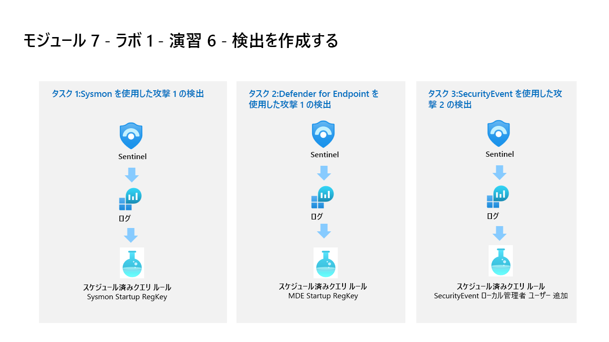

---
lab:
  title: 演習 6 - 攻撃を実施する
  module: Learning Path 9 - Create detections and perform investigations using Microsoft Sentinel
---

# ラーニング パス 9 - ラボ 1 - 演習 6 - 攻撃を実施する

## ラボのシナリオ



後で Microsoft Sentinel での検出と調査に使用する攻撃をシミュレートします。

>**重要:** ラーニング パス #9 のラボ演習は、*スタンドアロン*環境にあります。 ラボを完了せずに終了する場合は、構成を再実行する必要があります。

### このラボの推定所要時間: 30 分

### タスク 1: レジストリ キーの追加による永続化攻撃

>**重要:** 次の手順は、以前に作業していたものとは異なるマシンで行います。 参照タブで仮想マシン名を探します。

このタスクでは、Azure Arc に接続され、Azure Monitor エージェントが構成されているホストに対して攻撃を実行します。

1. パスワード **Pa55w.rd** を使い、管理者として WINServer 仮想マシンにログインします。  

    >**重要:** ラボの "節約" 機能により、WINServer が Azure Arc から切断される可能性があります。この問題は再起動すると解決します。**  

1. Windows で **[開始]** を選択します。 次に、 **[電源]** 、 **[再起動]** の順に選択します。

1. 手順に従って WINServer にもう一度ログインします。

1. タスク バーの検索で、*Command* と入力します。 検索結果にコマンド プロンプトが表示されます。 コマンド プロンプトを右クリックして、 **[管理者として実行]** を選択します。 表示される [ユーザー アカウント制御] ウィンドウで **[はい]** を選択し、アプリを実行できるようにします。

1. コマンド プロンプトで、ルート ディレクトリに Temp フォルダーを作成します。 最後の行の後で忘れずに Enter キーを押してください。

    ```CommandPrompt
    cd \
    mkdir temp
    cd temp
    ```

1. 次のコマンドをコピーして実行し、プログラムの永続化をシミュレートします。

    ```CommandPrompt
    REG ADD "HKCU\SOFTWARE\Microsoft\Windows\CurrentVersion\Run" /V "SOC Test" /t REG_SZ /F /D "C:\temp\startup.bat"
    ```


### タスク 2: ユーザーの追加による特権昇格攻撃

1. このコマンドをコピーして実行し、管理者アカウントの作成をシミュレートします。 最後の行の後で忘れずに Enter キーを押してください。

    ```CommandPrompt
    net user theusernametoadd /add
    net user theusernametoadd ThePassword1!
    net localgroup administrators theusernametoadd /add
    ```


### タスク 3: DNS を使用したコマンド アンド コントロール攻撃

1. 次のコマンドをコピーして実行し、C2 サーバーに対する DNS クエリをシミュレートするスクリプトを作成します。

    ```CommandPrompt
    notepad c2.ps1
    ```

1. **[はい]** を選択して新しいファイルを作成し、以下の PowerShell スクリプトを *c2.ps1* にコピーします。

    >**メモ:** 仮想マシン ファイルへの貼り付けでは、スクリプトの完全な長さが表示されない場合があります。 スクリプトが *c2.ps1* ファイル内で次の手順と同じであることを確認してください。

    ```PowerShell
    param(
        [string]$Domain = "microsoft.com",
        [string]$Subdomain = "subdomain",
        [string]$Sub2domain = "sub2domain",
        [string]$Sub3domain = "sub3domain",
        [string]$QueryType = "TXT",
        [int]$C2Interval = 8,
        [int]$C2Jitter = 20,
        [int]$RunTime = 240
    )
    $RunStart = Get-Date
    $RunEnd = $RunStart.addminutes($RunTime)
    $x2 = 1
    $x3 = 1 
    Do {
        $TimeNow = Get-Date
        Resolve-DnsName -type $QueryType $Subdomain".$(Get-Random -Minimum 1 -Maximum 999999)."$Domain -QuickTimeout
        if ($x2 -eq 3 )
        {
            Resolve-DnsName -type $QueryType $Sub2domain".$(Get-Random -Minimum 1 -Maximum 999999)."$Domain -QuickTimeout
            $x2 = 1
        }
        else
        {
            $x2 = $x2 + 1
        }    
        if ($x3 -eq 7 )
        {
            Resolve-DnsName -type $QueryType $Sub3domain".$(Get-Random -Minimum 1 -Maximum 999999)."$Domain -QuickTimeout
            $x3 = 1
        }
        else
        {
            $x3 = $x3 + 1
        }
        $Jitter = ((Get-Random -Minimum -$C2Jitter -Maximum $C2Jitter) / 100 + 1) +$C2Interval
        Start-Sleep -Seconds $Jitter
    }
    Until ($TimeNow -ge $RunEnd)
    ```

1. メモ帳のメニューで、 **[ファイル]** 、 **[保存]** の順に選択します。 

1. コマンド プロンプト ウィンドウに戻り、次のコマンドを入力して Enter キーを押します。 

    >**注:** DNS 解決エラーが表示されます。 これは予期されることです。

    ```CommandPrompt
    Start PowerShell.exe -file c2.ps1
    ```

>**重要:** これらのウィンドウを閉じないでください。 この PowerShell スクリプトをバックグラウンドで実行させておきます。 コマンドは、数時間ログエントリを生成する必要があります。 このスクリプトの実行中に次のタスクや次の演習に進むことができます。 このタスクで作成したデータは、後で脅威の捜索ラボで使用します。 このプロセスでは、大量のデータや処理を作成することはありません。

## 演習 7 に進む
