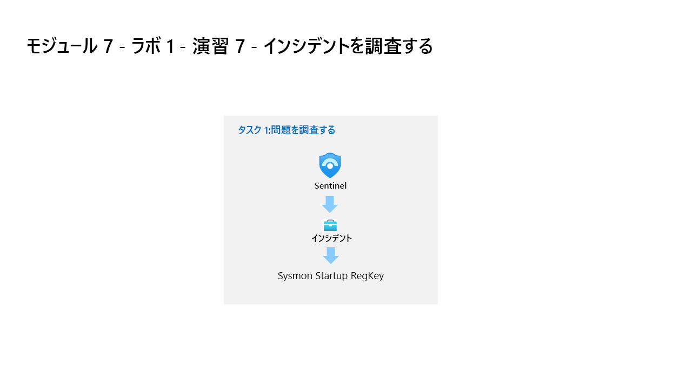

---
lab:
  title: 演習 7 - 検出を作成する
  module: Learning Path 9 - Create detections and perform investigations using Microsoft Sentinel
---

# ラーニング パス 9 - ラボ 1 - 演習 7 - 検出を作成する

## ラボのシナリオ



あなたは、Microsoft Sentinel を実装した会社で働いているセキュリティ運用アナリストです。 Log Analytics KQL クエリを使用し、そこから、環境内の脅威や異常な動作を検出するのに役立つカスタム分析ルールを作成します。

分析ルールでは、環境全体にわたる特定のイベントまたは一連のイベントを検索したり、特定のイベントしきい値または条件に達したときはユーザーに警告したり、SOC でトリアージと調査を行うためのインシデントを生成したり、自動化された追跡および修復プロセスを使用して脅威に対応したりします。

>**重要:** ラーニング パス #9 のラボ演習は、*スタンドアロン*環境にあります。 ラボを完了せずに終了する場合は、構成を再実行する必要があります。

### このラボの推定所要時間: 30 分

### タスク 1: 永続化攻撃の検出

>**重要:** 次の手順は、以前に作業していたものとは異なるマシンで行います。 仮想マシン名の参照を探します。

このタスクでは、前の演習の最初の攻撃の検出を作成します。

>**注:** Microsoft Sentinel は、**defenderWorkspace** という名前で Azure サブスクリプションに事前にデプロイされており、必要な *Content Hub* ソリューションがインストールされています。

1. 管理者として WIN1 仮想マシンにログインします。パスワードは**Pa55w.rd**。  

1. Edge ブラウザーで、Azure portal (<https://portal.azure.com> ) に移動します。

1. **[サインイン]** ダイアログ ボックスで、ラボ ホスティング プロバイダーから提供された**テナントの電子メール** アカウントをコピーして貼り付け、 **[次へ]** を選択します。

1. **[パスワードの入力]** ダイアログ ボックスで、ラボ ホスティング プロバイダーから提供された**テナントのパスワード**をコピーして貼り付け、 **[サインイン]** を選択します。

1. Azure portal の検索バーに「*Sentinel*」と入力してから、**[Microsoft Sentinel]** を選択します。

1. Microsoft Sentinel **defenderWorkspace** を選択します。

1. [全般] セクションで **[ログ]** を選びます。**

1. 次の KQL ステートメントをもう一度**実行**して、このデータがあるテーブルを呼び出します。

    ```KQL
    search "temp\\startup.bat"
    ```

    >**注:** イベントの結果が表示されるまでに最大 5 分かかる場合があります。 完了するまで待ちます。 表示されない場合は、前の演習で指示されているように WINServer を再起動し、ラーニング パス 6 ラボ、演習 2 のタスク #3 を完了していることを確認します。

1. テーブル *SecurityEvent* は、データが既に正規化されており、簡単にクエリを実行できるように見えます。 行を展開して、レコードに関連するすべての列を表示します。

1. 結果から、脅威アクターが reg.exe を使用してレジストリ キーにキーを追加し、プログラムが C:\temp にあることがわかりました。次のステートメントを**実行**し、クエリの *search* 演算子を *where* 演算子に置き換えます。

    ```KQL
    SecurityEvent 
    | where Activity startswith "4688" 
    | where Process == "reg.exe" 
    | where CommandLine startswith "REG" 
    ```

1. アラートについてできるだけ多くのコンテキストを提供することにより、セキュリティオペレーションセンターアナリストを支援することが重要です。 これには、調査グラフで使用するエンティティの投影が含まれます。 次のクエリを**実行**します。

    ```KQL
    SecurityEvent 
    | where Activity startswith "4688" 
    | where Process == "reg.exe" 
    | where CommandLine startswith "REG" 
    | extend timestamp = TimeGenerated, HostCustomEntity = Computer, AccountCustomEntity = SubjectUserName
    ```

1. 適切な検出ルールができたので、[ログ] ウィンドウで、コマンド バーの **[+ 新しいアラート ルール]** を選んでから、 **[Microsoft Sentinel アラートの作成]** を選びます。 これにより、新しいスケジュールされたルールが作成されます。 **ヒント:** コマンド バーの省略記号 (...) ボタンを選択する必要がある場合があります。

1. これで [分析ルール ウィザード] が起動します。 *[全般]* タブで、次のように入力します。

    |設定|値|
    |---|---|
    |名前|Startup RegKey|
    |説明|c:\temp の Startup RegKey|
    |方針|永続化|
    |Severity|高|

1. **[次へ: ルール ロジックを設定]** ボタンを選択します。

1. *[ルール ロジックの設定]* タブで、*[ルール クエリ]* に KQL クエリが既に設定されている必要があります。

1. 次の表のパラメーターを使用して、*[アラートの強化 - エンティティ マッピング]* の下でエンティティを構成します。

    |エンティティ|識別子|[データ フィールド]|
    |:----|:----|:----|
    |Account|FullName|AccountCustomEntity|
    |Host|Hostname (ホスト名)|HostCustomEntity|

1. *[クエリのスケジュール設定]* では、次のように設定します。

    |設定|値|
    |---|---|
    |クエリの実行間隔|5 分|
    |次の時間分の過去のデータを参照します|1 日|

    >**注:**  同じデータに対して意図的に多くのインシデントを生成しています。 これにより、ラボはこれらのアラートを使用できるようになります。

1. 残りのオプションは既定値のままにします。 **[次へ: インシデント設定>]** ボタンを選択します。

1. *[インシデント設定]* タブについては、既定値のままにし、 **[次へ: 自動応答 >]** ボタンを選択します。

1. [自動応答] タブの [Automation rules] (自動化ルール) で、 **[新規追加]** を選びます。** **

1. テーブルの設定を使用して、自動化ルールを構成します。

    |設定|値|
    |:----|:----|
    |自動化ルール名|Startup RegKey|
    |トリガー|インシデント作成時|
    |アクション |プレイブックを実行する|
    |playbook |Defender_XDR_Ransomware_Playbook_SecOps-Tasks|

    >**注:** プレイブックに既にアクセス許可を割り当てているため、使用可能になります。

1. **[適用]** を選択します

1. 下部にある **[次: 確認と作成 >]** ボタンをクリックします。
  
1. [確認と作成] タブで、**[保存]** ボタンを選択して新しいスケジュール化された分析ルールを作成します。**

### タスク 2: 特権昇格攻撃の検出

このタスクでは、前の演習の 2 番目の攻撃の検出を作成します。

>**注:** WINServer マシンで 4732 イベントをログに記録するようにローカル セキュリティ ポリシーを構成しました。 これは、*[高度な監査ポリシーの構成]、[システム監査ポリシー - ローカル グループ ポリシー オブジェクト]、[アカウント管理]、[監査セキュリティ グループ管理: 成功と失敗]* で構成されます。

1. Microsoft Sentinel ポータルで、[全般] セクションから **[ログ]** を選択します (このページから移動した場合)。

1. 次の KQL ステートメントを**実行**して、管理者を指すエントリを特定します。

    ```KQL
    search "administrators" 
    | summarize count() by $table
    ```

1. 結果には異なるテーブルからのイベントが表示される場合がありますが、ここでは、SecurityEvent テーブルを調査する必要があります。 目的の EventID および Event は "4732 - セキュリティが有効なローカル グループにメンバーが追加されました" です。 これを使用して、特権グループへのメンバーの追加を特定します。 次の KQL クエリを**実行**して確認します。

    ```KQL
    SecurityEvent 
    | where EventID == 4732
    | where TargetAccount == "Builtin\\Administrators"
    ```

1. 行を展開して、レコードに関連するすべての列を表示します。 Administrator として追加されたアカウントのユーザー名は表示されません。 問題は、ユーザー名ではなく、セキュリティ識別子 (SID) が格納されることです。 次の KQL を**実行**して、SID と、Administrators グループに追加されたユーザー名を照合します。

    ```KQL
    SecurityEvent 
    | where EventID == 4732
    | where TargetAccount == "Builtin\\Administrators"
    | extend Acct = MemberSid, MachId = SourceComputerId  
    | join kind=leftouter (
        SecurityEvent 
        | summarize count() by TargetSid, SourceComputerId, TargetUserName 
        | project Acct1 = TargetSid, MachId1 = SourceComputerId, UserName1 = TargetUserName) on $left.MachId == $right.MachId1, $left.Acct == $right.Acct1
    ```

   

1. 行を拡張して、結果の列を表示します。最後のものには、KQL クエリ内で ''*投影*'' する *UserName1* 列の下に追加されたユーザーの名前が示されます。 アラートについてできるだけ多くのコンテキストを提供することにより、セキュリティ運用アナリストを支援することが重要です。 これには、調査グラフで使用するエンティティの投影が含まれます。 次のクエリを**実行**します。

    ```KQL
    SecurityEvent 
    | where EventID == 4732
    | where TargetAccount == "Builtin\\Administrators"
    | extend Acct = MemberSid, MachId = SourceComputerId  
    | join kind=leftouter (
        SecurityEvent 
        | summarize count() by TargetSid, SourceComputerId, TargetUserName 
        | project Acct1 = TargetSid, MachId1 = SourceComputerId, UserName1 = TargetUserName) on $left.MachId == $right.MachId1, $left.Acct == $right.Acct1
    | extend timestamp = TimeGenerated, HostCustomEntity = Computer, AccountCustomEntity = UserName1
    ```

1. 適切な検出ルールができたので、[ログ] ウィンドウで、コマンド バーの **[+ 新しいアラート ルール]** を選んでから、 **[Microsoft Sentinel アラートの作成]** を選びます。 **ヒント:** コマンド バーの省略記号 (...) ボタンを選択する必要がある場合があります。

1. これで [分析ルール ウィザード] が起動します。 *[全般]* タブで、次のように入力します。

    |設定|値|
    |---|---|
    |名前|**SecurityEvent Local Administrators User Add**|
    |説明|**ローカル管理者グループに追加されたユーザー**|
    |方針|**特権エスカレーション**|
    |Severity|**高**|

1. **[次へ: ルール ロジックを設定]** ボタンを選択します。

1. [ルール ロジックの設定] タブの [ルール クエリ] には、[アラートの強化 - エンティティ マッピング] の下のエンティティだけでなく、KQL クエリが既に設定されているはずです。******

    |エンティティ|識別子|[データ フィールド]|
    |:----|:----|:----|
    |Account|FullName|AccountCustomEntity|
    |Host|Hostname (ホスト名)|HostCustomEntity|

1. [ホスト] エンティティに **Hostname** が選択されていない場合は、ドロップダウン リストからそれを選択し、前の表のパラメーターを使用してフィールドを設定します。**

1. *[クエリのスケジュール設定]* では、次のように設定します。

    |設定|値|
    |---|---|
    |クエリの実行間隔|5 分|
    |次の時間分の過去のデータを参照します|1 日|

    >**注:**  同じデータに対して意図的に多くのインシデントを生成しています。 これにより、ラボはこれらのアラートを使用できるようになります。

1. 残りのオプションは既定値のままにします。 **[次へ: インシデント設定>]** ボタンを選択します。

1. *[インシデント設定]* タブについては、既定値のままにし、 **[次へ: 自動応答 >]** ボタンを選択します。

1. [自動応答] タブの [Automation rules] (自動化ルール) で、 **[新規追加]** を選びます。** **

1. テーブルの設定を使用して、自動化ルールを構成します。

   |設定|値|
   |:----|:----|
   |自動化ルール名|SecurityEvent Local Administrators User Add|
   |トリガー|インシデント作成時|
   |アクション |プレイブックを実行する|
   |playbook |Defender_XDR_Ransomware_Playbook_SecOps-Tasks|

   >**注:** プレイブックに既にアクセス許可を割り当てているため、使用可能になります。

1. **[適用]** を選択します

1. **[次へ: 確認と作成 >]** ボタンを選択します。
  
1. *[確認と作成]* タブで、 **[作成]** ボタンを選択して新しいスケジュール化された分析ルールを作成します。

## 演習 8 に進む
